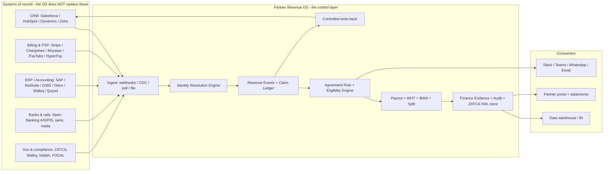

# Integration Layer & API / Data-Flows Manual

**Document type:** Capability & Architecture Manual (companion to the PDR and the End-to-End Business Workflow)
**Product:** Partner Revenue OS (revenue-sharing / partner-revenue control layer)
**Primary market lens:** Saudi Arabia — B2B, enterprise, compliance-ready finance & accounting
**Purpose of this document:** Build deep, ordered competence in the integration layer and API/data flows; catalogue every tool, product, and financial function the OS can connect to; specify the Saudi-specific rails and constraints; benchmark what Saudi corporates actually run and how they buy; and surface the overlooked patterns and levers.
**Writing rule:** Plain rationale. Every block answers *what it is*, *how the data flows*, and *why it matters* — in plain language.

> One-line thesis: **In this product the integration layer is not plumbing — it is the product.** Partner Revenue OS earns the right to "control the partnership" only by reading truth out of the systems where sales, finance, and money already live (CRM, billing, ERP, banks, tax authority), governing it, and writing a small amount of controlled truth back. Everything else is a feature on top of that data spine.

> **Phase discipline (governing):** This manual catalogues the *full* integration surface across all phases. It conforms to the canonical roadmap **Phase 1 Capture (PRM) → Phase 2 Settle → Phase 3 Orchestrate** (see `ROADMAP_ALIGNMENT_AUDIT.md` §2). Concordance: **MVP + V1 = Phase 1 Capture · V2 = Phase 2 Settle · V3 = late Phase 2 / Phase 3.** In Phase 1, every finance-system integration is **read-only** (evidence, validation, reconciliation data); **no write/execute integration with any payment rail, PSP, bank, or clearance API ships in Phase 1.** Settlement and disbursement integrations (§15) are Phase-2-late/Phase-3 capabilities — built last, or partnered to a licensed rail. Cataloguing a rail here is not a commitment to build it early.

---

## 0. How to read this manual

This manual is deliberately layered so it doubles as a learning path and a build reference.

- **Part I — The Skill & Experience Ladder** (§1–§2): what to *learn and be able to do*, from basic to frontier, split into direct (engineering) and indirect (domain/compliance/commercial) skills. This is the "acquire skills and experience" ask.
- **Part II — Architecture & Data-Flow Model** (§3–§6): the reference architecture, the system-of-record map, the canonical objects, the sync patterns, and the financial-function coverage map.
- **Part III — The Integration Catalogue** (§7–§12): every connectable system, organised by financial function and by Saudi vs global, with mechanics, direction, priority, and plain rationale.
- **Part IV — Saudi Compliance & Money Rails** (§13–§16): ZATCA e-invoicing, VAT/WHT, payments & open banking, KYB & identity — the rails that make Saudi finance data legal and movable.
- **Part V — End-to-End Data-Flow Walkthroughs** (§17): the actual API/data flows, step by step.
- **Part Vb — Integration Engineering Reference (build-grade)** (§E1–§E12): the canonical data model, source→canonical field maps, sequence diagrams, verified webhook/CDC event semantics, idempotency/reconciliation/error/identity-resolution algorithms, security-control-to-step mapping, the connector build spec, the OS's own API surface, and NFR budgets. This is the "how to build it" layer.
- **Part VI — Market Benchmark & Local B2B Behaviour** (§18): what KSA corporates run by segment, how they buy and integrate, and a benchmark of the adjacent tool categories the OS coexists with.
- **Part VII — Overlooked Patterns & Levers, Phasing, Risks, Sources** (§19–§23).
- **Appendix A — Saudi Local Product Landscape (Verified Catalogue)** (§A1–§A17): ~115 source-verified local products across every function (accounting, e-invoicing, ERP, POS, payments, wallets/e-money, spend, lending/BNPL, identity/KYB/AML, HR/payroll, credit data, banks, government rails), with a strict **Verified-vs-Excluded** split so nothing speculative is presented as fact.
- **Appendix B — Back-Office & Front-Office Tool Stack** (§B1–§B20): the accounting/financial **back-office** (ERP, close/consolidation/EPM, reconciliation, AP/AR automation, treasury & bank APIs, spend, EOR/payroll, tax) and the **front-office/GTM** stack (CRM, billing, CPQ, CLM/e-sign, support, CPaaS, affiliate/marketplace) your clients and partners actually run — KSA-usage-verified where possible, with integration mechanics, mapped to the data flows. Uses a stricter **Verified-vs-[Unverified-for-KSA]** standard.
- **Appendix C — Stakeholder Tiers, Market Segments & Tool Adoption** (§C1–§C6): *who* runs which back-office/front-office accounting & financial tools, by **organizational tier** (T0 micro → T6 RHQ/MNC) and **functional persona** (CFO/controller/AP/AR/treasury/tax/FP&A vs CRO/sales/RevOps/partner/CS), plus the **segmentation lattice** of non-obvious levers (SEZ/RHQ tax branches, rail availability, residency, sector statutory rails…) that flip the integration approach. Structural facts are source-verified.

It does not restate the PDR. Where the PDR (Section 12) and the Workflow doc (Part B) already define an integration, this manual goes deeper: the Saudi-specific mechanics, the data-flow detail, and the levers those documents do not name.

---

# PART I — THE SKILL & EXPERIENCE LADDER

## 1. Direct skills (the engineering craft of integrations)

"Direct" skills are the things a person/team must be able to *build and operate*. They are sequenced so each rung depends on the one below it.

### 1.1 Basic tier — "Move data safely, once"

**What you can do at this rung**
- Read and write a REST/JSON API with correct **auth** (API key header, HTTP Basic, OAuth2 authorization-code + refresh).
- Consume a **webhook** (verify signature, return `2xx` fast, then process asynchronously).
- Do **CSV import/export** with a preview-and-rollback step.
- Map fields between an external system and an internal object, and keep a record of that mapping.
- Page through large result sets and respect rate limits.

**What you must know (Saudi-aware from day one)**
- That a Saudi "tax invoice" is not just a row in a table — it is a legally cleared artifact (see §13). You will be reading invoice data whose authority lives at ZATCA, not in the ERP.
- That a partner record contains **personal data** (owners, signatories, IBAN) governed by PDPL (see §15).

**Proof of competence:** pull invoices + payments from one accounting system (e.g., Zoho Books or Wafeq) into the OS, map them to Revenue Events, and re-run the import idempotently without creating duplicates.

### 1.2 Mid tier — "Keep two systems in agreement over time"

**What you can do**
- Choose the right **sync pattern** per source: webhook / Change-Data-Capture (CDC) / polling / scheduled file — and know why (see §5).
- Implement **idempotency**: dedupe on a stable event ID with a cache that outlives the provider's retry window. (Stripe, Chargebee, and HubSpot all openly redeliver; assume **at-least-once** everywhere.)
- Build **retry with exponential backoff + jitter** and a **dead-letter queue (DLQ)** for events that exhaust retries.
- Implement **identity resolution / entity matching**: match a billing customer ↔ CRM account ↔ partner claim ↔ ERP vendor, with a human review queue for low-confidence matches.
- Run a **reconciliation job** that compares counts/keys between the OS and each source for a time window and raises exceptions.
- Manage **OAuth2 token lifecycles** (refresh, rotation, revocation) and **sandbox/test modes**.

**What you must know**
- The Saudi finance graph: invoice → collection → GL, and partner-payout = AP vendor bill. You cannot reconcile what you cannot map.
- WHT and VAT change the *net* number you reconcile to (see §14), so reconciliation must be tax-aware.

**Proof of competence:** keep the OS's Revenue Events in agreement with a CRM (via CDC) and a billing system (via webhooks) for 30 days with zero double-counted revenue and a clean exception queue; demonstrate replay after an outage.

### 1.3 Advanced tier — "Govern money-grade data across many systems"

*(Phase note: the settlement/disbursement skills in this tier are exercised in Phase 2 Settle and Phase 3 — they are listed here as the competence ladder, not as Phase-1 build scope.)*

**What you can do**
- Implement the **transactional outbox / event-sourcing** pattern so a domain event and the state change that produced it are persisted atomically, then published — no lost write-backs, no phantom payouts.
- Build **multi-party settlement** flows: collect → split → disburse to third-party IBANs, with **clawback** (refund/transfer-reversal) semantics that stay correct under refunds, downgrades, cancellations, and chargebacks.
- Operate **tiered consistency**: retries handle the *minutes*, replay handles the *hours*, reconciliation handles *everything else*. Know which tier owns which failure.
- Handle **schema drift** (a source adds/renames/removes a field) without breaking the pipeline or silently dropping data.
- Build **CRM write-back** that is selective, controlled, and reversible (write only what sales needs; never leak payout detail into CRM unless configured).
- Stand up **SSO (SAML/OIDC) + SCIM** for internal *and* external partner users, including instant deprovisioning.

**What you must know**
- The ZATCA clearance handshake end-to-end (CSID onboarding, UBL 2.1, ECDSA/SHA-256 stamp, PIH/ICV hash chain) and why the *cleared XML* — not the ERP row — is the canonical payout evidence.
- The split-payout primitives of PayTabs / Tap / Moyasar / Stripe Connect / Adyen and how `application_fee` / `destinations` / transfer-reversals map to "platform margin / partner share / clawback."

**Proof of competence:** run a full revenue-share cycle — verify partner, prove revenue from billing + cleared ZATCA invoice, compute eligibility net of WHT, disburse a split via a PSP to a validated IBAN, import payment status, and reconcile the disbursement against the settlement report — with a complete audit trail.

### 1.4 Frontier tier — "Make the integration layer a moat"

**What you can do**
- Treat **unified-API aggregators** (Merge, Codat, Rutter, Apideck) as a strategic accelerant for the long tail (dozens of accounting/CRM vendors), while hand-building native connectors for the *revenue-critical* paths (Stripe Connect, Salesforce CDC, ZATCA) where you need full event fidelity.
- Build an **Identity Resolution Engine** and **Ecosystem Touchpoint Ledger** (per the Workflow doc's Hub gap analysis) that fuse CRM + billing + marketplace + marketing + support signals into one contribution graph.
- Run **reverse-ETL** (warehouse → operational tools) so computed commissions/statements flow back into CRM/billing automatically.
- Design for **in-Kingdom data residency** and a **data-classification scheme** so the same product can pass an enterprise/bank security review (NCA ECC/CCC, SAMA CSF, CST cloud class).
- Build **continuous KYB monitoring** (re-poll Wathq / screening) so partner eligibility degrades automatically when a CR lapses or a sanction hits.

**What you must know**
- The full regulatory perimeter (§13–§16) as *design constraints*, not afterthoughts.
- The market forces (§18) that decide which integrations create the most enterprise pull.

**Proof of competence:** a buyer's IT/security and finance functions both sign off — security on residency/ECC/PDPL, finance on reconciliation and ZATCA evidence — without custom one-off work.

## 2. Indirect skills (the domain knowledge that makes integrations *correct*)

Indirect skills are not code. They are the knowledge without which a technically perfect integration produces wrong money. They matter as much as the engineering.

| Domain | What to learn | Why it matters (plain) |
|---|---|---|
| **Saudi e-invoicing (ZATCA Fatoora)** | Clearance vs reporting model; EGS/CSID onboarding; UBL 2.1; cryptographic stamp; PIH/ICV chain; QR TLV; wave thresholds | The invoice is only finance-valid once ZATCA clears it. Your payout evidence is the cleared XML, not the ERP row. |
| **VAT (15%) & Withholding Tax** | VAT invoice fields & 15-digit VAT IDs; WHT rates (5/15/20%) on payments to non-residents; remittance timing; treaty relief | If a partner is outside KSA you must withhold the right rate at payout and net it — get the rate wrong and you create a tax liability. |
| **PDPL / data residency** | Controller vs processor, SCCs + Transfer Risk Assessment, 72-hour breach, in-Kingdom expectations | Partner/IBAN/owner data is personal data. Mishandling cross-border transfer fails procurement and risks penalties. |
| **NCA ECC/CCC, SAMA CSF, CST cloud classes** | What enterprise/bank buyers flow down to a SaaS vendor | These gate procurement. No amount of features rescues a product that can't pass the security review. |
| **Saudi money rails** | mada vs sarie vs SADAD; IBAN structure & MOD-97; open banking AIS/PIS; that non-banks reach rails via a sponsor/licensee | Determines *how* you can actually move a partner's share, and that you likely move it through a licensed partner, not directly. |
| **KYB / commercial registry** | Wathq objects (CR, owners, managers, capital, activities, address); the 2025 unified CR; that ID/labour APIs are gated | You must verify the legal entity and authorized signatory before releasing money; most gov data is reached via aggregators. |
| **Finance operating model** | AR/AP, collections, revenue recognition, credit notes, multi-entity, multi-currency, reconciliation | The OS speaks finance's language only if you understand the objects finance actually books. |
| **Partner-revenue commercial logic** | Attribution vs eligibility; protection windows; revenue-share vs one-time commission; clawback on refund/churn | The integration exists to feed governed commercial decisions; wrong mental model → wrong rules → disputes. |
| **Procurement & buying behaviour (KSA)** | SI-led delivery, middleware reality, consolidation pressure, residency demands | Tells you which integrations to prioritise and how a deal actually gets bought and deployed (see §18). |

**Plain rationale for the whole ladder:** a junior can move a CSV; a senior keeps two systems honest; an expert moves money correctly across many systems under Saudi law; the frontier turns all of that into something a bank's security team and a CFO will both sign. The product's moat is the accumulated, governed event history — and that only accrues if the integration layer is built in this order.

---

# PART II — ARCHITECTURE & DATA-FLOW MODEL

## 3. The integration layer in one picture



**Plain rationale:** the OS sits *between* the systems that own truth and the people who must act on it. It never tries to be the CRM or the ERP. It ingests, resolves identity, governs, computes money, proves it, and pushes a thin controlled signal back. That posture (the PDR calls it "overlay + integrations first") is what makes it adoptable inside an enterprise.

## 4. The system-of-record map (who owns what)

Getting this wrong is the single most common cause of double-counting and disputes. Memorise it.

| Truth | System of record | OS role |
|---|---|---|
| Accounts, contacts, opportunities, sales stage, owner | **CRM** | Read; selective write-back |
| Subscription, invoice issued, collection, refund, churn | **Billing / subscription / PSP** | Read (this is *revenue reality*) |
| AR invoice, AP vendor bill, payment, GL, tax line, credit note | **ERP / accounting** | Read; later export approved payouts |
| Legally valid tax invoice (cleared) | **ZATCA Fatoora** | Read references; store cleared XML as evidence |
| Bank balance, statement, account ownership | **Bank / open-banking AIS** | Read (verification + reconciliation) |
| Money movement (collect / split / disburse) | **PSP / open-banking PIS / sarie** | Initiate + import status |
| Legal entity, CR, owners, signatory | **Wathq / Commercial Registry** | Read (KYB) |
| **Partner revenue claim, attribution decision, protection window, agreement rule, payout eligibility, dispute, partner statement** | **Partner Revenue OS** | **Own** |

**Plain rationale:** the OS only becomes the system of record for things no other system governs — the *claim* that a partner contributed and what they're therefore owed. Everything financial it asserts must be traceable back to a system that legitimately owns that fact.

## 5. Sync patterns — choose deliberately, per source

| Pattern | Use when | Watch out for |
|---|---|---|
| **Webhooks** (push) | Source emits events you care about (billing paid, contract signed, deal stage change) | At-least-once delivery → **dedupe**; some providers send **duplicate** events (HubSpot explicitly); return `2xx` fast then process async |
| **Change Data Capture / event bus** | Salesforce (CDC + Pub/Sub API, 72h retention, Replay IDs), Dataverse (change-tracking delta tokens) | Replay window is finite — pair with reconciliation for gaps beyond it |
| **Polling** (pull on schedule) | Source has weak/limited webhooks (Zoho CRM workflow webhooks; Qoyod likely poll-based) | Latency + rate limits; use delta filters (`modifiedon`/updated-since) |
| **Bulk / batch API** | Initial backfill, periodic full reconcile | Counts against shared limits (Salesforce Bulk allocations) |
| **Scheduled file / SFTP / report export** | On-prem ERPs (SAP ECC, Oracle EBS, Tally) and systems with no live API | Stale by design; treat as reference, schedule reconciliation |
| **Unified-API aggregator** | Long tail of accounting/CRM vendors you won't build natively | Some cache (lag); pass-through (Apideck) avoids it; less event fidelity than native |

**The consistency doctrine (commit this to memory):** *retries handle the minutes, replay handles the hours, reconciliation handles everything else.* Every financial integration needs all three tiers, because at-least-once delivery and finite replay windows guarantee that some events will only ever be recovered by a reconciliation sweep.

## 6. Financial-function coverage map — "connect as many financial functions as possible"

This is the answer to "identify the API/data flows … using as many … financial functions as you can." Each finance function is fed by a specific integration and a specific data object.

| Financial function | Feeding integration(s) | Key object / event | Why the OS needs it |
|---|---|---|---|
| **Accounts Receivable (revenue)** | ERP / accounting, billing | AR invoice, invoice line, tax line | Proves the partner-attributed deal became billable revenue |
| **Collections / cash application** | Billing/PSP, ERP, **open-banking AIS** | payment receipt, `invoice.paid`, bank credit | Commission should accrue on *collected* cash, not just invoiced |
| **Revenue recognition** | ERP (NetSuite/SAP/Fusion/D365 rev-rec), billing (Maxio) | recognition schedule, journal entry | For usage/subscription, the partner has a claim on a *stream*, not a snapshot |
| **Accounts Payable (partner payout)** | ERP AP, PSP payouts | vendor bill, payout/transfer | The partner's commission is your AP — this is the disbursement |
| **Tax — VAT** | ZATCA Fatoora, ERP tax lines | 15% VAT line, 15-digit VAT ID | Commission invoices must carry correct VAT and be cleared |
| **Tax — Withholding (WHT)** | OS WHT engine + ERP | WHT record, net-of-WHT amount | Cross-border partner payments must be withheld at source (5/15/20%) |
| **e-Invoicing / statutory invoice** | ZATCA Fatoora API | cleared UBL 2.1 XML, UUID, stamp, QR | The legal artifact behind every payout and revenue claim |
| **Treasury / payouts / settlement** | PSP split, **sarie** instant, bank files | disbursement, settlement report, `balance_transaction` | Moves the partner's share and lets you reconcile it |
| **Bank reconciliation** | Open-banking AIS, bank statements | account balance, transaction line | Match disbursement ⇄ bank debit; match collection ⇄ bank credit |
| **FX / multi-currency** | ERP, PSP | currency, FX rate, residual | GCC/global partners get paid in multiple currencies |
| **Credit notes / refunds / chargebacks** | Billing/PSP, ERP | credit memo, refund, dispute | Trigger **clawback** of already-accrued commission |
| **Audit & evidence** | All of the above | audit log, evidence provenance, cleared XML | CFO/legal/dispute defensibility |
| **KYB / payout readiness** | Wathq, FOCAL/Uqudo, IBAN validation | CR record, screening result, validated IBAN | Gate: don't pay an unverified or sanctioned entity |
| **Cost-to-serve (Partner P&L)** | Support/CS, marketing, billing | ticket cost, co-marketing spend | Net partner economics, not just gross revenue |

**Plain rationale:** "revenue sharing" touches almost every finance function. If the OS only reads CRM, it is a generic PRM. If it reads and reconciles across AR, AP, collections, tax, treasury, and bank — it is the finance-grade control layer the PDR describes. **Read ≠ operate:** in Phase 1 the OS *reads* these functions for evidence and reconciliation only; it does not execute against any of them. Executing (payout disbursement, clearance, settlement) is Phase 2 Settle at the earliest, built last or partnered to a rail.

---

# PART III — THE INTEGRATION CATALOGUE

> Direction key: **R** read, **W** write, **R/W** both. Priority maps to PDR roadmap (MVP / V1 / V2 / V3). Canonical-phase concordance: **MVP + V1 = Phase 1 Capture · V2 = Phase 2 Settle · V3 = late Phase 2 / Phase 3 Orchestrate.** Any **W** against a payment/clearance/settlement system is Phase 2+, regardless of the row.
> Confidence: most rows are well-sourced; **[verify]** marks a claim a build team must confirm against live docs (see §22).

## 7. CRM & sales-motion integrations

| System | Mechanics | Objects (R) / Write-back (W) | Priority | Why (plain) |
|---|---|---|---|---|
| **Salesforce** | REST/SOAP; **Bulk API 2.0** (backfill); **Composite** (bundle ≤25); **CDC + Pub/Sub API** (gRPC, 72h retention, Replay IDs); ship as **AppExchange managed package** | R: account, contact, lead, opportunity, stage, owner, product, amount, close date, source/campaign, custom partner fields. W: partner involved/name/role, claim ID, attribution status, protection expiry, payout-eligible flag, dispute flag, OS link | MVP→V1 | CRM is where pipeline lives; CDC gives a recoverable change stream, not lossy polling |
| **HubSpot** | CRM API v3 (objects) + v4 Associations; **Webhooks** (property change/creation) in a marketplace app | Same object set; **dedupe** — HubSpot warns of duplicate webhook deliveries | MVP→V1 | Common in KSA SMB/mid-market; webhooks need dedup |
| **Microsoft Dynamics 365 / Dataverse** | **Web API (OData v4)**; change-tracking delta tokens or `modifiedon`; **webhooks** (fan-out via Azure Service Bus for reliability) | Same object set | V1 | Strong in KSA enterprise/gov where Microsoft estate exists |
| **Zoho CRM** | v8 webhooks attached to **workflow rules** (≤6/rule, ≤10 fields) — low fidelity | Pair webhooks (notify) with polling (authoritative) | V1 | Popular KSA SMB; treat webhooks as notifications only |

## 8. Accounting & ERP integrations — Saudi-localised (the heart of revenue proof)

### 8.1 Local Saudi / ZATCA-native SaaS (SMB–mid-market install base)

| System | API mechanics | Objects | Integration ease | Why (plain) |
|---|---|---|---|---|
| **Wafeq** | Full REST (`api.wafeq.com/v1`), OAuth/key; ZATCA Phase-2 integrated (even exposes a ZATCA-reporting API) | invoices, bills, contacts (customers/vendors), **manual journals**, chart of accounts, payments — every txn journal-backed | **Easy / best** | Both AR (revenue) and AP (payout) reconciliation in one clean API |
| **Qoyod** | REST/JSON, `API-KEY` header; ZATCA Phase-2 certified; Zapier/Foodics/Geidea/Zid connectors | ~19 resources: invoices, customers, products, payments | Easy (webhooks likely **poll** [verify]) | Widely used SMB accounting; good read source |
| **Daftra** | Public API + ZATCA Phase-2 | invoices, clients, payments, suppliers/purchases, advance payments | Easy–moderate ([verify] webhook/journal breadth) | SMB accounting+invoicing+inventory |
| **Mezan** | Native ZATCA; **public API not confirmed** [verify] | — | Unknown | Priced under ZATCA's SAR 2,500 reimbursement ceiling; may be export-only |
| **Rewaa** | Native Fatoora API; retail **POS**/inventory | POS sales as revenue events; settlement | Moderate | Where partner revenue is point-of-sale/retail |
| **Salla** (commerce) | `docs.salla.dev`; App + Store **webhooks** (order create/update) | orders, products, customers, shipments | Easy / real-time | Best real-time GMV-attribution source if partners drive e-commerce |
| **Zid** (commerce) | Merchant API (JSON, key auth) + **webhooks** (`order.create`, `order.status.update`) | orders, products, customers, inventory | Easy / real-time | Same; pair GMV with the merchant's accounting for recognised revenue |
| **Edara / Onyx Pro / Focus** | Edara cloud connectors; Onyx & Focus often on-prem | varies | Harder / export-oriented | Traditional SMB/mid-market; treat as file/DB-level |

### 8.2 Global ERP/accounting localised for KSA (mid–large enterprise)

| System | API mechanics | Objects | Ease | Why (plain) |
|---|---|---|---|---|
| **Oracle NetSuite** | **SuiteTalk REST** (`/services/rest/record/v1/...`) + **SuiteQL**; Saudi E-Invoicing SuiteApp (direct Fatoora) | invoice, vendorbill, customerpayment, customer, vendor, journalentry, creditmemo | **Easy — top target** | KSA mid-market leader, well-documented, read-friendly |
| **Zoho Books** | REST v3 (OAuth2) + **webhooks**; ZATCA-approved (direct Fatoora push) | invoices, contacts, customerpayments, bills, vendorpayments, chartofaccounts, journals, creditnotes | Easy | One of the easiest global tools to read |
| **Odoo** | **XML-RPC / JSON-RPC** (REST via OCA); ZATCA via `l10n_sa` + `l10n_sa_edi` (sandbox/sim/prod) | `account.move` (invoices, bills, journals — unified), `account.payment`, `res.partner` | Easy | Unified `account.move` model is convenient; fast-growing in KSA |
| **Microsoft Dynamics 365** | **OData/REST**; F&O data entities; **Business Central** OData v4 + webhooks; MS Electronic Invoicing for ZATCA | AR/AP invoices, customers/vendors, payments, GL journals | Easy (BC) / Moderate (F&O) | Strong KSA mid/large presence |
| **SAP S/4HANA & Business One** | OData/REST (strategic) + legacy **BAPI/RFC/IDoc**; **SAP Document & Reporting Compliance** + Integration Suite for ZATCA; B1 Service Layer + DI-API | AR/AP invoices, journal entries, GL, business partners, payments | **Hard — via middleware/SI** | Dominant in KSA large enterprise/gov (Aramco, SABIC, STC, giga-projects) |
| **Oracle Fusion Cloud / E-Business Suite** | Fusion REST (`/invoices`, AR, payments, GL) but **OIC-favoured**; EBS via REST/SOAP/PL-SQL/middleware | AP/AR invoices, receipts, GL journals | Moderate–hard (OIC-gated) | Large enterprise; ZATCA usually via 3rd-party (Complyance/Accqrate) |
| **Sage (X3/300/200)** | X3 REST/SOAP web services; ZATCA via partners (Greytrix) | invoices, payments, GL | Moderate (product-fragmented) | Some KSA mid/large install base |
| **QuickBooks Online / Xero** | Solid REST (OAuth2); Xero webhooks | invoices, bills, payments, journals | Easy API, **but not native ZATCA** | KSA compliance bolted on via connectors (InvoiceQ/avtax) — weaker fit |
| **Tally / Focus** | Tally on-prem XML/HTTP gateway (ZATCA-accredited); Focus cloud APIs | invoices, vouchers | Hard (on-prem/export) | Common in traditional trading SMBs |

**Plain rationale & lever:** the install base is *wide and fragmented*. Hand-build the read connector once for the **revenue-critical, high-share** systems (NetSuite, Zoho, Odoo, D365 BC, Wafeq, Qoyod, Salla, Zid), reach the on-prem giants (SAP ECC/S4, Oracle EBS, Tally) **via middleware or the customer's SI**, and cover the long tail with a **unified accounting API (Codat)**. Also note: many KSA enterprises already route invoices through a **ZATCA compliance middleware** (Complyance, Accqrate, ClearTax, InvoiceQ) — that middleware is itself a clean, normalised read source you can integrate once instead of N times.

## 9. Billing / subscription & revenue-proof integrations

| System | Mechanics & key events | Why (plain) |
|---|---|---|
| **Stripe Billing** | Webhooks: `invoice.paid` (revenue materialised), `invoice.payment_failed`, `charge.refunded`, `charge.dispute.created`; events retrievable 30 days | `invoice.paid` is your **proof event**; refund/dispute drive **clawback** |
| **Chargebee** | All changes are events → webhooks; retries with backoff up to 2 days; **duplicate delivery possible** | Dedup required; strong subscription coverage |
| **Zuora / Recurly / Maxio / Paddle** | Zuora event-driven [verify reliability]; Recurly dunning events; Maxio adds GAAP rev-rec + usage; **Paddle = Merchant of Record** | For MoR (Paddle) you never see the raw charge → reconcile against *their payout reports* |
| **HyperPay / Moyasar / PayTabs / Geidea** (KSA PSPs) | REST + webhooks; see §15 for split-payout detail | These prove collection in the local market and double as payout rails |

**Plain rationale:** billing tells the OS whether attributed pipeline became invoice → collection → renewal → refund → churn. Accrue commission on **collected** revenue; reverse it on refund/chargeback. This is the difference between a defensible payout and an overpayment.

## 10. Money movement, marketplace split & payout integrations

This is the execution core of revenue-sharing. (Saudi rails detailed in §15; here is the capability shape.)

| Platform | Split / multi-party primitive | Clawback | Reconciliation key |
|---|---|---|---|
| **Stripe Connect** | Destination charges (`transfer_data[destination]`, `application_fee_amount`), Direct charges, or **separate charges & transfers** (one charge → many `Transfer`s) | **Transfer reversals** (full/partial, can refund the app fee) | `balance_transaction` ID |
| **Adyen for Platforms** | **Split instructions** at auth/capture/refund into multiple balance accounts; reusable split profiles | split refunds | `balancePlatform.transfer.*` webhooks |
| **PayTabs** (KSA) | **Split Payout** (one txn across beneficiaries) + **External Payout** (disburse to third parties) + escrow-style hold | via payout adjustments | dashboard + API |
| **Tap Payments** (KSA) | `destinations` object on Charges API (split across Destination IDs; remainder to master wallet) | refunds | webhooks |
| **Moyasar** (KSA) | **Payouts API**: Payout Account → Payout → Destination; explicitly supports paying vendors/gig + revenue split | payout reversal | webhooks |

**Plain rationale:** `application_fee` / split = **your platform margin**; the transfer/destination = **the partner's share**; the reversal/split-refund = **clawback**. Build this only after attribution and eligibility are trusted — automating payment before entitlement is trusted just amplifies financial risk (PDR §12.12).

## 11. CPQ, CLM/e-signature, identity, warehouse, comms, support

| Category | Systems | Mechanics / events | Why (plain) |
|---|---|---|---|
| **CPQ / product catalog** | Salesforce CPQ, DealHub, Oracle/SAP CPQ, PROS | **quote lines**: SKU, base price, qty, term, discount | Commission rate often depends on product/margin/term — read the quote line |
| **CLM / e-signature** | DocuSign (Connect), Adobe Acrobat Sign, PandaDoc, Ironclad [verify] | webhook on envelope/agreement **completed/signed** + metadata (effective/expiry, parties, terms) | The signed event is the clean, auditable "deal is real / agreement active" trigger |
| **Identity / SSO + SCIM** | Okta, Microsoft Entra ID, Auth0 (also Nafath — §16) | **SAML/OIDC** SSO + **SCIM 2.0** (separate app integrations); instant deprovisioning | Internal *and* external partner users; a churned partner rep must lose access immediately |
| **Data warehouse / BI** | Snowflake, BigQuery, Redshift, Databricks; Power BI, Tableau, Looker | Export governed partner-revenue tables + data dictionary | Be system-of-truth *and* let data flow out — portability builds enterprise trust |
| **ELT / reverse-ETL / iPaaS** | Fivetran (+Census), Airbyte, Hightouch, RudderStack; Workato, MuleSoft, Boomi, Tray | ELT in; **reverse-ETL** pushes computed commissions/statements back to CRM/billing; iPaaS orchestrates the long tail | Closes the loop and absorbs connectors you won't build natively |
| **Communication** | Slack, Microsoft Teams, **WhatsApp Business Cloud API**, email | webhooks/notifications; WhatsApp shifted to **per-delivered-template pricing (Jul 2025)** [plan cost] | Approvals, exceptions, partner-statement-ready alerts — human-in-the-loop with audit trail |
| **Ticketing / support / CS** | Zendesk, Freshdesk, Jira SM, ServiceNow, Intercom; Gainsight/Totango/ChurnZero | webhooks; tickets, health scores, renewal/expansion risk | Post-sale partner contribution (implementation/adoption) + support cost into Partner P&L |
| **Marketing / campaign** | HubSpot Mktg, Marketo, SFMC, Mailchimp, webinar/event tools | campaign/UTM/lead-source, partner co-marketing source | Capture partner *influence before* a sales opportunity exists |
| **Marketplace / co-sell** | AWS/Azure/GCP marketplaces; Tackle, WorkSpan | private offers, co-sell refs, transaction IDs/status | Marketplace motion is underreported in CRM; unify it with claims |

## 12. Unified-API & "buy vs build" accelerants

| Aggregator | Strength | Use it for |
|---|---|---|
| **Codat** | Accounting/fintech depth; normalises NetSuite ⇄ QuickBooks ⇄ Xero ⇄ … | The accounting long tail — one integration, many ERPs |
| **Merge.dev** | Broadest category coverage (HRIS, CRM, accounting, ticketing) | Fast coverage across categories |
| **Rutter** | E-commerce/commerce normalisation | Commerce/GMV sources |
| **Apideck** | Real-time **pass-through** (no cache lag) | When you need fresh reads, not cached |

**Plain rationale & the core lever:** *native where it's revenue-critical, unified-API where it's the long tail.* You cannot hand-build and maintain 40 accounting connectors; you also cannot afford a cache-lagged aggregator on the Stripe Connect payout path. Split the estate deliberately.

---

# PART IV — SAUDI COMPLIANCE & MONEY RAILS

> These are not "nice to have localisation." They are the rails that make Saudi finance data **legal** and **movable**, and they are hard constraints on every data flow above.

## 13. ZATCA e-invoicing (Fatoora) — Phase 2, the hardest and most important integration

**What it is.** Phase 2 ("Integration Phase") is a Continuous Transaction Control regime. Any component of the OS that issues invoices (e.g., partner commission invoices, B2B billing) is an **EGS** (E-invoice Generating Solution) that must connect to ZATCA's Fatoora platform.

**The design fork (decide early):**
- **Clearance model — B2B / B2G "standard tax invoices."** XML is sent to ZATCA's **Clearance API in real time**; the invoice is **legally valid only after** ZATCA validates it, applies its cryptographic stamp, and returns the cleared XML + QR. You cannot share it with the buyer until cleared. *Partner commission invoices are almost always standard → clearance.*
- **Reporting model — B2C "simplified tax invoices."** Stamped locally by the EGS, then **reported to ZATCA within 24 hours.**

**EGS onboarding / API flow** (REST/JSON; certificate-based trust):
1. **OTP** from the Fatoora portal (valid ~1 hour) authorises the EGS unit.
2. EGS generates a **CSR** (Certificate Signing Request).
3. **Compliance CSID API** — submit CSR + OTP → receive a **Compliance CSID** (test cert) → run mandatory compliance checks (sample standard/simplified invoices + notes).
4. **Production CSID API** — exchange compliance CSID → receive the **Production CSID** for live clearance/reporting. Renewal repeats the flow.
5. **Auth:** HTTP **Basic** — `Authorization: Basic base64(binarySecurityToken : secret)`, where the token is the CSID.

**Data & anti-tamper:**
- **XML in UBL 2.1** (invoice / credit note / debit note); simplified can be PDF/A-3 with embedded XML.
- **Cryptographic stamp:** ECDSA signature + SHA-256 hash, keyed by the CSID.
- **Hash chaining:** every invoice carries the **Previous Invoice Hash (PIH)** + an **Invoice Counter Value (ICV)** — an unbroken chain so no invoice can be inserted/deleted/altered retroactively.
- **QR:** Base64 **TLV** (Tag-Length-Value), Phase-2 carries 9 tags (seller, VAT no., timestamp, totals, VAT amount, hash, stamp/public key).

**Rollout (2025–2026):** waves by turnover, notified ≥6 months ahead. **Wave 23** (> SAR 750k) go-live by **31 Mar 2026**; **Wave 24** (> SAR 375k) **1 Apr–30 Jun 2026**. Thresholds descend each wave → effectively the whole VAT-registered base. **Assume your enterprise buyers are already live.**

**Why it matters (plain):** the invoice behind a payout is not finance-valid until ZATCA clears it. Your "finance evidence pack" must store the **cleared XML + ZATCA stamp/UUID + the PIH chain** as the canonical record. This is the single hardest integration and the one that most differentiates a serious KSA finance product. **[verify]** exact endpoint paths, CSID validity, sandbox URLs against ZATCA's *Detailed Technical Guideline* / Developer Portal manual before build.

## 14. VAT & Withholding Tax — the numbers that change the payout

- **VAT — 15%** since July 2020. Tax invoice needs supplier name + **15-digit VAT registration number** (not required below SAR 1,000), date, line items, total incl. VAT, VAT amount. VAT rides the same UBL/clearance pipeline.
- **Withholding Tax (WHT)** — applies when a Saudi resident/PE pays a **non-resident** for KSA-sourced income. Indicative rates: dividends/interest **5%**, royalties **15%**, technical/consulting services **5%**, management fees **20%**, head-office/other **~15%**. Remit to ZATCA **within the first 10 days of the month after payment**. Tax treaties (DTTs) can reduce/eliminate if the payee is the beneficial owner and provides documentation.

**Why it matters (plain):** if a partner sits **outside KSA**, the OS must **withhold the correct rate at payout**, net it from the eligible amount, generate a WHT record, and handle treaty relief. Misclassifying a service (5% vs 15% vs 20%) changes the net payout and creates liability. **Build a WHT engine; don't bolt it on.** **[verify]** treaty application is case-specific — route through a tax advisor.

## 15. Payments, open banking & settlement — how the partner's share actually moves

> **⚠️ Phase gate: everything in this section is Phase 2 (Settle) at the earliest — and disbursement execution is late-Phase-2/V3, built last or partnered to a licensed rail.** Nothing here ships in Phase 1 (Capture). In Phase 1 the only permitted touchpoints with this layer are *read/validate* operations: IBAN format validation and open-banking **AIS reads** for reconciliation evidence. Fund-holding/escrow additionally requires an e-money/PI licence decision that is explicitly out of scope until the Phase-2 settlement gate is passed.

**SAMA Open Banking Framework.** Release 1 = **Account Information Services (AIS)** (issued Nov 2022; banks live Q1 2023). Release 2 = **Payment Initiation Services (PIS)** + Confirmation of Availability of Funds (Sept 2024). APIs follow the UK OBIE-style standard, secured with a **FAPI** profile (mTLS, signed JWS request objects, explicit consent). The **Open Banking Lab** is a mandatory sandbox + conformance gate. **Key 2026 shift:** on **26 March 2026** SAMA moved open banking from sandbox to a **fully licensed activity**; **Lean Technologies** became the **first licensed open-banking provider** (Major Payment Institution licence).

**How you connect:** either become SAMA-licensed yourself (multi-quarter), or — faster — go **through a licensed aggregator** under their licence:
- **Lean Technologies** — Data (account verification, balances, transactions, income/cash-flow) + Payments (PIS, instant A2A "pay by bank", payouts). First SAMA licensee; single REST API. Best fit for both reconciliation and A2A collection.
- **Tarabut** — SAMA-certified AIS; **Income Verification** (real-time salary/income from bank data — useful for KYC). REST, consent-driven.
- **Spare** — AIS + Payment Initiation. **Ozone API** — bank-side standards platform (only if you operate the bank side). **Salt Edge** — aggregation.

**Core rails:**
- **sarie** — national **24/7 real-time** instant payments on **ISO 20022**; P2P/P2B/**B2B**; IBAN-addressed + alias (IPA) layer. **This is the rail for instant partner payouts.** Non-banks typically reach it **via a sponsor bank or licensed PI** [verify access path + per-txn limits].
- **mada** — domestic debit/POS/ATM acceptance (pay-in), >90% of domestic card value; not a payout rail.
- **SADAD** — national bill-payment (collections via biller reference); not for paying partners.
- **IBAN** — Saudi IBAN is **24 chars**: `SA` + 2 check digits + **2-digit SAMA bank code** + 18-digit BBAN. **Validate every partner IBAN** (format + **MOD-97** + valid bank code) before payout to prevent failed/misrouted disbursements. BIC for Saudi banks commonly ends `…SARI`.

**PSP split-payout capability (most critical for revenue-sharing):** see §10 and the fuller §A5 table. **PayTabs (Split Payout + External Payout), Moyasar (Payouts), HyperPay (HyperSplits), Tap (destinations), and Telr (Split-in-Payment)** all have *documented* split/marketplace/payout-to-third-party primitives — these are the strongest local build candidates. **Geidea, Amazon Payment Services, Ottu, MoneyHash, noon, EdfaPay** split-to-third-party is **Unknown (not "No") — [verify]** with the vendor. Tamara/Tabby and all BNPL are **pay-in only** (merchant settled in full). A bank-direct alternative exists too: **ANB Connect** documents **bulk payments + SADAD** payout APIs (§A12).

**WPS / Mudad — keep separate.** The Wage Protection System / Mudad governs **employer-to-employee wages**, not commercial B2B partner commissions. If partners are companies/contractors, route payouts through **sarie/PSP rails, not WPS**. Misclassifying partner payouts as wages would wrongly pull you into WPS.

**Escrow / funds-holding.** PayTabs offers escrow-style hold + split (closest turnkey); e-money licensees (Tweeq, Barq) and BaaS (Jeel) can hold/disburse. **Holding partner funds generally requires an e-money/payment-institution licence or a sponsor that has one — [verify] with SAMA before architecting fund-holding.**

**Why it matters (plain):** the recommended shape is — validate IBAN → use **AIS** (Lean/Tarabut) for revenue validation & bank reconciliation → collect via mada/cards or **PIS** → **split & disburse** via PayTabs/Tap/Moyasar landing on **sarie** → keep it all out of WPS.

## 16. KYB, identity & government data — verify before you pay

**Access reality first (plain):** almost every authoritative Saudi gov data source is **gated** to licensed/regulated entities. A private SaaS realistically consumes them **through aggregators** (Elm, Mozn, Uqudo), not direct government contracts. Plan for this.

| Service | What it gives | Access | Why (plain) |
|---|---|---|---|
| **Wathq** (`developer.wathq.sa`) | **KYB backbone**: CR (trade name, number, status, capital, activities), **owners & managers**, new-legislation CR endpoint, CR search, Articles of Association, Power of Attorney, deeds, business National Address | **Paid subscription, open to businesses** (basic free tier; rate limits ~5 req/s) | Verify the legal entity + authorized signatory before releasing commission — most accessible authoritative source |
| **Nafath** (national SSO) | Government-grade login; verified national/Iqama ID, name, status | **Via Elm / TCC-licensed provider + SDAIA key** | Strong login + confirms the human signatory is real |
| **Yakeen/Yaqeen** (Elm) | ID/Iqama lookups (name, DOB, nationality, status) | **Gated to regulated entities** (SAMA rulebook) | Confirms an individual is real and active |
| **National Address / SPL** (`api.address.gov.sa`) | Address verify, geocode, district lookup | **Free self-signup** | Validate registered business address for payout records |
| **ZATCA VAT lookup** | Verify VAT status by VAT no./cert/CR | **Web lookup; clean programmatic API uncertain** [verify] | Confirm the partner can legitimately invoice you VAT |
| **GOSI / Qiwa / Muqeem / Mudad** | Employer/labour status, Saudization/Nitaqat | **Employer portals; no open self-serve API** | Optional context, not a hard gate — deprioritise |
| **Etimad** | Government tenders/supplier/contract & financial claims | Supplier file via Nafath; **no clear open API** | Only relevant if partners transact with government |

**KYB / AML / sanctions vendors (the practical path to compliance via one API):**
- **Mozn — FOCAL:** KSA-built, **locally hosted**, **SAMA-aligned**, **Yakeen integration** + gov-DB access; screens **1,300+ watchlists** (UN/OFAC/EU sanctions, PEPs, RCAs), real-time. Strongest *local* fit (notes a UBO-depth gap for complex ownership).
- **Uqudo:** KYC/AML; Saudi ID/Iqama/licence verification + biometric liveness (`SAU_ID`).
- **Sumsub + ComplyAdvantage:** full KYC/**KYB/UBO** + sanctions/PEP/**adverse media** — strong on corporate structures.
- **IDMerit; Refinitiv World-Check** (underlying watchlist data). *(**Tahaluf** appears to be an events/data company, not an AML vendor — [verify] the intended vendor.)*

**Note for the data model:** the **Unified Commercial Register** (effective **3 Apr 2025**, transition to 2030) **abolishes branch CRs** — one CR covers all regions/activities. Do not assume one-CR-per-branch; use Wathq's new-legislation endpoint.

**Why it matters (plain):** payout-readiness is more than attribution. Finance needs a **verified legal entity, valid CR, real VAT number, validated IBAN, and a clean sanctions/PEP screen on the entity and its owners** before money moves. In regulated/finance-adjacent sectors this is a hard gate.

---

# PART V — END-TO-END DATA-FLOW WALKTHROUGHS

## 17. The flows that matter, step by step

### 17.1 Partner onboarding & KYB (payout-readiness gate)
1. Partner submits legal/commercial info in the portal (CR number, VAT number, IBAN, signatory).
2. OS calls **Wathq** → confirm CR status, capital, activities, **owners/managers**; match the submitted signatory to a listed manager/PoA.
3. OS calls **National Address / SPL** → validate registered address.
4. OS validates **IBAN** (format + MOD-97 + bank code) and (optionally, via AIS) confirms account ownership.
5. OS calls **FOCAL/Uqudo** → sanctions/PEP/adverse-media screen on entity **and** owners/UBOs.
6. OS verifies VAT status (ZATCA lookup / aggregator).
7. All artifacts stored with provenance → partner reaches **payout-ready** only if every check passes; failures route to a review queue.
**Plain rationale:** this turns "we trust this partner" into evidence a CFO and an auditor will accept.

### 17.2 Revenue proof (does the attributed deal actually exist as money?)
1. **CRM CDC** event: opportunity → closed-won → OS updates the linked claim's revenue status.
2. **Billing webhook**: `invoice.paid` (Stripe/Chargebee/Moyasar) → OS creates/updates a **Revenue Event** (collected, not just invoiced).
3. OS references the **ZATCA cleared XML** for that invoice (UUID, stamp, PIH) and stores it as evidence.
4. **ERP read** (NetSuite/SAP/Wafeq) confirms the AR invoice + GL posting for reconciliation.
5. Refund/credit-note/chargeback events reduce the Revenue Event and flag **clawback**.
**Plain rationale:** commission accrues on proven, collected, statutorily-cleared revenue — not on a hopeful CRM stage.

### 17.3 Payout with WHT, split & instant settlement
1. Claim is attribution-accepted + protection-valid + revenue-validated → **eligibility engine** computes gross payout from the agreement rule.
2. **WHT engine**: if partner is non-resident, withhold the correct rate, net the amount, create a WHT record (remit within 10 days of month-end).
3. Generate the partner commission invoice → **ZATCA clearance** → store cleared XML.
4. **PSP split / payout** (PayTabs/Tap/Moyasar) or **PIS/sarie** disburses the net share to the validated IBAN; your platform fee is the `application_fee`/retained split.
5. Import **payment status** + settlement report; update partner statement.
6. **Reconcile** disbursement ⇄ bank debit (AIS) ⇄ settlement `balance_transaction`.
**Plain rationale:** every riyal that leaves is correct, taxed, cleared, traceable, and reconciled.

### 17.4 Reconciliation & exception handling (the always-on backstop)
- Scheduled job compares OS Revenue Events / payouts against billing, ERP, PSP settlement, and bank (AIS) for each window.
- Mismatches → exception queue → finance task; *retries handled the minutes, replay handled the hours, this handles the rest.*
**Plain rationale:** at-least-once delivery + finite replay windows guarantee drift; reconciliation is how you catch it before it becomes a dispute.

### 17.5 Executive export & write-back loop
- Governed partner-revenue tables export to **Snowflake/BigQuery** (+ data dictionary) for Power BI/Tableau.
- **Reverse-ETL** writes computed commission/eligibility/statement status back to **CRM** (controlled fields only) and to billing where useful.
**Plain rationale:** be the system of truth *and* let the truth flow into the buyer's stack — portability is what enterprise trust is made of.

---

# PART Vb — INTEGRATION ENGINEERING REFERENCE (BUILD-GRADE)

> Purpose: turn Parts II–V from *what* and *why* into *how to build it*. This part is the engineering contract for the integration layer — the canonical data model, the source→canonical field maps, the actual call/event sequences, the verified webhook/CDC semantics, and the idempotency, reconciliation, error, identity-resolution, and security mechanics that make partner money correct.
>
> **Fact discipline (per "no mistakes / no hallucination"):** external vendor specifics below (event names, ZATCA artifacts, Stripe primitives) are only those verified in §13/§A5 and re-confirmed against vendor docs. Anything that is *our design* (the canonical model, the OS's own API surface, NFR budgets) is labelled **[design]** — it is a recommended contract, not a claim about an external system. Exact field casing for third-party schemas is marked "confirm against live schema" where not certain.

## E1. The Canonical Data Model (CDM) — the layer's internal contract `[design]`

Every connector maps its source into one normalized model; every consumer (rules engine, payout, dashboards, warehouse) reads from the CDM, never from a raw source. This decoupling is what lets you add a 30th accounting system without touching the rules engine.

**Core entities** (system-of-record per §4; "OS-owned" = the OS is the system of record):

| CDM entity | Purpose | Fed by (source) | OS-owned? |
|---|---|---|---|
| `Partner` / `PartnerLegalEntity` | Operating + legal identity of a partner | Wathq, KYB vendor, portal | Partner: yes; legal facts: Wathq |
| `BankAccount` | Partner payout destination | Portal + AIS + IBAN validator | OS (verified flag from AIS) |
| `Agreement` / `AgreementRule` | Commercial terms as executable rules | CLM/e-sign + manual | OS |
| `CustomerAccount` | The end customer | CRM | CRM |
| `Opportunity` | The deal | CRM | CRM |
| `PartnerRevenueClaim` | The atomic unit (PDR §8.2) | Portal/CRM/marketplace | **OS** |
| `AttributionDecision` | Credit decision + evidence | OS workflow | **OS** |
| `ProtectionWindow` | Partner rights window | OS engine | **OS** |
| `RevenueEvent` | Proof revenue materialised | Billing, ERP/AR | Billing/ERP |
| `Invoice` (+ ZATCA fields) | Statutory invoice | ERP/accounting + ZATCA | ERP; cleared-XML = ZATCA |
| `Payment` | Collection / bank credit | Billing/PSP, AIS | source |
| `PayoutEligibility` | Computed entitlement | OS engine | **OS** |
| `WHTRecord` | Withholding at payout | OS engine + ERP | **OS** |
| `Payout` | Disbursement to partner | PSP/PIS/bank | source (status), OS (intent) |
| `Dispute` | Conflict + resolution | Portal/support | **OS** |
| `EvidenceItem` | Provenance-scored evidence | All | **OS** |
| `AuditEvent` | Immutable change log | All | **OS** |
| `IntegrationConnection` / `SyncCheckpoint` | Connector state + cursors | OS platform | **OS** |

**Two rules every CDM record obeys `[design]`:**
1. **External-ID map, not overwrite.** Each record carries `external_ids: [{system, external_id, external_version}]`. Identity across systems is resolved (E8), never assumed by name.
2. **Sync metadata on every row:** `source_system`, `source_id`, `source_version`, `ingested_at`, `last_synced_at`, `payload_checksum`, `confidence (0–1)`. This is what makes reconciliation (E6) and audit (§11.4) possible.

**Worked field detail for the four money-critical entities `[design]`:**

`RevenueEvent` — `id` · `claim_id?` · `customer_ref` · `opportunity_ref?` · `invoice_ref?` · `type {invoiced|collected|recognized|refunded|credit_note|chargeback}` · `gross_amount` · `currency` · `fx_rate?` · `event_time` · `source_system` · `source_id` · `confidence`.

`Invoice` — `id` · `direction {AR_customer|AP_partner}` · `number` · `issue_date` · `net` · `vat_amount (15%)` · `total` · `buyer_vat_id` · `seller_vat_id` · **ZATCA block:** `zatca_uuid` · `zatca_invoice_hash` · `pih (previous-invoice-hash)` · `icv (counter)` · `clearance_status {cleared|reported|rejected}` · `cleared_xml_ref` · `qr_tlv`.

`PayoutEligibility` — `id` · `claim_id` · `agreement_rule_id` · `gross_payout` · `wht_rate` · `wht_amount` · `net_payout` · `currency` · `status (PDR §9.6)` · `missing_conditions[]` · `evidence_refs[]`.

`Payout` — `id` · `partner_id` · `bank_account_id` · `eligibility_ids[]` (batchable) · `net_amount` · `currency` · `rail {PSP_split|PIS|bank_bulk|file}` · `provider_ref` · `settlement_ref (e.g. balance_transaction)` · `status {intended|submitted|settled|failed|reversed}` · `wht_record_id`.

## E2. Source → Canonical field-mapping reference

Concrete maps for the highest-traffic sources. Field names are the provider's documented names where verified; **"confirm against live schema"** flags casing/availability to check at build.

**CRM — Salesforce `Opportunity` → `Opportunity` (+ seeds `RevenueEvent` on closed-won)**
| Salesforce field | CDM field | Transform |
|---|---|---|
| `Id` | `external_ids[salesforce]` | store, don't use as PK |
| `AccountId` | `customer_ref` | resolve via E8 |
| `Amount` | `RevenueEvent.gross_amount` (on win) | currency from org/CurrencyIsoCode |
| `StageName` / `IsWon` / `IsClosed` | `Opportunity.stage` / revenue status | map win → emit `RevenueEvent{type:invoiced?}` only after billing proof |
| `CloseDate` | `expected_close` / `event_time` | |
| `OwnerId` | sales owner | |
| `LeadSource` / custom partner fields | claim seed / influence signal | feeds attribution |

**Billing — Stripe `invoice.paid` event → `RevenueEvent{collected}` + `Payment`**
| Stripe field | CDM field | Note |
|---|---|---|
| `data.object.id` (Invoice) | `Invoice.external_ids[stripe]` | |
| `data.object.customer` | `customer_ref` | resolve E8 |
| `data.object.amount_paid` / `currency` | `Payment.amount` / `currency` | minor units → decimal |
| `status_transitions.paid_at` | `RevenueEvent.event_time` | |
| `charge` / `payment_intent` | `Payment.provider_ref` | |
| (later) `charge.refunded` / `charge.dispute.created` | `RevenueEvent{refunded|chargeback}` | triggers clawback (E6) |

**Accounting AR invoice (NetSuite `invoice` / Wafeq invoice) → `Invoice{AR_customer}`**
| Source | CDM | Note |
|---|---|---|
| invoice id/number | `number` + external id | |
| `tranDate` / issue date | `issue_date` | |
| line tax / VAT line | `vat_amount` | must be 15% line |
| total / amount | `total` / `net` | |
| customer | `customer_ref` | |

**ZATCA clearance response → `Invoice` ZATCA block** (the canonical payout evidence, §13)
| ZATCA artifact | CDM field | Note |
|---|---|---|
| cleared signed XML | `cleared_xml_ref` | store immutably |
| invoice UUID | `zatca_uuid` | |
| invoice hash | `zatca_invoice_hash` | |
| previous-invoice-hash | `pih` | unbroken chain |
| invoice counter value | `icv` | monotonic |
| clearance status | `clearance_status` | standard=cleared; simplified=reported≤24h |

**KYB — Wathq Commercial Registration → `PartnerLegalEntity`**
| Wathq field | CDM | Note |
|---|---|---|
| CR number | `cr_number` (natural key) | identity anchor |
| business/trade name | `legal_name` | Arabic + English |
| status + date | `cr_status` | gate payout if not active |
| capital / activities | `capital` / `activities[]` | risk scoring |
| parties (owners/managers) | `signatories[]` | match portal signatory; UBO → screening |

**Bank AIS transaction (SAMA/OBIE-style) → `Payment` / reconciliation**
| AIS field (confirm against live schema) | CDM | Note |
|---|---|---|
| `TransactionId` | `external_id` | |
| `Amount` + `CreditDebitIndicator` | `amount` + sign | credit = collection; debit = our payout |
| `BookingDateTime` | `event_time` | |
| `TransactionReference` | match key | tie to `Payout.provider_ref` |

## E3. Critical-flow sequence diagrams

**Flow A — Revenue proof** (narrative §17.2). Note the consistency tiers in the margin.
```mermaid
sequenceDiagram
  participant CRM as Salesforce (CDC)
  participant BILL as Billing (webhook)
  participant ZATCA as ZATCA Fatoora
  participant ERP as ERP/AR
  participant OS as Partner Revenue OS
  CRM-->>OS: ChangeEvent Opportunity closed-won (Replay ID)
  OS->>OS: update claim.revenue_status (no money yet)
  BILL-->>OS: invoice.paid (at-least-once)
  OS->>OS: dedup(event.id); create RevenueEvent{collected}
  OS->>ZATCA: reference cleared invoice (uuid, hash, PIH)
  OS->>ERP: match AR invoice + GL posting (poll/batch)
  OS->>OS: claim -> revenue-validated; evidence stored
  Note over OS: refund/credit-note later -> RevenueEvent{refunded} -> clawback (E6)
```

**Flow B — Payout with WHT, split & settlement** (narrative §17.3)
```mermaid
sequenceDiagram
  participant OS as Partner Revenue OS
  participant TAX as WHT engine
  participant ZATCA as ZATCA
  participant PSP as PSP split / PIS / ANB bulk
  participant AIS as Bank AIS
  OS->>OS: eligibility = rule(gross) ; attribution+protection+revenue OK
  OS->>TAX: if non-resident -> withhold (5/15/20%); net = gross - wht
  OS->>ZATCA: clear partner commission invoice -> cleared XML
  OS->>PSP: disburse net to validated IBAN (idempotency key)
  PSP-->>OS: settlement_ref (e.g. balance_transaction) ; status
  OS->>AIS: reconcile payout debit (E6)
  Note over OS,PSP: refund != auto-reverse transfer — must reverse/net later (E6)
```

**Flow C — KYB onboarding gate** (narrative §17.1): portal submit → Wathq (CR+owners) → National Address → IBAN MOD-97 (+AIS ownership) → FOCAL/Sumsub screen entity+UBOs → VAT check → `payout_ready` only if all pass; any fail → review queue.

**Flow D — Reconciliation sweep** (E6): scheduler → per source/window fetch keys+sums → diff vs CDM → classify {missing, extra, amount_mismatch, stale} → exception queue → finance task.

## E4. Webhook & change-data event reference (verified semantics)

| Source | Mechanism | Key events / tokens | Delivery | Dedup / ordering key | Replay |
|---|---|---|---|---|---|
| **Stripe** | Webhooks | `invoice.paid`, `invoice.payment_failed`, `charge.refunded`, `charge.dispute.created`; transfer reversals; `balance_transaction` = recon key | at-least-once | `event.id` | events retrievable ~30 days |
| **Chargebee** | Webhooks | event types; `resource_version` for ordering | at-least-once (**duplicates possible**) | `id` + `resource_version` | events API; retry ~2 days |
| **Zuora** | Callouts | event-driven; OAuth2 or HMAC; ~25s timeout | at-least-once | event id | configurable |
| **Salesforce** | **CDC + Pub/Sub** | ChangeEvents; **Replay ID**; Platform Events; Outbound Messages (SOAP) | at-least-once | Replay ID | **~72h retention** → reconcile beyond |
| **HubSpot** | Webhooks | object create/update events | at-least-once (**duplicate deliveries documented**) | objectId+propertyVersion | — |
| **Dynamics/Dataverse** | Webhooks + change tracking | create/update/delete; delta tokens | at-least-once | delta token | change-tracking cursor |
| **ZATCA** | **Synchronous API** (not webhook) | Compliance CSID → Production CSID → Clearance/Reporting | request/response | `icv`+`pih` chain | re-submit on reject |
| **Bank AIS / PIS** | Consent + poll (FAPI) | account/transaction reads; payment initiation status | request/response | `TransactionId` | re-poll window |
| **PSP (PayTabs/Moyasar/Tap)** | Webhooks | payment + payout/split status (exact names — confirm per §A5) | at-least-once | provider txn id | provider-specific |

**Build rule:** treat *every* row as at-least-once → dedup is mandatory on financial paths (E5).

## E5. Idempotency, ordering & dedup `[design]`

- **Idempotency key** on every outbound money call (`Payout`): `sha256(eligibility_ids + partner + amount + currency + rail)` — re-submitting never double-pays.
- **Inbound dedup:** store processed `event.id` (or `id+resource_version`) in a key store with **TTL > provider retry window** (Stripe/Chargebee redeliver; HubSpot duplicates). First-write-wins.
- **Ordering:** never trust arrival order. Order by provider token (`resource_version`, Replay ID) or `event_time`; drop an event whose version ≤ the stored version (stale update).
- **Outbox/event-sourcing:** persist the domain event + state change in one transaction, publish after commit — no lost write-backs, no phantom payouts.
- **Goal is exactly-once *effect*, not exactly-once *delivery*** — every handler must be safe to run twice.

## E6. Reconciliation engine `[design]`

The three-tier doctrine made concrete: **retries handle minutes, replay handles hours, reconciliation handles everything else.**

**Money reconciliation chain (must all tie out):**
`Invoice(AR) ⇄ RevenueEvent{collected} ⇄ Payment(bank credit via AIS)` and `PayoutEligibility ⇄ Payout ⇄ PSP settlement_ref ⇄ bank debit (AIS) ⇄ AP vendor bill (ERP)`.

**Sweep algorithm (per source, per window):**
```
for window W, source S:
   src = S.fetch(keys, sums, W)          # API/Bulk/file
   cdm = CDM.fetch(S, W)
   diff = compare(src, cdm)              # by external_id + amount(±tolerance)
   classify -> missing | extra | amount_mismatch | stale
   route(exception) -> finance_task ; raise if > SLA
```
**Tolerances:** FX rounding ±0.01 / configured bps; reject anything above tolerance.
**Clawback rule (verified):** a billing **refund/chargeback does NOT auto-reverse a split transfer** — the engine must reduce a later payout or issue a `Payout{reversed}`; never assume the rail unwound it.

## E7. Error & exception taxonomy `[design]`

| Class | Examples | Policy |
|---|---|---|
| Transient | 5xx, timeout, network | retry exp-backoff **+ jitter**, cap, then DLQ |
| Rate-limit | 429 | honor `Retry-After`; token-bucket per connector |
| Auth | 401/expired token | refresh OAuth2; alert if refresh fails |
| Validation | bad field/schema drift | quarantine row, alert; **never silent-drop** |
| Business-rule | missing agreement, no protection | route to review queue (not an error) |
| Data-quality | unmatched entity, low confidence | identity-resolution review (E8) |
| Compliance-block | failed KYB, sanctions hit, IBAN invalid, WHT unknown | **hard stop** payout; finance/compliance task |

DLQ is monitored and replayable in bulk; partner-facing vs internal errors are separated.

## E8. Identity resolution engine `[design]`

1. **Deterministic match first** on natural keys: `cr_number`, `vat_id`, validated `IBAN`, CRM `AccountId`, email domain.
2. **Probabilistic fallback:** fuzzy name + National Address + normalized legal-form; score 0–1.
3. **Thresholds:** ≥0.95 auto-link; 0.80–0.95 → review queue; <0.80 → new entity.
4. **Merge/split** are first-class, audited operations (CRM duplicates are the norm — PDR §18.1).
5. Every link writes an `external_ids` row + `confidence`; downstream consumers can filter by confidence.

## E9. Security & compliance control → data-flow-step mapping

| Step | PDPL / residency | ZATCA | Tax (WHT/VAT) | SAMA/NCA | Platform |
|---|---|---|---|---|---|
| **Ingest** | consent + lawful basis; in-Kingdom landing | — | — | FAPI/mTLS for bank APIs | signature-verify webhooks |
| **Store** | data classification; in-Kingdom for finance data; encryption at rest | cleared-XML immutable retention | VAT/WHT records retained | NCA ECC/CCC controls | RBAC + field-level security |
| **Process** | processor DPA; purpose limitation | hash-chain integrity (PIH/ICV) | correct VAT/WHT computation | audit trail | idempotency + outbox |
| **Payout** | minimize PII in payloads | partner commission invoice cleared | withhold at source; remit ≤10 days month-after | licensed rail / sponsor | idempotency key; 4-eyes |
| **Export (DWH)** | SCCs + Transfer Risk Assessment if cross-border | evidence references | — | — | data dictionary; lineage |

Cross-border export of partner/IBAN/owner PII requires SDAIA SCCs + a TRA (§15); in-Kingdom hosting is the safe default (§13/§18.2).

## E10. Connector build specification + decision matrix `[design]`

**Every connector implements this contract:** auth (+token refresh) · sync mode (webhook/CDC/poll/file) · object set + **field map to CDM** · pagination + **incremental cursor** + **backfill** · rate-limit/backoff · dedup + ordering · error→DLQ · **health metrics** (last sync, lag, error rate, DLQ depth) · sandbox/test mode · teardown.

**How to reach each system class:**
| System class | Default reach | Why |
|---|---|---|
| Revenue-critical, rich events (Stripe Connect, Salesforce) | **Native connector** | need full event fidelity + write-back |
| Accounting long tail (40+ KSA/global) | **Unified API (Codat)** | one integration, many ERPs (§12) |
| On-prem giants (SAP ECC/S4, Oracle EBS, Tally) | **Middleware / customer SI** (BTP, OIC, MuleSoft/Boomi) | brittle direct access; security |
| Banks (corporate) | **Bank dev portal** (Riyad Access, ANB Connect) **or** AIS aggregator (Lean/Tarabut) | payout + statement; licensing |
| ZATCA compliance estate | **EGS / ZATCA middleware** (InvoiceQ/Complyance) as normalized read | invoice truth once, not N times |
| No API (some POS/legacy) | **Scheduled file / SFTP** + reconciliation | only option; treat as reference |

## E11. The OS's own API & webhook surface `[design]`

What the OS *exposes* (so partners' and clients' systems can integrate inward):
- **REST resources:** `/partners`, `/claims`, `/agreements`, `/revenue-events`, `/payout-eligibility`, `/payouts`, `/statements`, `/disputes`, `/evidence`, `/integration-connections`. Cursor pagination; `If-Match`/version concurrency.
- **Idempotency:** `Idempotency-Key` header required on POST that move money/state.
- **OS-emitted webhooks** (so customers react to us): `claim.submitted`, `claim.attributed`, `protection.expiring`, `eligibility.changed`, `payout.settled`, `dispute.opened`, `statement.ready`. At-least-once with `event.id` for dedup — we hold ourselves to the same contract we expect of others.
- **Auth:** OAuth2 (client-credentials for system, auth-code for users) + **SCIM** provisioning + SSO (SAML/OIDC); internal vs external-partner scopes.
- **Warehouse export contract:** governed tables + data dictionary + lineage (Snowflake/BigQuery), and reverse-ETL back to CRM/billing for computed commissions (§11, §A15).

## E12. Non-functional engineering budgets `[design]`

| Dimension | Target | Source |
|---|---|---|
| Scale | thousands of partners, **millions of events**, multi-entity/-currency | PDR §15.3 |
| Revenue-proof latency | webhook→RevenueEvent < seconds; ERP match < batch window | §17.2 |
| Payout integrity | zero double-pay (idempotency); WHT/VAT exact | §14 |
| Reliability | retry+DLQ, replay, reconciliation tiers; **no silent failure** | PDR §11.2/§15.2 |
| Observability (Integration Health Monitor) | last-sync, sync-success rate, webhook-failure count, DLQ depth, data-completeness, duplicate-account rate, CRM write-back adoption | PDR §11.2, Workflow Phase 7 |
| Auditability | full claim/attribution/eligibility/payout history + provider updates | PDR §15.5 |

**Bottom line:** the CDM (E1) + verified event semantics (E4) + idempotency/reconciliation (E5–E6) are the load-bearing trio. Get those three right and every connector in Appendices A–B becomes a thin, replaceable adapter rather than a source of money errors.

---

# PART VI — MARKET BENCHMARK & LOCAL B2B BEHAVIOUR

## 18. What Saudi corporates actually run, and how they buy & integrate

### 18.1 Tool adoption by segment (the install base you must meet)
| Segment | Accounting/ERP | CRM | Payments | Reached via |
|---|---|---|---|---|
| **Large enterprise & government** | SAP S/4HANA / ECC (dominant), Oracle Fusion/EBS, some D365 F&O, Infor | Salesforce, Dynamics 365 | Bank-direct, mada acquiring, HyperPay/Geidea | **System Integrators + middleware** (MuleSoft, Boomi, OIC, SAP Integration Suite) |
| **Mid-market** | **NetSuite (leader)**, Dynamics 365 (F&O + BC), Odoo (rising), Sage | HubSpot, Dynamics, Salesforce | Moyasar, PayTabs, HyperPay, Geidea | Mostly **direct REST/OData** |
| **SMB / SME** | Qoyod, Wafeq, Daftra, Mezan, Zoho Books, Odoo, Focus, Tally | HubSpot, Zoho | Moyasar, PayTabs, Tap; **Salla/Zid** for commerce; **Rewaa** for retail | **Direct APIs**, mixed webhook support |

### 18.2 How KSA B2B actually buys and integrates (behaviour, plain)
- **ZATCA already structured the data for you.** The e-invoicing mandate has pulled nearly the whole VAT-registered base onto structured, cleared invoices — so the *invoice data you need is already digital and standardised*. Many firms already run a **ZATCA compliance middleware** you can read from once.
- **Enterprise integration is SI-led and middleware-mediated.** You rarely touch SAP/Oracle directly; you land via the customer's integration platform or their SI. Budget for that, don't fight it.
- **Data residency is a buying gate, not a preference.** PDPL + NCA/CCC + SAMA + CST class expectations mean finance-data buyers will ask where data lives. **In-Kingdom hosting** on a CST-registered region (or a Class B "sovereign cloud") is often the difference between a closed and a stalled deal.
- **Identity trust runs through Nafath.** Buyers and partners expect government-grade identity; integrating Nafath (via Elm/TCC) is a trust signal, not just a feature.
- **Consolidation pressure is real.** Teams run ~8 tools on average and a large majority plan to consolidate — "a ninth icon dies on contact." Win by positioning as a **control layer/overlay that reduces net tool count**, not as one more dashboard.
- **Procurement-channel migration (marketplaces) is a durable wave.** Enterprise software is migrating onto hyperscaler marketplaces (industry sizing ≈ $30B in 2024 → ≈$163B by 2030, ~29% CAGR per Omdia-type forecasts cited in your market docs). Every marketplace transaction is a co-sell/attribution event with private-offer and payout complexity — i.e., your exact problem at scale. Integrating **Tackle/WorkSpan + the hyperscaler marketplaces** rides that wave.

### 18.3 Benchmark of adjacent tool categories (integration targets *and* competitive reference)
| Category | Representative tools | Relationship to the OS |
|---|---|---|
| **PRM (Partner Relationship Mgmt)** | PartnerStack, Allbound, Impact.com, Zift, Channeltivity | The OS is explicitly **not** a PRM (PDR §2.4); integrate/replace the weak attribution+payout parts, coexist on enablement |
| **Ecosystem-Led Growth / account mapping** | **Crossbeam, Reveal** | Data co-ops that reveal partner-account overlap — a **partner-discovery & influence-signal** integration source |
| **Marketplace co-sell** | **Tackle, WorkSpan**, AWS/Azure/GCP Marketplaces | Source of co-sell/private-offer/transaction events to fold into claims |
| **Billing/usage & rev-rec** | Stripe Billing, Chargebee, Maxio, Zuora | Revenue-proof + usage-stream attribution |
| **Unified-API** | Merge, Codat, Rutter, Apideck | Accelerant to cover the fragmented KSA ERP long tail |

**Why the forces matter (plain):** the structural shifts — AI collapsing the cost of *generating* sales activity (so *adjudicating* contribution becomes the scarce, valuable job), usage pricing turning revenue into a continuous stream (so payouts must be continuous, not one-shot), partner selling becoming near-universal (so the problem shifts from *having* partners to *governing* them), and e-invoicing hardening partner revenue into an auditable record — all push value toward exactly what a well-integrated control layer does. The integration layer is how the OS captures that value; the deeper and more Saudi-correct it is, the more durable the moat.

---

# PART VII — LEVERS, PHASING, RISKS, SOURCES

## 19. Overlooked patterns & levers (the asked-for "every overlooked lever")

**Engineering patterns teams routinely skip — and pay for later:**
1. **Idempotency everywhere.** All major providers are at-least-once; some (HubSpot, Chargebee) openly send duplicates. Dedupe on stable event IDs with a cache outliving the retry window — *mandatory* on any path that moves money.
2. **Transactional outbox / event sourcing.** Persist the domain event + state change atomically, then publish — the only reliable way to avoid lost write-backs and phantom payouts.
3. **DLQ + backoff *with jitter*.** Jitter prevents a thundering herd hammering a recovering endpoint; a monitored DLQ enables bulk replay.
4. **CDC + Replay IDs over polling** (Salesforce) — a recoverable change stream beats lossy polling; but the replay window is finite, so still reconcile.
5. **Reconciliation as a first-class subsystem**, not a cron afterthought — the bedrock of revenue-proof.
6. **Schema-drift tolerance** — sources add/rename/remove fields; fail loudly, never drop silently.
7. **Selective, reversible CRM write-back** — write only what sales needs; never leak payout detail into CRM.

**Saudi/finance levers most products miss:**
8. **The cleared ZATCA XML is the canonical payout evidence** — store it (UUID, stamp, PIH chain), don't treat the ERP row as the source of truth.
9. **A real WHT engine** — withhold at payout for non-resident partners; net it; track treaty relief. Bolting this on later corrupts historical payouts.
10. **IBAN MOD-97 + bank-code validation** before every disbursement — the cheapest way to kill failed/misrouted payouts.
11. **Partner payouts ≠ WPS/Mudad** — keep commercial commissions off the wage rail; misclassification creates labour-law exposure.
12. **AIS for two jobs, not one** — bank-data reconciliation *and* partner income/account verification (Tarabut income verification, Lean data).
13. **PIS/sarie for instant, low-cost A2A payouts** — bypasses card economics for disbursement; reach it via a licensed aggregator/sponsor.
14. **ZATCA compliance middleware as a normalised read source** — integrate the middleware once instead of N ERPs for invoice truth.
15. **Wathq continuous monitoring** — re-poll CR status/owners on a schedule so eligibility auto-degrades when a CR lapses or ownership changes; pair with continuous sanctions screening.
16. **In-Kingdom residency + data-classification as a sales unlock** — architect for it up front; it converts a stalled enterprise/bank deal into a closeable one.
17. **Unified-API for the long tail, native for the revenue-critical path** — the explicit buy-vs-build split (§12).
18. **Marketplace GMV as an attribution source** — co-sell/private-offer events are partner-revenue claims hiding outside CRM (Tackle/WorkSpan + hyperscaler marketplaces).
19. **Account-mapping data co-ops (Crossbeam/Reveal) as a discovery & influence signal** — surfaces partner-account overlap the CRM never recorded.
20. **Reverse-ETL write-back loop** — push computed commissions/statements back into CRM/billing so the OS's truth reaches operators where they work.
21. **Continuous attribution & influence decay** for usage-priced revenue — a partner who sourced a consumption account has a claim on a *stream*; statements must update as usage moves (per your market thesis and the Workflow doc's Influence Decay).

## 20. Phased integration sequence (tie to PDR roadmap)

> Concordance: **MVP + V1 = Phase 1 Capture (the PRM — read-only on finance systems, no money movement) · V2 = Phase 2 Settle · V3 = late Phase 2 / Phase 3 Orchestrate.** No item moves left of its phase without re-passing the relevant exit gate.

- **MVP — control the claim** *(Phase 1 — Capture)*: CSV import/export; CRM link (read-first) + light write-back; manual finance-evidence export; IBAN validation; Wathq KYB; **localisation fields** (VAT no., CR, National Address, IBAN cert, ZATCA references, Arabic legal name — capture stubs only, no clearance). *Do not* build deep ERP, any payment-rail write integration, or payout execution yet.
- **V1 — make it operational** *(Phase 1 — Capture)*: native CRM (CDC) + controlled write-back; data-quality + identity-resolution engine; data-warehouse export; integration health monitor (sync status, failed webhooks, DLQ, retry queue); SSO/SCIM.
- **V2 — make it finance-ready** *(Phase 2 — Settle; entered only after the Phase-1 exit gate)*: billing integration (revenue proof); ERP/accounting read + approved-payout export; **ZATCA clearance**; **WHT engine**; invoice matching + collection validation; reconciliation; KYB/AML screening; open-banking AIS reconciliation.
- **V3 — make it investable & automated** *(late Phase 2 / Phase 3 — Orchestrate; money movement built last or partnered to a licensed rail)*: PSP split + PIS/sarie payout execution; settlement reconciliation; reverse-ETL; marketplace/co-sell integrations; continuous KYB monitoring; forecasting/ROI feeds.

## 21. Risk & anti-pattern register
| Risk / anti-pattern | Consequence | Mitigation |
|---|---|---|
| Automating payouts before entitlement is trusted | Amplifies financial error at speed | Eligibility + evidence first; payout execution in V3 |
| Treating ERP row as invoice truth | Non-compliant, indefensible payouts | Store cleared ZATCA XML as canonical |
| Ignoring WHT until "later" | Corrupted historical payouts + tax liability | WHT engine in V2 |
| No dedupe on financial webhooks | Double-paid commissions | Idempotency keys, mandatory |
| Silent integration failure | Unreliable revenue line, lost trust | Integration health monitor, DLQ, visible sync logs |
| Cross-border data export without SCCs/TRA | PDPL breach, failed procurement | In-Kingdom hosting + DPAs + Transfer Risk Assessment |
| Direct-to-SAP/Oracle ambitions | Brittle, slow, security-blocked | Middleware/SI path; unified-API for long tail |
| Over-writing CRM with payout detail | Sales distrust, data leakage | Selective, controlled write-back only |
| Misclassifying partner payouts as wages | Labour-law exposure | Route via sarie/PSP, never WPS/Mudad |

## 22. Verify-before-build list (carried over from research; do not treat as settled)
- ZATCA **exact API endpoint paths**, CSID validity period, sandbox URLs (ZATCA *Detailed Technical Guideline* / Developer Portal).
- **PDPL grace-period** length (sources conflict; operative fact: enforceable since 14 Sep 2024).
- **NCA CCC-2:2024** in-Kingdom localisation relaxation (confirm against live NCA PDF + sector rules).
- **sarie** per-transaction limits and direct-vs-sponsor access for non-banks.
- **Escrow / fund-holding** licensing (e-money/PI) with SAMA before architecting balances.
- Split-to-third-party support for **Geidea / Amazon Payment Services / Checkout.com** in KSA specifically.
- **Mezan** public API existence; **Qoyod/Daftra** webhook breadth; **Onyx/Focus/Tally** API specifics (likely on-prem/export).
- Programmatic **ZATCA VAT-verification** API (web lookup confirmed; clean API not).
- **Ironclad** webhook specifics; **Zuora/Zoho** webhook fidelity (treat as notification, reconcile via API).
- Current full roster of **SAMA-licensed open-banking firms** (licensing opened Mar 2026).
- WHT **treaty rates** are transaction-specific — confirm with a tax advisor.
- **WhatsApp Cloud API** pricing (per-delivered-template since Jul 2025) — model cost at statement-notification scale.

## 23. Sources & references

These are the external sources behind the Saudi/integration specifics above. Government PDFs and some vendor docs intermittently block automated fetch; technical specifics were cross-checked across multiple sources and flagged where confidence is lower.

**ZATCA / e-invoicing / tax**
- ZATCA Roll-out phases — https://zatca.gov.sa/en/E-Invoicing/Introduction/Pages/Roll-out-phases.aspx
- ZATCA E-Invoicing Detailed Guideline — https://zatca.gov.sa/en/E-Invoicing/Introduction/Guidelines/Documents/E-Invoicing_Detailed__Guideline.pdf
- ZATCA Detailed Technical Guideline — https://zatca.gov.sa/en/E-Invoicing/Introduction/Guidelines/Documents/E-invoicing-Detailed-Technical-Guideline.pdf
- ZATCA Security Features (hash/PIH/stamp) — https://zatca.gov.sa/ar/E-Invoicing/SystemsDevelopers/Documents/20220624_ZATCA_Electronic_Invoice_Security_Features_Implementation_Standards.pdf
- ZATCA QR Code Creation — https://zatca.gov.sa/ar/E-Invoicing/SystemsDevelopers/Documents/QRCodeCreation.pdf
- EY — Wave 23 — https://www.ey.com/en_gl/technical/tax-alerts/saudi-arabia-announces-23rd-wave-of-phase-2-e-invoicing-integration
- EY — Wave 24 — https://www.ey.com/en_gl/technical/tax-alerts/saudi-arabia-announces-24th-wave-of-phase-2-e-invoicing-integration
- Jibrid — ZATCA Phase 2 API integration guide — https://www.jibrid.com/blog/zatca-phase2-api-integration-guide
- PwC — Saudi WHT — https://taxsummaries.pwc.com/saudi-arabia/corporate/withholding-taxes
- ZATCA VAT — https://zatca.gov.sa/en/RulesRegulations/VAT/Pages/default.aspx
- ZATCA VAT Taxpayer Lookup — https://zatca.gov.sa/en/eServices/Pages/TaxpayerLookup.aspx

**Data protection & security (PDPL / NCA / SAMA / CST)**
- Morgan Lewis — PDPL transition ends 14 Sep 2024 — https://www.morganlewis.com/pubs/2024/09/saudi-arabia-personal-data-protection-law-transition-period-ends-september-14
- Baker McKenzie — Data Transfer Regulation + SCCs — https://insightplus.bakermckenzie.com/bm/data-technology/saudi-arabia-updates-data-transfer-regulations-and-introduces-the-first-set-of-standard-contractual-clauses
- Global Privacy Blog — Feb 2025 Transfer Risk Assessment — https://www.globalprivacyblog.com/2025/03/kingdom-of-saudi-arabia-issues-new-data-transfer-risk-assessment-guidelines/
- NCA Essential Cybersecurity Controls — https://nca.gov.sa/ecc-en.pdf
- NCA Cloud Cybersecurity Controls — https://nca.gov.sa/ccc-en.pdf
- SAMA Cyber Security Framework — https://www.sama.gov.sa/en-US/RulesInstructions/CyberSecurity/Cyber%20Security%20Framework.pdf
- CST — Cloud Computing Provisioning Regulations — https://www.cst.gov.sa/en/regulations-and-licenses/regulations/Document-1550

**Payments & open banking**
- SAMA Open Banking — https://www.sama.gov.sa/en-us/news/pages/news-794.aspx
- Open Banking Expo — Second release (PIS) — https://www.openbankingexpo.com/news/saudi-central-bank-issues-second-release-of-open-banking-framework/
- Clyde & Co — SAMA open-banking licensing (Mar 2026) — https://www.clydeco.com/en/insights/2026/03/sama-new-licensing-framework-for-open-banking
- Finextra — first Major Payment Institution licence to Lean — https://www.finextra.com/newsarticle/47504/saudi-arabia-issues-first-major-payment-institution-licence-to-lean-technologies
- Lean Technologies — https://www.leantech.me/
- Tarabut — Income (KSA) — https://docs.tarabut.com/docs/introduction-to-income-ksa
- SAMA Rulebook — sarie instant payments — https://rulebook.sama.gov.sa/en/instant-payments-launch-sarie
- Saudi Payments launches sarie (IBM/Mastercard) — https://www.prnewswire.com/news-releases/saudi-payments-launches-instant-payments-system-sarie-in-cooperation-with-ibm-and-mastercard-301273426.html
- mada — https://www.mada.com.sa/en
- Saudi IBAN structure — https://bank.codes/iban/structure/saudi-arabia/ ; https://rulebook.sama.gov.sa/en/printed-iban-account-formats
- PayTabs Split Payouts — https://docs.paytabs.com/manuals/PT-API-Endpoints/Deposit-and-Payouts/Split-Payouts/Split-Payouts-Landing/
- Tap — marketplace split payments — https://developers.tap.company/docs/marketplace-split-payments ; destinations — https://developers.tap.company/reference/destinations
- Moyasar Payouts — https://moyasar.com/payouts ; https://docs.moyasar.com/guides/payouts/introduction/
- Payroll compliance (GOSI/WPS/Mudad) — https://blog.zenhr.com/en/payroll-compliance-in-saudi-arabia-gosi-wps-mudad-explained

**Accounting / ERP**
- Qoyod API — https://apidoc.qoyod.com/ ; integrations — https://www.qoyod.com/en/integrations/
- Wafeq API — https://wafeq.com/en/docs/api-reference/api-invoices ; ZATCA — https://zatca.wafeq.com/docs/report-a-simplified-invoice-to-zatca
- Daftra — https://docs.daftra.com/en/user_manual/integrating-with-the-electronic-invoice-phase-2/
- Rewaa ZATCA — https://help.platform.rewaatech.com/en/articles/9904020-your-guide-to-integrating-rewaa-with-zatca
- Salla dev — https://docs.salla.dev/ ; Zid Merchant API — https://docs.zid.sa/docs/zid-merchant-api/o9kp944zroiq4-about-the-merchant-api ; Zid webhooks — https://docs.zid.sa/webhooks
- NetSuite SuiteTalk REST — https://docs.oracle.com/en/cloud/saas/netsuite/ns-online-help/section_1011033552.html
- SAP e-invoicing (KSA) — https://community.sap.com/t5/enterprise-resource-planning-blog-posts-by-sap/sap-e-invoicing-solution-for-saudi-arabia-ksa/ba-p/13513033
- Oracle Fusion e-invoicing (KSA) — https://complyance.io/resources/blog/integrating-api-with-oracle-fusion-erp-e-invoicing-compliance-in-saudi-arabia
- Dynamics 365 e-invoicing (KSA) — https://learn.microsoft.com/en-us/dynamics365/finance/localizations/mea/gs-e-invoicing-sa-get-started
- Zoho Books API — https://www.zoho.com/books/api/v3/invoices/ ; KSA e-invoicing — https://www.zoho.com/sa/books/e-invoicing/
- Odoo KSA localisation — https://www.odoo.com/documentation/18.0/applications/finance/fiscal_localizations/saudi_arabia.html
- ZATCA Solution Providers Directory — https://zatca.gov.sa/en/E-Invoicing/SolutionProviders/Pages/SolutionProvidersDirectory.aspx
- KSA ERP market — https://www.grandviewresearch.com/industry-analysis/saudi-arabia-enterprise-resource-planning-software-market-report

**Identity / KYB / government**
- Wathq APIs — https://developer.wathq.sa/en/apis ; CR API — https://developer.wathq.sa/en/api/16 ; new legislation — https://developer.wathq.sa/en/api/32 ; pricing — https://developer.wathq.sa/en/Pricing
- Nafath SSO guide — https://sdaia.gov.sa/en/Services/ServicesGuidelines/SingleSignontoGovernmentPrivateServices.pdf
- Yaqeen (SAMA rulebook) — https://rulebook.sama.gov.sa/en/yaqeen-id-verification ; Elm digital identifiers — https://www.elm.sa/en/our-business/digital-products/Pages/Digital-identifiers.aspx
- National Address API (SPL) — https://splonline.com.sa/en/national-address-api/ ; https://api.address.gov.sa/
- Unified Commercial Register 2025 — https://almadanilaw.com/unified-commercial-register-in-saudi-arabia/
- FOCAL by Mozn — https://www.mozn.ai/focal ; customer screening in KSA — https://www.getfocal.ai/blog/customer-screening-in-saudi-arabia
- Uqudo (KSA KYC/AML) — https://uqudo.com/saudi-arabia-kyc-aml-services/
- Sumsub & ComplyAdvantage partnership — https://sumsub.com/newsroom/sumsub-and-complyadvantage-announce-strategic-partnership-to-enhance-aml-screening-for-compliance-teams/
- Etimad — https://portal.etimad.sa/en-us

**Global B2B SaaS & integration engineering**
- Salesforce CDC — https://trailhead.salesforce.com/content/learn/modules/change-data-capture/understand-change-data-capture ; Bulk API 2.0 — https://developer.salesforce.com/docs/atlas.en-us.api_asynch.meta/api_asynch/bulk_api_2_0.htm
- HubSpot webhooks best practices — https://hookdeck.com/webhooks/platforms/guide-to-hubspot-webhooks-features-and-best-practices
- Dataverse change tracking — https://learn.microsoft.com/en-us/power-apps/developer/data-platform/use-change-tracking-synchronize-data-external-systems
- Stripe Billing webhooks — https://docs.stripe.com/billing/subscriptions/webhooks ; Connect — https://docs.stripe.com/connect ; separate charges & transfers — https://docs.stripe.com/connect/separate-charges-and-transfers ; transfer reversals — https://docs.stripe.com/api/transfer_reversals
- Adyen for Platforms splits — https://docs.adyen.com/platforms/online-payments/split-transactions/split-payments-at-authorization
- DocuSign Connect webhooks — https://www.docusign.com/blog/developers/dsdev-adding-webhooks-application ; Adobe Sign — https://helpx.adobe.com/sign/developer/webhook/overview.html
- Okta SCIM — https://help.okta.com/en-us/content/topics/apps/apps_app_integration_wizard_scim.htm
- Reverse-ETL (Fivetran/Census) — https://www.fivetran.com/blog/what-is-reverse-etl
- iPaaS comparison — https://www.unitedtechno.com/boomi-vs-mulesoft-vs-workato-integration/
- Webhook reliability/idempotency/retries — https://www.digitalapplied.com/blog/webhook-reliability-idempotency-retries-engineering-reference-2026 ; https://hookdeck.com/blog/webhooks-at-scale
- Unified APIs — https://www.merge.dev/blog/unified-api-examples ; https://www.apideck.com/blog/best-unified-api-platforms-for-developers-and-saas-teams

---

# APPENDIX A — SAUDI LOCAL PRODUCT LANDSCAPE (VERIFIED CATALOGUE)

**Why this appendix exists (plain):** §7–§12 list the integration *categories* and the global anchors. This appendix goes ~10x deeper on the *local Saudi products* a partner-revenue/payout platform will actually meet in the field — across accounting, e-invoicing, ERP, POS, payments, wallets/e-money, spend, lending/BNPL, identity/KYB/AML, HR/payroll, credit data, banks, and government rails.

**Verification rule applied (no hallucination):** a product appears in a "Verified" table only if it was confirmed against a real source during research. A capability is stated as **Yes** only where documented; otherwise **Unknown** (never assumed). Candidate names that could not be confirmed are listed, by name, in **§A16 (Excluded)** rather than blended in. Two structural caveats hold throughout:
1. **Government identity/labour data is gated.** Nafath, Yakeen, Tahaqaq, Muqeem, Qiwa, GOSI, Mudad are restricted to licensed/regulated entities; a private SaaS reaches them via a licensed aggregator (Mozn/Uqudo/Elm) or a SAMA licence — not open self-signup. Open, self-service gov APIs are essentially **Wathq** (free CR tier), **National Address/SPL**, **ZATCA sandbox**, and **Etimad**.
2. **SAMA's official "permitted fintechs" and "licensed finance/PSP" index pages, and ZATCA's solution-provider directory, block automated fetch (HTTP 403).** Existence/role of each entity below was confirmed via vendor docs, regulator news, and reputable press — but before relying on a *current licence status*, a human should reconcile against SAMA's and ZATCA's live lists (URLs in §A17).

Catalogue date: 2026-05. Counts: ~115 verified entries across §A1–§A14.

## A1. Local cloud accounting & invoicing SaaS
| Product | What it is (segment) | Integration / capability | Source |
|---|---|---|---|
| **Qoyod** | KSA cloud accounting + invoicing + POS/inventory (SMB) | **Public API** (apidoc.qoyod.com, API-KEY header, ~19 resources, Tech-Partner program); ZATCA Phase-2 (auto-sign + Fatoora submit) | qoyod.com ; apidoc.qoyod.com |
| **Wafeq** | KSA/UAE cloud accounting + e-invoicing (SMB/mid) | **Public API** (developer.wafeq.com, API-Key+OAuth2; journal-backed invoices/bills/contacts/COA/payments); ZATCA Phase-2 | wafeq.com ; developer.wafeq.com |
| **Daftra** | Cloud ERP/accounting/invoicing/inventory (SMB) | **Public API** (developers.daftra.com app/dev portal); ZATCA Phase-2 | daftra.com ; docs.daftra.com |
| **Mezan** | KSA-built cloud accounting (SMB) | **Public API** (mezan.sa/docs, premium tier); first-party ZATCA Phase-2 | mezan.sa |
| **Qeemah** | KSA cloud accounting + e-invoicing/payroll/inventory (SMB) | API unknown; ZATCA Phase-2 (UBL 2.1, crypto stamp, Fatoora) | qeemahcloud.com |
| **QuickDice ERP** | KSA ERP w/ finance/VAT/e-invoicing (SMB/mid) | API unknown; ZATCA Phase 1 & 2 | quickdiceerp.com |
| **SMACC** | KSA accounting + POS (since 1986) (SMB/mid) | API unknown; appears in ZATCA POS/accounting vendor list | smacc.com |
| **Edara (getedara)** | Cloud accounting/ERP w/ commerce connectors (SMB) | API unknown; ZATCA-aware | getedara.com |
| **Akaunting** | Open-source accounting w/ dedicated **ZATCA-SA app** (SMB) | Open-source **REST API** + app SDK; ZATCA Phase-2 app | akaunting.com/apps/zatca-sa |
| **TallyPrime** | Widely-used accounting/ERP (SMB/mid; trading) | ODBC/HTTP-XML/TDL integration (on-prem, export-oriented); vendor states ZATCA-accredited | tallysolutions.com |
| **Zoho Books (KSA edition)** | Cloud accounting (SMB) | **Public REST API** + webhooks; ZATCA Phase-2 (direct Fatoora) | zoho.com/sa/books |

**Plain rationale:** these are the *read* sources that prove partner-attributed revenue is real for SMB/mid customers. Best read targets (live API docs): Qoyod, Wafeq, Daftra, Mezan, Zoho Books, Akaunting.

## A2. ZATCA e-invoicing middleware / EGS providers
| Product | What it is | Integration / capability | Source |
|---|---|---|---|
| **InvoiceQ** | ZATCA compliance layer over ERP/POS (mid/ent) | **API** (REST+SOAP); Phase 1 & 2 | invoiceq.com |
| **ClearTax (KSA)** | E-invoicing EGS + ZATCA API (SMB→ent) | **API** (docs.cleartax.in e-invoicing-ksa) | cleartax.com/sa |
| **Complyance** | Global e-invoicing API incl. ZATCA (mid/ent) | **API** (REST/JSON; EGS onboarding) | complyance.io |
| **Accqrate** | ZATCA e-invoicing + ERP plug-ins (SAP/D365/Oracle) (mid/ent) | **API**/plugin; Phase 1 & 2; 5000+ KSA businesses | accqrate-erp.com |
| **Flick Network** | E-invoicing middleware ERP↔ZATCA (mid/ent) | API-oriented (docs not confirmed); acts as EGS | flick.network |
| **Fatora (fatora.io)** | KSA invoicing platform w/ ZATCA (SMB/mid) | **API** for custom/enterprise; Phase-2 from dashboard | fatora.io |
| **FatooraOnline / FatooraPlus** | ZATCA Phase-2 e-invoicing + revenue automation (mid/ent) | API unknown; Phase 2 | fatooraonline.com ; fatooraplus.com |
| **Pagero (TR ONESOURCE)** | Global e-invoicing network, ZATCA KSA (enterprise) | **API** (Pagero/ONESOURCE) | thomsonreuters.com |
| **Taxilla** | E-invoicing compliance platform, KSA (mid/ent) | API unknown; Phase-2 EGS | taxilla.com |

**Plain rationale & lever (reaffirmed):** a KSA enterprise often already routes invoices through one of these. Integrate the **middleware once** as a normalised invoice/clearance read source instead of N ERPs — and it gives you the cleared-XML evidence (§13) directly.

## A3. ERP — local/regional & KSA-localised global
| Product | What it is (segment) | Integration / capability | Source |
|---|---|---|---|
| **SowaanERP** | ERPNext-based ERP for KSA (mid) | **REST API** (Frappe); ZATCA e-invoicing | sowaanerp.sa |
| **Oracle NetSuite** (localised by **Azdan** et al.) | Cloud ERP (mid/ent) | **SuiteTalk REST/SOAP** + SuiteQL; Saudi E-Invoicing SuiteApp | azdan.com ; oracle.com |
| **SAP S/4HANA & Business One** (partners e.g. **Seidor**) | Enterprise ERP (large/gov) | OData/REST + BAPI/RFC/IDoc; SAP Doc & Reporting Compliance for ZATCA; **via SI/middleware** | seidor.com |
| **Microsoft Dynamics 365 (F&O + Business Central)** | ERP (mid/ent) | OData/REST (+ BC webhooks); MS Electronic Invoicing for ZATCA | learn.microsoft.com |
| **Odoo / ERPNext (KSA localisations)** | Open-source ERP (SMB/mid) | Odoo XML-RPC/JSON-RPC; ERPNext REST; `l10n_sa` / saudi-phase-2 modules | odoo.com ; github.com/ERPGulf |

(Global ERP mechanics & ease ratings are in §8.2; this row set confirms the KSA-localised delivery partners.)

## A4. POS / retail / F&B systems
| Product | What it is | Integration / capability | Source |
|---|---|---|---|
| **Foodics** | Restaurant/F&B RMS+POS (22k+ outlets); **Foodics Pay** acceptance | **API** (OAuth2, marketplace, console.foodics.com); ZATCA Phase-2; SAMA fintech licence. NB: "split pay" = diner bill-splitting, **not** third-party payout | foodics.com |
| **Rewaa** | Retail POS + inventory (7k+ retailers) | **REST API** (doc.api.rewaatech.com, bidirectional); ZATCA-ready | rewaatech.com |
| **Marn (مرن)** | Cloud iPad POS, restaurant/retail (since 2014) | Public API unconfirmed (Postman workspace exists); KSA POS | marn.com |
| **Tijarah360** | ZATCA-compliant smart POS (retail) | API unknown; QR + XML e-invoicing | tijarah360.com |
| **Loyverse** | Free cloud/mobile POS used in KSA (Arabic, ZATCA receipts) | Public API (global) | loyverse.com |

**Plain rationale:** where partner revenue is point-of-sale (retail/F&B), POS GMV + settlement is a revenue-event source. Best read targets: Foodics, Rewaa.

## A5. Payment gateways / PSPs / orchestration — split/payout is the decisive column
| Product | KSA status | **Split / payout to 3rd party** | API | Source |
|---|---|---|---|---|
| **PayTabs** | Saudi-built, SAMA-licensed | **Yes — documented**: *Split Payout* (one txn → many beneficiaries) + *External Payout* (disburse to third parties) | Yes (REST) | docs.paytabs.com |
| **Moyasar** | KSA, SAMA-supervised | **Yes — documented**: *Payouts* API pays vendors/gig workers + splits revenue | Yes (REST+webhooks) | moyasar.com/payouts |
| **HyperPay** | KSA PSP (since 2014) | **Yes — documented**: *HyperSplits* split-payment/payout across recipients (marketplaces) | Yes (unified API) | hyperpay.com |
| **Tap Payments** | GCC/KSA, SAMA-licensed | **Yes — documented**: `destinations` split on Charges API + Marketplace API payouts | Yes | developers.tap.company |
| **Telr** | UAE+KSA (telr.com/sa-en) | **Yes — documented**: *Split in Payment* (primary + sub-accounts; flat/%/remaining) | Yes | docs.telr.com |
| **Geidea** | KSA; first non-bank SAMA acquiring licence | **Unknown** — no split/marketplace-payout API found in public docs | Yes (REST) | docs.geidea.net |
| **Amazon Payment Services** (ex-PayFort) | KSA (since 2020); mada | **Unknown** — installments yes; no documented marketplace split | Yes | paymentservices.amazon.com |
| **Checkout.com** | KSA processing cert (2023) | **Yes (global product)**: payouts + marketplace splits/escrow — *KSA-specific [verify]* | Yes | checkout.com |
| **Ottu** | KSA/MENA orchestration | **Unknown** — routing/tokenization; split not documented | Yes | ottu.com |
| **MoneyHash** | MEA orchestration "super-API"; KSA via partners | **Unknown** — has a payout platform; dedicated split API not documented | Yes | moneyhash.io |
| **noon Payments** | KSA gateway (mada, recurring) | **Unknown** | Yes | noonpayments.com |
| **Paylink (paylink.sa)** | Saudi payment facilitator | **Unknown** — APIs cover merchants/invoices/**balances & settlements** | Yes (developer.paylink.sa) | paylink.sa |
| **Paymob** | Egypt-origin; KSA ops (paymob.sa) | **Partial — documented**: mass payouts/disbursement to suppliers/employees; marketplace split unknown | Yes | developers.paymob.com |
| **EdfaPay** | KSA SoftPOS; **SAMA technical licence** | **Unknown** — white-label acceptance | Yes | edfapay (zawya) |

**Plain rationale (core to revenue-sharing):** the build candidates for *collect → split → disburse-to-partner-IBAN* are, in confidence order: **PayTabs, Moyasar, HyperPay, Tap, Telr** (all documented). **Do not assume** split/payout for Geidea, Amazon Payment Services, Ottu, MoneyHash, noon, EdfaPay — these are *Unknown*, pending vendor confirmation, not "No".

## A6. Wallets, e-money & digital banks
| Product | What it is | KSA licence | Note for payouts | Source |
|---|---|---|---|---|
| **STC Pay → STC Bank** | Wallet → digital bank | Early SAMA e-wallet; STC **Bank** go-live Jan 2025 | Merchant/payroll mentioned; no documented 3rd-party-payout API | stcbank.com.sa |
| **urpay** (by neoleap) | Digital wallet (6.5M+ users) | neoleap SAMA-licensed (2021) | Wallet; payout API unknown | neoleap.com.sa |
| **neoleap** | Al Rajhi fintech subsidiary; merchant/SME, WaaS | SAMA-licensed (2021) | Powers Pemo KSA cards; business portal; full API [verify] | business.neoleap.com.sa |
| **Barq** | Digital wallet, intl transfer, Visa cards | SAMA e-wallet licence (Jan 2024) | Payout API unknown | barq (fintechfutures) |
| **Tweeq** | E-wallet super-app (individuals+SMEs) | SAMA e-money licence (Dec 2022) | Payout API unknown | tweeq (EPI) |
| **Hala (ex-Halalah)** | SME neobank: POS + account + card (also "Cashier" POS, MSME embedded finance) | **SAMA EMI licence** | Disbursement/payout API unknown | hala.com |
| **BayanPay** | Wallet + gateway aggregator | **SAMA licence** | **Partial**: "BayanPay Business" *accepts, processes and disburses* B2B/B2C/B2G | bayanpay (pymnts) |
| **D360 Bank** | Shariah digital bank (PIF) | SAMA digital-bank licence; live Dec 2024 | Inbound payouts via TerraPay (3rd-party rail), own payout API unknown | spa.gov.sa |
| **Enjaz (Bank Albilad)** | Remittance brand (card/app/POS) | Part of SAMA-licensed bank | Consumer remittance, not B2B partner payout | enjaz.com |
| **mada Pay / Apple Pay (KSA)** | NFC consumer wallets | National scheme / issuing banks | Pay-in only; **not** a payout rail | mada.com.sa |

## A7. Spend management / corporate cards / BaaS / acquiring infra
| Product | What it is | KSA note | Source |
|---|---|---|---|
| **SiFi** | SME spend mgmt + corporate (Mastercard) cards | Affiliate holds **SAMA EMI licence**; 3,500+ orgs | sifi.app |
| **Moola** | Corporate cards (mada+Visa) + expense + ZATCA e-invoice tracking | KSA finance platform | moola.sa |
| **Pemo** | Corporate/virtual cards + spend mgmt | UAE-origin; **launched KSA Apr 2025 via neoleap** | pemo.io |
| **Pluto (PlutoCard)** | Corporate cards + spend mgmt (MENA) | Serves KSA; SAMA status [verify] | getpluto.com |
| **DarbPay** | Corporate expense + fleet/fuel cards | KSA spend/fleet | darbpay.com |
| **Lean Technologies** | Open-banking **Data + Payments** (AIS, PIS, A2A payouts) | **First SAMA open-banking/Major Payment Institution licence (Mar 2026)** | leantech.me |
| **Nearpay** | SoftPOS / Tap-on-Phone infra-as-a-service | SAMA/Saudi-Payments specs, Visa-certified, PCI-DSS | nearpay.io |
| **Jeel (Riyad Bank)** | BaaS: Cards-as-a-Service, Wallet-as-a-Service (Mambu/Mastercard) | Bank-owned; SAMA cloud rules | mambu.com |

**Plain rationale:** SiFi/Moola/Pemo/Pluto/DarbPay are where a buyer's *spend* data lives (cost-to-serve / Partner P&L inputs). **Lean** doubles as the AIS-reconciliation + A2A-payout rail (§15).

## A8. Lending, BNPL & SME / embedded finance
*(Relevant when the platform advances partner cash, embeds working capital, or partners with financiers. All BNPL below pay the **merchant in full** and collect from the consumer → pay-in only, not a partner-payout rail.)*

| Product | Category | KSA licence | API/embedded | Source |
|---|---|---|---|---|
| **Tabby** | BNPL (KSA's first fintech unicorn; HQ Riyadh) | SAMA BNPL | **Yes** (docs.tabby.ai) | docs.tabby.ai |
| **Tamara** | BNPL → broader consumer finance (KSA leader) | SAMA BNPL + consumer-finance licence (2025) | **Yes** (merchant SDK/API) | tamara.co |
| **MIS Pay** | BNPL (subsidiary of Tadawul-listed MIS) | SAMA BNPL permit | Unknown | mis.com.sa |
| **Madfu** | BNPL (Riyadh) | SAMA BNPL permit | Unknown | EPI |
| **Spotii** | BNPL (Zip-owned) | SAMA BNPL permit | Unknown — *verify current operation* | EPI |
| **Jeel Pay** | "Study-Now-Pay-Later" (education) | SAMA BNPL | Unknown | arabnews |
| **Lendo** | SME invoice/receivables finance, debt crowdfunding | SAMA-licensed | Unknown | lendo.sa |
| **Tameed (Ta3meed)** | **Purchase-Order financing** crowd-lending | SAMA licence (2023) | Unknown | ta3meed.com |
| **Manafa** | Debt crowdfunding + supply-chain finance for SMEs | SAMA-licensed | Unknown | sama news-801 |
| **Raqamyah** | SME debt crowdfunding | SAMA-licensed | Unknown | raqamyah.com |
| **Funding Souq** | SME debt crowdfunding + invoice finance | SAMA licence (2024) | Unknown | fundingsouq.com |
| **Forus** | Debt/equity crowdfunding (largest by investors) | Licensed | Unknown | lenderkit (Forus) |
| **Erad** | **Revenue-based working-capital** for online SMEs; embeds finance at point of sale | Deploys via CMA-licensed funds | **Yes** (embedded POS finance) | erad.co |
| **Quara Finance** | Consumer + SME finance, leasing | SAMA finance licence | Unknown | quarafinance.com |
| **Nayifat** | Listed NBFI; personal+SME finance, Islamic cards | SAMA-licensed | Unknown | argaam (Nayifat) |
| **Emkan** | Fully-digital consumer finance (Al Rajhi arm) | SAMA-licensed | Unknown | emkanfinance.com.sa |
| **Tamam** | Digital consumer micro-financing (Zain arm) | SAMA micro-finance licence | Unknown | zain.com/tamam |
| **Sulfah** | Fast personal micro-finance | SAMA-licensed | Unknown | arabnews (Sulfah) |
| **Hakbah** | Automated savings groups (Jam'iya/ROSCA) | SAMA-permitted | Unknown | menabytes |
| **Abyan Capital** | Robo-advisor; **Abyan Business** = treasury/yield on idle corporate cash | **CMA-licensed** | Unknown | business.abyancapital.sa |
| **HALA** | MSME embedded finance/lending (also e-money + POS) | EMI; lending licence [verify] | **Yes** (embedded) | hala.com |

**Plain rationale & lever:** the categories closest to a B2B revenue-sharing platform are **PO/invoice finance** (Lendo, Tameed, Manafa, Funding Souq) and **revenue-based/embedded working capital** (Erad, HALA) — natural "advance a partner against their pending share" partners. **Tabby/Tamara/Erad/HALA** are the ones with documented embeddable APIs.

## A9. Identity / KYB / AML / RegTech
| Product | What it is | Access model | Source |
|---|---|---|---|
| **Mozn — FOCAL** | KSA-built FRAML (AML monitoring, sanctions/PEP, KYC, **KYB**), Arabic name-matching, Yakeen integration, local hosting, SAMA-aligned, 1,300+ watchlists | API-first; enterprise contract | getfocal.ai ; mozn.ai |
| **Uqudo** | eKYC: doc + NFC + biometric liveness + AML; Saudi `SAU_ID`/`SAU_DL` | API/SDK; B2B | uqudo.com |
| **IDMerit (IDMkyX)** | KYC/AML/KYB with KSA offering | API; B2B | idmerit.com/saudi-arabia |
| **Sumsub** | Global KYC/**KYB/UBO**/AML; KSA SAMA/CMA guidance; AML via ComplyAdvantage (2026) | API/SDK; B2B | sumsub.com |
| **ComplyAdvantage** | AML/sanctions/PEP/adverse-media data ("Mesh") | API; B2B | complyadvantage (sumsub) |
| **Nafath** | National SSO/digital identity (SDAIA+MOI), biometric, 530+ services | **Gated** — approved providers (via Elm/TCC) | my.gov.sa ; iam.gov.sa |
| **Yakeen** | Elm/NIC ID & business-registration verification | **Gated** — licensed entities (SAMA rulebook) | elm.sa ; rulebook.sama.gov.sa |
| **Tahaqaq** | Elm/SAMA service linking mobile number ↔ national ID (anti-fraud KYC step) | **Gated** — SAMA-regulated FIs | getfocal.ai |
| **Wathq** | MCI business-data: CR, owners/managers, capital, activities, Qawaem financials, address | **Public API** (free basic + paid) | developer.wathq.sa |
| **Elm** | PIF gov-tech operator of Yakeen/Tahaqaq (350+ products) | B2B/gov | elm.sa |
| **Thiqah** | Gov-platforms operator (Etimad, Saber…); acquired by Elm 2025 | B2B/gov | thiqah.sa |
| **emdha** | First CST-licensed Certificate Authority (e-signature) | Trust-service; B2B | emdha.sa |
| **Signit** | DGA-licensed trust-service / e-signature provider | Trust-service; B2B | signit.sa |

**Plain rationale:** for partner KYB the realistic stack is **Wathq** (entity/owners — the one open API) + a **commercial screening vendor** (Mozn FOCAL for local hosting/SAMA fit; Sumsub for UBO depth), with **Nafath** for signatory identity *via a licensed aggregator*.

## A10. HR / payroll / WPS (cost-to-serve & employer-status context)
| Product | What it is | Note | Source |
|---|---|---|---|
| **Mudad** | MHRSD payroll/WPS platform (banks+GOSI) | Partnership-gated; certified integrators | hrsd.gov.sa |
| **GOSI** | Social-insurance contributions | Via accredited HR platforms; e-cert verify | gosi.gov.sa |
| **Qiwa** | Labor platform (contracts, Saudization/Nitaqat) | Partnership/accredited integrators | qiwa.sa |
| **Jisr** | KSA HR + payroll (GOSI/Mudad/Muqeem/WPS) | SaaS; integrates gov systems | jisr.net |
| **Palm HR** | HR + payroll (KSA/GCC SMEs) | SaaS | palmhr.net |
| **ZenHR** | MENA HRMS; GOSI/Mudad/Muqeem; Hijri | SaaS | zenhr.com |
| **Bayzat** | HR/payroll/benefits, KSA offering | SaaS | bayzat.com/ksa |
| **Qsalary** | Earned-wage-access / salary e-wallet | EWA fintech; WPS-aligned | qsalary (press) |

**Plain rationale:** mostly *optional context* (partner-as-employer standing; partner cost data). Keep partner commissions **off** Mudad/WPS (§15) — that rail is for wages.

## A11. Credit bureaus, business-data & LEI
| Product | What it is | Access | Source |
|---|---|---|---|
| **SIMAH (Saudi Credit Bureau)** | Oldest SAMA-licensed bureau; commercial credit reports (SIMAT); runs the LEI unit | Member/licensed | simah.com |
| **Bayan Credit Bureau** | SAMA-supervised bureau focused on **commercial-establishment** credit | Member/licensed | bayancb.com |
| **MOARIF (by SIMAH)** | GLEIF-accredited KSA **LEI** issuer; SAMA mandates LEIs for supervised FIs | Registration/portal | lei.simah.com |

**Plain rationale:** credit-bureau + **LEI** data strengthen partner-entity risk scoring and unique-entity resolution beyond what Wathq alone gives.

## A12. Banks with developer / open-banking APIs
*(New, decision-relevant finding: several KSA banks expose self-service developer portals — production access still needs SAMA TPP/open-banking licensing or an aggregator.)*

| Bank | Developer/open API | Notably useful for payouts? | Source |
|---|---|---|---|
| **Al Rajhi Bank** | **Yes** — Open Banking portal (FAPI, AIS, sandbox) | AIS (verification/reconciliation) | developer.alrajhibank.com.sa |
| **Riyad Bank** | **Yes** — Open Banking + **Riyad Access** corporate API sandbox | Corporate payments via Riyad Access | riyadbank.com/open-banking |
| **Arab National Bank (ANB)** | **Yes** — **ANB Connect** (Single/**Bulk Payments**, **SADAD/MOI**, statements, FX) + sandbox | **Strongest documented payout API set** | developer.anb.com.sa |
| **Alinma Bank** | **Yes** — alinma API Portal (accounts/payments/txns; sandbox) | Payments | alinma.com |
| **Bank Albilad** | **Yes** — API portal (AIS; mTLS) | AIS | developer.bankalbilad.com |
| **Saudi Investment Bank (SAIB)** | **Yes** — portal (AIS/PIS, sandbox, marketplace) | PIS payouts | developer.saib.com.sa |
| **Saudi Awwal Bank (SAB)** | **Yes** — Open Banking via shared portal infra | AIS | sab.com |
| **SNB / AlAhli** | Open banking exists; **no public self-service portal** | Via licensed TPP | alahli.com |
| **BSF** | BaaS strategy (TCS BaNCS); **no public portal** | Partnership / via Tarabut | bsf.sa |
| **GIB — meem** | Open-banking interface; only **Bahrain** dev docs found, KSA portal [verify] | Partnership | gib.com |

**Digital-only banks (SAMA-licensed; no public dev portals found):** **STC Bank**, **D360 Bank**, **Saudi Digital Bank**, **EZ Bank** (pre-launch, 2025).

**Plain rationale & lever:** **ANB Connect** (bulk payments + SADAD) and Riyad Access are direct *corporate-payout* channels worth evaluating alongside PSP split rails — a bank-direct payout path you didn't have in the global catalogue.

## A13. National payment rails & government B2B platforms (with APIs)
| Entity | What it is | API access | Source |
|---|---|---|---|
| **SAMA / Saudi Open Banking Program + Lab** | Regulator; FAPI AIS/PIS/CAF standards; test/certify Lab | Standards + Lab (not a direct API provider) | openbanking.sa ; sama.gov.sa |
| **Saudi Payments** | Operator of mada, SADAD, sarie, Esal | Banks integrate; no public dev portal | saudipayments.com |
| **sarie** | National **instant payments** + RTGS (ISO 20022) | Via banks' corporate APIs (e.g., ANB Connect) | sarie.sa |
| **mada** | National debit/POS network | Via acquirers/PSPs | mada.com.sa |
| **SADAD** | National bill presentment/payment | Via banks | sama.gov.sa |
| **ZATCA (Fatoora)** | E-invoicing Phase-2 | **Public sandbox** (sandbox.zatca.gov.sa) + production onboarding | zatca.gov.sa |
| **Wathq** | Business/CR data | **Public API** (free tier + paid) | developer.wathq.sa |
| **Etimad** | Gov procurement/tenders/financial services | **Public developer portal** (apiportal.etimad.sa) | apiportal.etimad.sa |
| **National Address / SPL** | Address validation/geocode | **Public API** (free + paid) | api.address.gov.sa |
| **Qiwa / Mudad / GOSI / Muqeem** | Labor / payroll / social-insurance / residency | Partnership/accredited only | qiwa.sa ; gosi.gov.sa |
| **Fasah / Saber (SASO)** | Customs single-window / product conformity | B2G/accredited integration | fasah.sa ; saudipedia (Saber) |
| **Nafath** | National SSO/identity | Gov-approved providers only | iam.gov.sa |
| **Tameeni (Rasan) / Najm** | Insurance aggregator / motor-claims | Partnership API | tameeni.com ; najm.sa |
| **Saudi Business Center / Maroof / Absher Business / Monsha'at / Tawuniya** | Business lifecycle / e-store verify / employer portal / SME authority / insurer | **Service portals — not public APIs** (CR data comes via Wathq) | business.sa ; my.gov |

## A14. e-Signature / trust-service providers (agreement execution)
- **emdha** — first CST-licensed Certificate Authority for e-signature (emdha.sa).
- **Signit** — DGA-licensed trust-service provider (signit.sa).
- (Global CLM/e-sign — DocuSign, Adobe Acrobat Sign, PandaDoc — in §11.) **Plain rationale:** a locally-recognised e-signature on the partner agreement strengthens the legal basis of every downstream commission rule.

## A15. Mapping the catalogue to the OS — what to integrate first, per function (plain)
- **Prove revenue (read):** SMB → Wafeq/Qoyod/Zoho Books; mid → NetSuite/D365/Odoo; enterprise → SAP/Oracle via SI or a **ZATCA middleware** (InvoiceQ/ClearTax/Complyance/Accqrate) as a single normalised source.
- **Legal invoice/evidence:** ZATCA sandbox → production (store cleared XML).
- **Verify partner (KYB):** Wathq (open) + Mozn FOCAL or Sumsub (screening) + Nafath via aggregator.
- **Reconcile bank / verify IBAN:** Lean/Tarabut AIS, or a bank open-banking portal (Al Rajhi/Riyad/ANB).
- **Pay the partner (split/disburse):** PayTabs/Moyasar/HyperPay/Tap/Telr (documented split) or PIS/sarie via Lean; consider **ANB Connect bulk payments** as a bank-direct path.
- **Cost-to-serve (Partner P&L):** SiFi/Moola/Pemo spend data.
- **Working-capital partner offers (optional):** Erad/HALA (embedded), Lendo/Tameed/Funding Souq (PO/invoice finance).

## A16. Deliberately EXCLUDED (could not verify — not in the catalogue above)
Listed by name so the gap is explicit, not silently dropped. **Do not add without a source.**
- **Accounting/ERP/POS:** Anbar, Mtaajer/متاجر, Defenders, Onyx Pro (resolves to "Onyx FC", a D365 consultancy — disambiguate), Focus (Focus Softnet — KSA-ZATCA source not surfaced), Cordis, Marsai, Mrina, ClearVAT, Twasal, Rubikon, Anyware/Mishkah-as-POS, generic "Cashier".
- **Payments/wallets:** Surepay (no KSA SAMA source), Edenred-KSA (UAE confirmed, KSA unconfirmed), friendi/Mobily Money, Alinma Pay, Misned, Mala, "T2" (parent **Thiqah** is verified; no product literally "T2").
- **Lending/BNPL:** Cashew (UAE-centric, no KSA SAMA), Postpay (no KSA SAMA source), Dapi (KSA status unconfirmed), Msool (no source), "Quara" as a *BNPL* (only **Quara Finance** consumer/SME lender verified).
- **Identity/RegTech/spend:** Tam, Authentica, Baianat (the verified bureau is **Bayan**), Premium/Baseeta, "Qoyod-expense" module.
- **Banks/infra:** "Vault", "Nuyu" (not real KSA banks — the four digital banks are STC Bank, D360, Saudi Digital Bank, EZ Bank), "SiNet" (no verifiable KSA payments entity).

## A17. Verification caveats & live sources a human must re-check
- **SAMA permitted/licensed lists (403 to automated fetch — open in a browser to confirm current status):** Permitted fintechs — https://www.sama.gov.sa/en-US/-SandBox/pages/permitted-fintechs.aspx ; Licensed finance companies — https://www.sama.gov.sa/en-US/LicenseEntities/Pages/FinanceLicencedEntities.aspx ; licensed PSPs/banks pages on sama.gov.sa.
- **ZATCA solution-provider directory (403; indicative, not a binding certification):** https://zatca.gov.sa/en/E-Invoicing/SolutionProviders/Pages/SolutionProvidersDirectory.aspx and the Arabic vendor PDF.
- **Bank developer portals** (developer.alrajhibank.com.sa, developer.anb.com.sa, developer.saib.com.sa, developer.bankalbilad.com, riyadbank.com/open-banking, alinma.com) are live but anti-bot; confirm endpoint/sandbox details directly.
- **Split/payout capability** is asserted **only** for PayTabs, Moyasar, HyperPay, Tap, Telr (documented), plus partial for Paymob/BayanPay. Everything else marked *Unknown* must be confirmed with the vendor before design.
- **Licence statuses** evolve quickly (e.g., open banking only became a licensed activity in Mar 2026); treat any licence note as "as of 2026-05", re-verify at build time.

---

# APPENDIX B — BACK-OFFICE & FRONT-OFFICE TOOL STACK (the systems your clients & partners actually run)

**Why this appendix exists (plain):** the integration layer's whole job is to plug into the systems your clients and partners already operate. This appendix catalogues those systems by the **function** the OS connects to — split into the **finance back-office** (where revenue is booked, reconciled, and paid) and the **front-office / go-to-market** stack (where partner influence, deals, contracts, and customer relationships live). It deliberately centres on **accounting and financial** tooling (per the product's focus) rather than industry-vertical platforms.

**Verification rule (stricter than Appendix A):** "**Used in KSA — Verified**" requires real KSA evidence (a named Saudi customer, an in-Kingdom cloud region/data centre, or a regulatory mandate). Tools that are real and globally documented but for which **no KSA-specific adoption evidence** was found are demoted to **[Unverified for KSA]** — listed by name, never asserted. Integration mechanics are stated **only where vendor docs confirm them**; otherwise "Unknown". Items already detailed in Appendix A are cross-referenced, not repeated.

**One correction worth surfacing up front:** **Stripe is not available to onshore KSA merchants** — KSA businesses use it only via a foreign/US entity (e.g., Stripe Atlas). Don't assume a local Stripe rail; for KSA acceptance/payout use the local PSPs in §A5/§10.

---

## PART 1 — FINANCE BACK-OFFICE (where revenue is booked, reconciled, and paid)

### B1. Core ERP & accounting (the books-of-record)
Cross-ref §A1 (local SaaS) and §A3 (ERP). KSA-usage and new entries:
| System | KSA usage (evidence) | Integration mechanics | OS reads |
|---|---|---|---|
| **SAP S/4HANA + SAP Ariba** | **Verified, dominant** — Aramco migrated all ERP to S/4HANA; SATORP runs Ariba via SAP's **Riyadh data centre** | OData/SOAP APIs, SAP BTP/Integration Suite; usually via **SI/middleware** | AR invoices, AP vendor bills, GL, payments; Ariba = supplier/partner master + PO/invoice |
| **Oracle Fusion Cloud ERP** (+ Oracle Health) | **Verified** — active KSA deployments (e.g., Alrajhi Medicine) | Fusion REST, **Oracle Integration Cloud (OIC)** | AR/AP, receipts, GL journals |
| **Microsoft Dynamics 365 Finance / Business Central** | **Verified** — large KSA partner base; ZATCA + Arabic RTL | OData/REST; BC webhooks | AR/AP, payments, GL |
| **Zoho Books (KSA edition)** | **Verified** — KSA data centres (Riyadh/Jeddah) | REST API + webhooks; direct Fatoora | invoices, payments, bills, journals |
| **Qoyod / Wafeq / Mezan / Daftra / Rewaa** | **Verified, KSA-native** (see §A1) | REST APIs (Qoyod/Wafeq strong; Mezan/Rewaa = Fatoora-integration confirmed, broader API Unknown) | SME books-of-record + cleared e-invoices |
| **New/industry ERP:** Focus X, Epicor Kinetic/Prophet 21, Infor, IFS, Sage X3/300, RIB Candy/BuildSmart (construction), Cordis (hospital), Wazen, Zyno Books, PosBytz | **Verified KSA presence** (see §A3 additions) | Mixed; Focus X states API; Sage via Greytrix/Al Ebdaa for ZATCA; most enterprise ones via SI | revenue/AP/GL per system |

### B2. Financial close / consolidation / EPM
| Tool | KSA usage | Integration | Why it matters |
|---|---|---|---|
| **Oracle Fusion EPM (FCCS/Hyperion)** | **Verified** — Oracle KSA EPM pages + local partners (Appspro, Azdan) | REST + **EPM Automate**, via OIC | Consolidated, validated financials + intercompany reconciliation = the truth the OS reconciles partner revenue against |
| **Anaplan** | **Verified** — hosted for KSA via **Google Cloud** partnership | REST/transactional APIs, Anaplan Connect | Partner-revenue/payout-pool planning, forecast vs actual |
| **OneStream** | Partial — KSA certification training only (no named customer) | REST/marketplace (not verified here) | Consolidation/close |
| **CCH Tagetik** | Partial — ME implementation partner; no named KSA customer | Unknown | Consolidation/close |
| **[Unverified for KSA]** | Jedox, Board, Workday Adaptive Planning, LucaNet, Prophix, Vena, Fathom, Syft Analytics | — | real tools, KSA usage unconfirmed |

### B3. Account reconciliation / close automation
| Tool | KSA usage | Integration | Why it matters |
|---|---|---|---|
| **BlackLine** | **Verified, strong** — expanded to KSA with a **locally hosted Google Cloud region** for data residency; SAP/EY/Deloitte partners | REST APIs/connectors, prebuilt SAP/ERP | The reconciliation engine: matches bank/ERP transactions to validate revenue and reconcile partner balances before payout |
| **FloQast** | Not confirmed KSA | **API documented** (developer platform) | Close/reconciliation control layer |
| **[Unverified for KSA]** | Numeric, Ledge, ReconArt, AutoRek, Trintech | — | KSA usage unconfirmed |

### B4. AP automation / procure-to-pay / e-procurement
| Tool | KSA usage | Integration | Why it matters |
|---|---|---|---|
| **SAP Ariba** | **Verified** — Aramco e-Marketplace, SATORP | APIs + Cloud Integration Gateway; via SAP middleware | Supplier/partner master + PO/invoice validation + payables backbone for payouts |
| **Etimad** (MoF) | **Verified, mandatory for gov** | **Developer portal** (apiportal.etimad.sa); Contract Data Inquiry API | Authoritative contract value, claims & **disbursement status** for partners doing government business |
| **Zoho Procurement / Zoho Expense** | **Verified** (Zoho KSA) | Zoho REST APIs | source-to-pay, AP automation, expense |
| **Qashio** | **Verified** — launched KSA with **Alinma Bank** (invested Sept 2025) | Platform/integrations | spend + AP automation |
| **Mala** | **Verified** — Saudi B2B **"Procure-Now, Pay-Later"** (launched KSA Q4 2024) | Unknown | procurement financing for partners |
| **Lawazem / BRKZ** | **Verified** — Saudi B2B procurement marketplaces (BRKZ = construction materials) | Unknown | supplier procurement + payout flows |
| **[Unverified for KSA]** | Coupa, Tipalti, Stampli, Medius, Basware, Yokoy, Kofax, Esker | documented globally | KSA usage unconfirmed |

### B5. AR automation / collections / cash application
| Tool | KSA usage | Integration | Why it matters |
|---|---|---|---|
| **HighRadius** | **Verified** (KSA among customer geographies per 6sense telemetry — directional) | ERP integration + APIs; bank formats (MT940/CAMT/BAI2) | **Directly central:** auto cash-application matches incoming payments to invoices (revenue validation) and reconciles AR — the exact mechanics of partner-payment reconciliation |
| **[Unverified for KSA]** | Chaser, Upflow, Gaviti, Esker AR | — | KSA usage unconfirmed |

### B6. Treasury & cash management / bank connectivity (the payout + reconciliation rail)
| Tool | KSA usage | Integration | Why it matters |
|---|---|---|---|
| **Kyriba** | **Verified, strong** — Zahid Group/Zahid Tractor; Saudi German Health | bank + ERP connectivity (10,000+ banks), APIs, bank formats | executes/reconciles outbound partner payments; validated cash positions |
| **SAMA Open Banking** | **Verified, regulatory** — AIS + **PIS (Sept 2024)** + CAF; Open Banking Lab | FAPI-secured standardized APIs (authorized TPPs only) | sanctioned route to read account/transaction data (reconciliation) and **initiate partner payments** across KSA banks |
| **Riyad Bank — "Riyad Access"** | **Verified** | corporate APIs + **API sandbox** | statement retrieval + payment initiation |
| **ANB — "ANB Connect"** | **Verified** | **developer portal** (developer.anb.com.sa) incl. **SADAD** + bulk-payment APIs | strongest documented bank-direct **payout** path |
| **Al Rajhi — "alrajhi business"/eCorp** | **Verified** (largest KSA bank) | **ARB developer portal** (open-banking + payment-gateway APIs) | statements + payments |
| **SNB — "eCorp / AlAhli eCorp"** | **Verified** (largest by assets) | open-banking APIs (host-to-host specifics Unknown) | corporate payments/statements |
| **SAB — "SAB Connect (B2B)" / HSBCnet** | **Verified** (top-3) | host-to-host / file-based B2B channel | file-based payment & statement exchange |
| **SADAD** | **Verified, national EBPP** (SAMA) | via bank channels; ANB exposes SADAD APIs | authoritative payment-status source for bill/collection-type revenue |
| **[Unverified for KSA]** | TIS, GTreasury (named KSA customer not found); SWIFT/virtual accounts = generic rails | — | pattern real, named KSA deployment unconfirmed |

### B7. Spend management / corporate cards
Cross-ref §A7. KSA-verified: **SiFi** (SAMA EMI affiliate), **Moola**, **Pemo** (via neoleap), **Qashio** (via Alinma), **DarbPay** (fleet), **Pluto** ([verify] KSA licence). **Why:** cost-to-serve / Partner P&L inputs.

### B8. EOR / payroll / WPS
Cross-ref §A10. KSA-local: **Jisr, Bayzat, Palm HR, ZenHR** (+ **Mudad** WPS rail). Global EOR serving KSA (**Verified**): **Deel** (API), **Mercans, Multiplier, Remofirst, Rippling** (API), **Skuad, Remote, Papaya Global, Safeguard Global, NNRoad, Horizons, Tarmack**. **Why:** partner-as-employer context + payout-vs-wages separation (keep partner commissions off WPS — §15).

### B9. Tax / zakat / e-invoicing middleware
Cross-ref §A2. KSA-verified additions: **ZATCA Fatoora** (sandbox→production), **Greytrix ZATCA for Sage**, **Al Ebdaa** (Sage 300), **Avalara** (VAT/e-invoicing content + APIs), **AvTax connector** (makes QuickBooks/Xero/Loyverse ZATCA-compliant). **Why:** the cleared invoice is the canonical revenue/payout evidence (§13).

---

## PART 2 — FRONT-OFFICE / GO-TO-MARKET (where partner influence, deals & contracts live)

### B10. CRM (KSA-verified)
| CRM | KSA evidence | Integration mechanics (documented) |
|---|---|---|
| **Salesforce** | **Verified, strong** — in-country launch + **Hyperforce data residency on AWS (Nov 2025)**, $500M investment; customers (Aramco Sales Cloud, Umrahme); big partner base | REST/SOAP/Bulk; **Change Data Capture**, **Platform Events**, Outbound Messages; AppExchange managed package |
| **Microsoft Dynamics 365 Sales** | **Verified** — large KSA Gold-partner base; ZATCA + Arabic | Dataverse **Web API (OData)**; **webhooks** + **change tracking**; Azure Service Bus |
| **Zoho CRM** | **Verified** — KSA data centres (Riyadh/Jeddah, PDPL residency) | REST API + webhooks |
| **HubSpot** | **Verified** — KSA partners; auto ZATCA-aligned invoices | CRM API + **Webhooks API** (deal/line-item events) |
| **Pipedrive / Odoo CRM** | Partial/Verified-presence (regional resellers / KSA partner directory) | REST + webhooks (Pipedrive); XML-RPC/JSON-RPC (Odoo) |
| **[Unverified for KSA]** | Creatio, SugarCRM, Zoho Bigin, Bitrix24 | — |

**Why it matters:** CRM is where partner-sourced/-influenced opportunities live; CDC/webhooks/change-tracking are the canonical hooks for reading deal & stage changes into the attribution engine, and selective write-back returns claim/eligibility status (§7, §17.2).

### B11. Billing / subscription / revenue
- **KSA-local (Verified):** Wafeq, Qoyod (books-of-record + cleared e-invoices — §A1).
- **Global (documented mechanics; [Unverified for KSA] adoption):** **Chargebee** (webhooks with `resource_version` ordering, 2-day retry), **Zuora** (callouts w/ OAuth2/HMAC, 25s timeout), Recurly, Paddle (MoR), Maxio, Chargify.
- **Stripe Billing:** **not onshore in KSA** (foreign-entity only) — see top-of-appendix note. **Why:** these emit the `invoice.paid`/refund/dispute events that prove revenue materialised and trigger clawback (§9, §17.2).

### B12. CPQ / quoting / proposals
**All [Unverified for KSA]** (real, documented, KSA adoption unconfirmed): Salesforce CPQ, DealHub, Oracle CPQ, **PandaDoc CPQ** (Salesforce AppExchange — quote + e-sign), Qwilr, Proposify. **Why:** quote lines carry the SKU/price/term/discount that commission rules depend on (§11).

### B13. CLM / e-signature (agreement execution)
| Tool | KSA evidence | Note |
|---|---|---|
| **emdha** | **Verified, KSA-local** — first **CST-licensed** Trust Service Provider, DGA-regulated, WebTrust, Saudi National Root CA; Cloud Signature Consortium member | qualified KSA signatures; API via CSC (specifics [verify], 403) |
| **Signit** | **Verified, KSA-local** — DGA-licensed **Comprehensive Digital Trust Service Provider**; "only CLM built in KSA"; 700+ orgs | e-sign + contract management; API [verify] |
| **DocuSign / Adobe Acrobat Sign / Zoho Sign** | **Verified via KSA legality pages**; Zoho Sign is **Nafath-integrated** | global; **qualified** signatures may require an accredited KSA TSP (emdha/Signit) |
| **[Unverified for KSA]** | Ironclad, ContractBook | — |

**Why it matters:** the signed-agreement event is the clean "deal is real / agreement active" trigger for commission eligibility (§11, §17.2); a locally-recognised qualified signature strengthens the legal basis.

### B14. Customer support / success
- **Verified KSA:** **Freshworks** (Freshdesk — Al Tayyar Travel; UAE AWS DC for MEA), **ServiceNow** ($500M KSA investment, 2 in-country data centres, Riyadh MENA HQ).
- **[Unverified for KSA]:** Zendesk, Intercom, Jira Service Management, Gainsight, Totango, ChurnZero. **Why:** post-sale partner contribution (implementation/adoption) + dispute/exception workflows + support cost into Partner P&L (§11).

### B15. Marketing / campaign & CPaaS (partner-influence signals + notification rail)
Cross-ref the fuller CPaaS list. **KSA-local CPaaS (Verified):** **Unifonic** (Riyadh HQ; OTP/2FA; clients IKEA/Aramex/Careem), **Taqnyat** (REST SMS/OTP/WhatsApp), **Msegat, OurSMS, 4Jawaly, Deewan, Mottasl, Yamamah**. **KSA-operating BSPs:** **Infobip** (in-Kingdom data centre, 2024), **Cequens, Route Mobile, Sinch, Twilio, Vonage**. **Engagement:** MoEngage, CleverTap, WebEngage. **Marketing:** HubSpot Marketing (Verified).
**KSA SMS compliance to bake into the notification layer:** mandatory **CST/CITC alphanumeric Sender-ID registration** (~2 weeks), **`-AD` suffix** for promotional, **opt-out (STOP)** required, **9am–9pm** promo window, URL/content filtering. **Why:** this is how partner statements/approval alerts/portal-OTP are delivered (§11 Communication, §17).

### B16. Affiliate / marketplace commission sources (front-office attribution inputs)
A revenue-sharing platform should treat these as *partner-commission data sources*, not just commerce:
- **Salla Affiliate API** (per-affiliate codes/links + configurable commission); **Noon** (3P seller payouts, 5–27%, weekly) and **Amazon.sa** (SP-API, referral fees) — marketplace 3P payouts; **ArabClicks / DCMnetwork / Boostiny** — KSA/MENA affiliate networks (CPA/CPS); **Resal / YouGotaGift / PointCheckout** — loyalty/gift-card APIs (redemption/commission). **Why:** these contain partner-attributable commission events that the claim ledger can ingest (§7 marketplace/marketing rows, §17.2).

---

## PART 3 — USING THIS STACK

### B17. Mapping to the OS data flows (plain)
- **Back-office feeds revenue-proof + reconciliation + payout:** ERP/accounting (B1) + e-invoicing (B9) prove revenue; close/recon (B2/B3) and treasury/bank APIs (B6) reconcile; AP (B4) + bank payout APIs (B6, e.g., **ANB Connect bulk payments**) + spend (B7) execute and account for payouts; AR/cash-app (B5) confirms collection.
- **Front-office feeds attribution + agreement + notification:** CRM (B10) + affiliate/marketplace (B16) supply partner-influence/deal signals; billing (B11) proves materialised revenue; CPQ (B12) supplies the rate basis; CLM/e-sign (B13) activates the agreement rule; support/CS (B14) supplies post-sale contribution + dispute workflow; CPaaS (B15) delivers statements/approvals/OTP.
- This maps directly onto Parts II–V (system-of-record map §4, financial-function coverage §6, end-to-end flows §17).

### B18. Integration-mechanics cheat-sheet (documented)
- **Salesforce:** CDC + Pub/Sub (72h replay), Platform Events, Outbound Messages, Bulk for backfill.
- **Dynamics/Dataverse:** Web API (OData), webhooks + change-tracking delta tokens, Azure Service Bus fan-out.
- **HubSpot:** Webhooks API (dedupe — duplicate deliveries).
- **Chargebee:** webhooks with `resource_version` ordering, 2-day retry (dedupe).
- **Zuora:** callouts (OAuth2/HMAC, 25s timeout).
- **Banks:** corporate APIs/sandboxes (Riyad Access, ANB Connect, Al Rajhi, SNB, SAB) + **host-to-host + MT940/CAMT/BAI2** files; SAMA Open Banking FAPI for authorized TPPs.
- **EPM/ERP enterprise:** Oracle EPM REST + EPM Automate via **OIC**; SAP via **BTP/Integration Suite**; heterogeneous estates via **MuleSoft/Boomi** (pattern real; named KSA finance deployment unverified).
- **ZATCA:** public **sandbox** → production clearance/reporting (§13).

### B19. Deliberately EXCLUDED / Unverified-for-KSA (consolidated)
Real products, but **no KSA-specific adoption evidence** found (do not assert KSA usage): **EPM/FP&A** — Jedox, Board, Workday Adaptive, LucaNet, Prophix, Vena, Fathom, Syft; **recon** — Numeric, Ledge, ReconArt, AutoRek, Trintech; **AP** — Coupa, Tipalti, Stampli, Medius, Basware, Yokoy, Kofax, Esker; **AR** — Chaser, Upflow, Gaviti; **treasury** — TIS, GTreasury; **CRM** — Creatio, SugarCRM, Bigin, Bitrix24; **billing** — Chargebee, Zuora, Recurly, Paddle, Maxio (KSA adoption unconfirmed); **CPQ** — Salesforce CPQ, DealHub, Oracle CPQ, PandaDoc, Qwilr, Proposify; **CLM** — Ironclad, ContractBook; **support/CS** — Zendesk, Intercom, Jira SM, Gainsight, Totango, ChurnZero; **PRM/sales-engagement** — PartnerStack, Impartner, Allbound, Crossbeam, Reveal, Outreach, Salesloft; **middleware (as named KSA finance deployments)** — MuleSoft, Boomi, Oracle Integration Cloud, Informatica. **Stripe Billing** — not onshore KSA. Names that couldn't be confirmed at all: Defterly, Anbar, Motakamel, Mtaajer, Numu (≠ accounting), Priority/Syspro (KSA), Dext (KSA-ZATCA).

### B20. Caveats
- **KSA-usage standard:** "Verified" = named KSA customer, in-Kingdom region, or regulatory mandate; everything weaker is flagged or excluded.
- Several bank/vendor pages (Riyad Access, ANB, Al Rajhi, Kyriba, BlackLine, DocuSign/Adobe legality, emdha/Signit) returned **HTTP 403** to automated fetch; facts rest on official-domain search extracts + corroboration — confirm specifics directly at build time.
- **emdha/Signit API mechanics** and the **basic-vs-qualified e-signature** distinction under KSA law (accredited-TSP requirement) are flagged, not asserted.
- **Stripe-not-onshore** and the **ANB-Connect bulk-payment** path are the two findings most likely to change a build decision — verify both against live docs.

---

# APPENDIX C — STAKEHOLDER TIERS, MARKET SEGMENTS & TOOL ADOPTION (with the non-obvious levers)

**Why this appendix exists (plain):** Appendices A/B catalogue the *tools*. This one answers **who runs which tools, and what that means for how the OS integrates with them** — segmented two ways: by the **organizational tier** of the client/partner (a micro merchant and a giga-project do not integrate the same way) and by the **functional persona** inside that organization (the AP clerk and the CRO touch entirely different systems). It closes with the **segmentation lattice** — the non-obvious dimensions that multiply into the real "100x" segment space and change the integration approach.

**Fact discipline:** the *structural* facts (SME thresholds, RHQ, SEZ tax/VAT) are verified with sources in §C6. The *tool-by-tier/persona* mappings are grounded in the **verified KSA adoption data of Appendices A/B** plus established finance/GTM org structure — labelled **[pattern]** where it is a well-established norm rather than a per-company claim. Named-company examples are only the ones verified earlier (Aramco, SATORP, Zahid). No adoption statistics are invented.

## C1. The two axes (why one segmentation isn't enough)
- **Axis 1 — Organizational tier (firmographic):** decides *which systems exist* and *how you reach them* (CSV/portal → unified-API → native → middleware/SI → government rail).
- **Axis 2 — Functional persona:** decides *which object you read/write* and *which OS stakeholder (PDR §6) you serve*.
The OS must integrate across **both at once**: e.g., a *Tier-3 enterprise's AR clerk* (HighRadius cash-app) is a different integration than the same enterprise's *partner manager* (CRM + portal). The product wins when each persona, at each tier, sees the OS speak their system's language.

## C2. Axis 1 — Organizational tiers × back-office & front-office tool stack
| Tier | Who (KSA) | Back-office accounting/finance tools | Front-office tools | What it means for OS integration (the lever) |
|---|---|---|---|---|
| **T0 — Micro / sole establishment** (1–5 staff, ≤SAR 3M) | freelancers, single-branch retail/F&B, online sellers | Qoyod / Wafeq / Daftra / Zoho Invoice; POS (Rewaa/Foodics/Marn); ZATCA via the app | Salla/Zid storefront; mada/Moyasar/PayTabs acceptance; WhatsApp (Unifonic/Taqnyat) — **no CRM** | **CSV/portal-first + unified-API (Codat) for books**; revenue proof from POS/commerce webhooks; payout to a single IBAN. Manual-safe (PDR §12.1). |
| **T1 — Small** (6–49) | growing SMEs, multi-branch retail, agencies | Qoyod/Wafeq/Zoho Books; spend (SiFi/Moola); payroll (Jisr/ZenHR + Mudad/WPS) | HubSpot/Zoho CRM; PSP + Salla/Zid; affiliate (ArabClicks) | Native REST to the accounting SaaS (webhooks where present); light iPaaS; ZATCA via their tool. |
| **T2 — Medium / mid-market** (50–249, <SAR 200M) | mid-market B2B SaaS, distributors, mid retail groups | **NetSuite / Odoo / D365 Business Central**; close (FloQast where present); spend (Qashio/SiFi); AP (Zoho/Medius); payroll (Jisr/ZenHR) | **Salesforce/Dynamics/HubSpot/Zoho CRM**; Chargebee-type billing; CPQ; CLM (emdha/Signit/DocuSign) | **Native connectors** (CDC/webhooks); the sweet-spot ICP (PDR §5). ZATCA middleware (InvoiceQ/Complyance) often already in place → read once. |
| **T3 — Large enterprise (local)** (250+ / >SAR 200M) | banks, telcos, large retail/industrial, listed cos | **SAP S/4HANA / Oracle Fusion / D365 F&O**; **BlackLine** (recon), **Kyriba** (treasury), **HighRadius** (AR), **Oracle EPM/Anaplan** (close/FP&A), **SAP Ariba** (P2P); bank host-to-host | **Salesforce / Dynamics 365**; CPQ; ServiceNow; data warehouse (Snowflake/BigQuery) | **Reach via SI / middleware** (SAP BTP, Oracle OIC, MuleSoft/Boomi), not direct; bank corporate APIs (Riyad Access/ANB Connect) for payout/recon; in-Kingdom + NCA/CCC posture. |
| **T4 — Conglomerate / family business house** (multi-entity, multi-sector) | family groups & holdings (e.g., **Zahid Group** — verified Kyriba) | multiple ERPs per subsidiary + **shared-services centre**; **consolidation/EPM** (Oracle EPM/OneStream); **treasury across many banks** (Kyriba); intercompany | mixed CRM estate; per-business GTM tools | **Multi-entity, intercompany, multi-currency** is the headline; connector-per-entity + a consolidation read; one master-data/identity-resolution problem (E8). |
| **T5 — Government / SOE / PIF / giga-project** | ministries, SOEs, PIF portfolio (NEOM, ROSHN, Red Sea), gov-related entities | **SAP / Oracle** (heavy); **Etimad** (gov procurement, contract value, **disbursement status**); sector rails (Nphies/Najm/Wafi) | gov portals; Salesforce/Dynamics in some | **Etimad is the authoritative revenue/disbursement source** for gov-facing partners; **strict in-Kingdom residency + NCA ECC/CCC + SAMA (if financial)**; gov rails are partnership-gated (§A13). |
| **T6 — MNC subsidiary / RHQ** | regional HQs + KSA subsidiaries of multinationals | **global ERP instance** (SAP/Oracle/D365) + a **KSA localization overlay** (ZATCA middleware) for Fatoora/VAT; global treasury | **global Salesforce/Dynamics** instance | **RHQ = 0% WHT on eligible activities** → the WHT engine must *check RHQ status before withholding*; integrate as a **localization overlay on a global instance**, not a greenfield connector. |

**Plain rationale:** the integration approach is a function of the tier, not the feature list. The same "read AR invoices" requirement is a unified-API call at T0–T2, a middleware project at T3–T5, and a localization-overlay read at T6.

## C3. Axis 2 — Functional personas × tools (back office & front office)
**Back-office finance personas** — what they run, what the OS reads/writes, and which OS stakeholder (PDR §6) they are:
| Persona | Their tool(s) | OS reads / writes | PDR map |
|---|---|---|---|
| **CFO / Finance Director** | EPM/consolidation + BI; the board pack | reads: payout liability, leakage, partner ROI · writes: the **CRO/CFO pack** (§10.12) | §6.6 |
| **Financial Controller / Chief Accountant** | ERP GL, close (BlackLine/FloQast), ZATCA | reads: GL/journal, cleared invoices · writes: finance-evidence pack | §6.6/§6.7 |
| **AP / Payables clerk** | AP automation (Ariba/Tipalti/Zoho), vendor master | the **partner-payout leg**: vendor bill, payment batch, IBAN | §6.6 |
| **AR / Collections / Credit** | AR automation (HighRadius), cash application | the **revenue-proof leg**: invoice⇄payment match | §6.6 |
| **Treasury / Cash manager** | Kyriba, bank portals (Riyad Access/ANB Connect) | the **payout/settlement + bank-recon leg** | §6.6 |
| **Tax / Zakat manager** | ZATCA Fatoora, VAT/WHT | the **compliance leg**: VAT lines, WHT records, SEZ/RHQ treatment | §6.8 |
| **FP&A analyst** | Anaplan / Oracle EPM / Adaptive | partner-revenue forecast vs actual feed | §6.5/§6.10 |
| **Procurement / buyer** | Ariba / Etimad; supplier onboarding | partner-as-vendor master + **Wathq/KYB** gate | §6.6/§6.9 |
| **Payroll / HR-finance** | Jisr/ZenHR/Mudad/WPS, GOSI | the **payout-vs-wages boundary** (keep commissions off WPS) | §6.9 |
| **Internal audit / Compliance** | audit logs, screening (FOCAL/Sumsub) | the **audit trail + evidence provenance** (§11.4) | §6.8/§6.9 |

**Front-office / GTM personas:**
| Persona | Their tool(s) | OS reads / writes | PDR map |
|---|---|---|---|
| **CRO / VP Sales** | CRM pipeline, forecast | partner-sourced/-influenced pipeline (§14.2) | §6.5 |
| **Sales rep / AE** | CRM (native partner fields) | conflict alerts, minimal data entry, write-back | §6.4 |
| **RevOps** | CRM hygiene, field mapping | the **data-quality engine** (§11.1), sync monitoring | §6.7 |
| **Partner / channel manager** | the **partner portal + OS itself** | deal registration, claims, attribution | §6.1/§6.2 |
| **Marketing** | HubSpot/Marketo, UTM, CPaaS | partner co-marketing **influence signals** (§12.10) | — |
| **CS / Account manager** | Gainsight/Freshworks/ServiceNow | **post-sale** partner contribution (renewal/expansion) | — |
| **Deal desk / Quoting** | CPQ (Salesforce CPQ/DealHub) | the **rate basis** for commission rules | §6.7 |
| **Legal / Contracts** | CLM/e-sign (emdha/Signit/DocuSign) | agreement metadata → executable rules | §6.8 |
| **Order mgmt / Billing ops** | billing/subscription (Chargebee/Stripe/Wafeq) | the **revenue-materialization** signal (`invoice.paid`) | §6.6 |

**Plain rationale:** a partner-revenue claim travels across ~10 personas and their systems before it becomes a reconciled, taxed payout. The OS's job is to be the one place that connects them — which is only possible if the integration layer reads each persona's system of record (Axis 2) at each tier's reachability (Axis 1).

## C4. The segmentation lattice — non-obvious levers (the real "100x")
The honest framing: there are not 100 *named* segments — there is a **combinatorial lattice**. ~7 tiers × ~19 personas × the orthogonal levers below produces the large segment space, and each lever **flips the integration approach**. These are the dimensions teams routinely miss:

**Tax-treatment levers (change the money math):**
1. **SEZ status** (KAEC/Ras Al-Khair/Jazan/Cloud Computing) → **0% intra-zone VAT / out-of-scope** → the OS's VAT & ZATCA logic needs a zero-rated/out-of-scope branch; a partner *or customer* in an SEZ changes a commission invoice's tax.
2. **RHQ status** → **0% WHT on eligible activities** → the WHT engine must check RHQ status *before* withholding on a cross-border partner payment.
3. **Bonded / integrated-logistics zone** (e.g., Riyadh SILZ) → customs/VAT-suspended → different invoice treatment.
4. **Zakat vs income-tax payer** (Saudi/GCC-owned → Zakat; foreign-owned → CIT; mixed) → affects entity classification on partner records.

**Compliance / residency levers (change the deployment & access):**
5. **ZATCA wave** (already-live > SAR 375k vs not) → is structured invoice data already available?
6. **ZATCA-middleware-in-place** (Complyance/InvoiceQ/Accqrate) → read once vs N ERPs.
7. **Cloud-residency requirement** (in-Kingdom mandatory for finance data) → deployment tier (CST class).
8. **Regulated entity** (SAMA/CMA/IA) → SAMA CSF third-party security review; gated gov data via aggregator.
9. **PDPL posture / cross-border** → SCCs + Transfer Risk Assessment vs in-Kingdom only.

**Rail levers (change how money moves & reconciles):**
10. **PSP split-capability** of their gateway (PayTabs/Moyasar/Tap/HyperPay/Telr = yes; Geidea/APS = unknown) → payout-rail choice.
11. **Bank corporate-API availability** (ANB Connect bulk + SADAD / Riyad Access vs host-to-host file vs manual).
12. **Open-banking adoption** (AIS for reconciliation / PIS or sarie for instant payout) vs card-only.
13. **mada-only vs card-heavy acceptance** → acceptance economics + which collection data you see.
14. **WPS exposure** (employees) → keep partner commissions off the wage rail.

**Data / architecture levers (change build vs buy):**
15. **On-prem vs cloud ERP** → middleware/SI vs direct REST.
16. **Unified-API coverage** of their accounting system (Codat-supported?) → buy vs build the connector.
17. **ERP-localization maturity** (native ZATCA like NetSuite/Zoho/Odoo vs connector-bolted QBO/Xero).
18. **Multi-entity / multi-currency** complexity → connector-per-entity + intercompany + FX.
19. **Hijri vs Gregorian** close calendar → period mapping for revenue/payout cut-offs.
20. **Arabic RTL / bilingual** requirement → partner statements + portal localization.
21. **Webhook fidelity** of their stack (Salesforce CDC strong vs Zoho workflow-webhooks weak) → CDC vs poll.

**Sector & commercial-model levers (change the revenue-event source):**
22. **Sector statutory rail** as the revenue oracle: Nphies (health claims), Najm (motor), Wafi (off-plan escrow), Etimad (gov disbursement) — these *are* the revenue/payment-status source for partners in those sectors.
23. **Marketplace/GMV channel** (Salla/Zid/Noon/Amazon) → 3P-seller-payout + affiliate-commission as claim sources.
24. **Commission model**: one-time vs **recurring/usage** → continuous attribution + influence decay (§19, lever 21).
25. **Existing PRM/affiliate** (PartnerStack/ArabClicks/Impact) → migration/coexistence vs greenfield.
26. **Earned-wage-access / payroll-fintech** (Qsalary) present → alternative disbursement context.
27. **Credit-bureau footprint** (SIMAH/Bayan) + **LEI** (MOARIF) → partner-entity risk & unique resolution.
28. **Saudization / Nitaqat band** → HR/payroll tooling depth + eligibility/risk signal for B2B partners.
29. **Government-contract exposure** → Etimad as source **and** the RHQ-preference dynamic (post-1 Jan 2024).
30. **Family-conglomerate shared-services** → one integration serves many legal entities (high leverage).

**Plain rationale:** pick any client and you are at a *coordinate* in this lattice — e.g., "T6 RHQ, regulated, in-Kingdom, SAP-on-S/4, ZATCA-live, mada+open-banking, recurring-commission." That coordinate — not a generic "enterprise" label — determines the connector set, the tax branches, the payout rail, and the deployment. The lattice *is* the 100x.

## C5. Tier → integration-strategy decision matrix (quick pick)
| Tier | Reach the books via | Prove revenue via | Pay the partner via | Deploy |
|---|---|---|---|---|
| T0–T1 | unified-API (Codat) / portal / CSV | POS/commerce + billing webhooks | single-IBAN PSP payout | multi-tenant, in-Kingdom |
| T2 | native REST/CDC connectors | billing `invoice.paid` + ZATCA | PSP split (PayTabs/Moyasar/Tap) | in-Kingdom |
| T3 | SI / middleware (BTP/OIC/MuleSoft) | ERP AR + ZATCA + AIS recon | bank API (ANB/Riyad) or PIS/sarie | in-Kingdom, NCA/CCC |
| T4 | per-entity connectors + consolidation read | multi-entity ERP + EPM | multi-bank treasury (Kyriba) | in-Kingdom, multi-entity |
| T5 | SAP/Oracle via SI + **Etimad** | Etimad/ERP + sector rail | gov/bank rails | in-Kingdom, sovereign/CST-B |
| T6 | localization overlay on global instance | global ERP + KSA ZATCA layer | global treasury + KSA rail; **check RHQ WHT** | hybrid, residency-aware |

## C6. Verified structural facts, sources & caveats
- **Monsha'at SME tiers** — Micro 1–5 staff & ≤SAR 3M; Small 6–49; Medium 50–249; SME ceiling <250 staff & <SAR 200M (higher of the two criteria). Source: https://www.monshaat.gov.sa/en/SMEs-definition ; https://saudipedia.com/en/small-and-medium-enterprises-general-authority
- **RHQ program** — 0% CIT + 0% WHT on eligible activities for **30 years** (renewable); WHT exemption covers dividends, payments to related persons, and payments to unrelated persons for necessary services; **gov-contracting preference for RHQ from 1 Jan 2024** (MISA + MoF + ZATCA). Sources: KPMG https://kpmg.com/sa/en/insights/tax-insights/tax-alert-tax-incentives-are-announced-for-the-rhq-program.html ; EY https://www.ey.com/en_gl/technical/tax-alerts/saudi-arabia-unveils-new-tax-rules-for-the-regional-headquarters ; PwC https://taxsummaries.pwc.com/saudi-arabia/corporate/tax-credits-and-incentives
- **Special Economic Zones** — four SEZs (KAEC, Ras Al-Khair, Jazan, Cloud Computing) under **ECZA**; **5% CIT up to 20 years**, **0% WHT on profit repatriation**, **0% customs on capital inputs**, and **0% VAT on intra-zone / inter-SEZ / mainland-into-zone** activity (some imports out-of-scope), Zakat relief; entities must be a Saudi LLC sited in the zone. Implementing tax/VAT regulations in force 2026. Sources: KPMG https://kpmg.com/sa/en/insights/tax-insights/saudi-arabia-publishes-regulatory-frameworks-governing-four-of-its-special-economic-zones.html ; Aurifer https://aurifer.tax/ ; ECZA context via Grant Thornton https://www.grantthornton.sa/en/insights/articles-and-publications/special_economic_zones_new_regulatory_frameworks_issued/
- **Caveats:** tool-by-tier/persona rows are **[pattern]** grounded in Appendices A/B (verified KSA adoption) + standard finance/GTM org structure — not per-company assertions except the verified examples (Aramco/SATORP = SAP; Zahid = Kyriba). **Nitaqat** band specifics and conglomerate ERP choices are referenced generically on purpose (band rules were revamped; per-group ERP not individually verified) — confirm before relying. SEZ/RHQ tax treatment is **entity- and activity-specific** → route through a KSA tax advisor before encoding tax branches.

---

*Companion documents: `Partner_Revenue_OS_PDR.md` (§12 Integration Architecture), `Partner_Revenue_OS_End_to_End_Business_Workflow.pdf` (Part B Integration Workflow Manual, §37 Event-Driven Backend Pattern), and the Market Analysis growth-driver set. This manual deepens those with Saudi-specific mechanics, data-flow detail, the skill ladder, the integration catalogue, the market benchmark, and the overlooked levers.*
