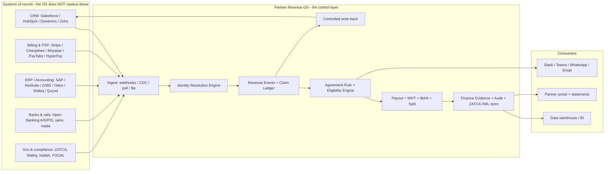

# Integration Layer & API / Data-Flows Manual

**Document type:** Capability & Architecture Manual (companion to the PDR and the End-to-End Business Workflow)
**Product:** Partner Revenue OS (revenue-sharing / partner-revenue control layer)
**Primary market lens:** Saudi Arabia — B2B, enterprise, compliance-ready finance & accounting
**Purpose of this document:** Build deep, ordered competence in the integration layer and API/data flows; catalogue every tool, product, and financial function the OS can connect to; specify the Saudi-specific rails and constraints; benchmark what Saudi corporates actually run and how they buy; and surface the overlooked patterns and levers.
**Writing rule:** Plain rationale. Every block answers *what it is*, *how the data flows*, and *why it matters* — in plain language.

> One-line thesis: **In this product the integration layer is not plumbing — it is the product.** Partner Revenue OS earns the right to "control the partnership" only by reading truth out of the systems where sales, finance, and money already live (CRM, billing, ERP, banks, tax authority), governing it, and writing a small amount of controlled truth back. Everything else is a feature on top of that data spine.

---

## 0. How to read this manual

This manual is deliberately layered so it doubles as a learning path and a build reference.

- **Part I — The Skill & Experience Ladder** (§1–§2): what to *learn and be able to do*, from basic to frontier, split into direct (engineering) and indirect (domain/compliance/commercial) skills. This is the "acquire skills and experience" ask.
- **Part II — Architecture & Data-Flow Model** (§3–§6): the reference architecture, the system-of-record map, the canonical objects, the sync patterns, and the financial-function coverage map.
- **Part III — The Integration Catalogue** (§7–§12): every connectable system, organised by financial function and by Saudi vs global, with mechanics, direction, priority, and plain rationale.
- **Part IV — Saudi Compliance & Money Rails** (§13–§16): ZATCA e-invoicing, VAT/WHT, payments & open banking, KYB & identity — the rails that make Saudi finance data legal and movable.
- **Part V — End-to-End Data-Flow Walkthroughs** (§17): the actual API/data flows, step by step.
- **Part VI — Market Benchmark & Local B2B Behaviour** (§18): what KSA corporates run by segment, how they buy and integrate, and a benchmark of the adjacent tool categories the OS coexists with.
- **Part VII — Overlooked Patterns & Levers, Phasing, Risks, Sources** (§19–§23).

It does not restate the PDR. Where the PDR (Section 12) and the Workflow doc (Part B) already define an integration, this manual goes deeper: the Saudi-specific mechanics, the data-flow detail, and the levers those documents do not name.

---

# PART I — THE SKILL & EXPERIENCE LADDER

## 1. Direct skills (the engineering craft of integrations)

"Direct" skills are the things a person/team must be able to *build and operate*. They are sequenced so each rung depends on the one below it.

### 1.1 Basic tier — "Move data safely, once"

**What you can do at this rung**
- Read and write a REST/JSON API with correct **auth** (API key header, HTTP Basic, OAuth2 authorization-code + refresh).
- Consume a **webhook** (verify signature, return `2xx` fast, then process asynchronously).
- Do **CSV import/export** with a preview-and-rollback step.
- Map fields between an external system and an internal object, and keep a record of that mapping.
- Page through large result sets and respect rate limits.

**What you must know (Saudi-aware from day one)**
- That a Saudi "tax invoice" is not just a row in a table — it is a legally cleared artifact (see §13). You will be reading invoice data whose authority lives at ZATCA, not in the ERP.
- That a partner record contains **personal data** (owners, signatories, IBAN) governed by PDPL (see §15).

**Proof of competence:** pull invoices + payments from one accounting system (e.g., Zoho Books or Wafeq) into the OS, map them to Revenue Events, and re-run the import idempotently without creating duplicates.

### 1.2 Mid tier — "Keep two systems in agreement over time"

**What you can do**
- Choose the right **sync pattern** per source: webhook / Change-Data-Capture (CDC) / polling / scheduled file — and know why (see §5).
- Implement **idempotency**: dedupe on a stable event ID with a cache that outlives the provider's retry window. (Stripe, Chargebee, and HubSpot all openly redeliver; assume **at-least-once** everywhere.)
- Build **retry with exponential backoff + jitter** and a **dead-letter queue (DLQ)** for events that exhaust retries.
- Implement **identity resolution / entity matching**: match a billing customer ↔ CRM account ↔ partner claim ↔ ERP vendor, with a human review queue for low-confidence matches.
- Run a **reconciliation job** that compares counts/keys between the OS and each source for a time window and raises exceptions.
- Manage **OAuth2 token lifecycles** (refresh, rotation, revocation) and **sandbox/test modes**.

**What you must know**
- The Saudi finance graph: invoice → collection → GL, and partner-payout = AP vendor bill. You cannot reconcile what you cannot map.
- WHT and VAT change the *net* number you reconcile to (see §14), so reconciliation must be tax-aware.

**Proof of competence:** keep the OS's Revenue Events in agreement with a CRM (via CDC) and a billing system (via webhooks) for 30 days with zero double-counted revenue and a clean exception queue; demonstrate replay after an outage.

### 1.3 Advanced tier — "Govern money-grade data across many systems"

**What you can do**
- Implement the **transactional outbox / event-sourcing** pattern so a domain event and the state change that produced it are persisted atomically, then published — no lost write-backs, no phantom payouts.
- Build **multi-party settlement** flows: collect → split → disburse to third-party IBANs, with **clawback** (refund/transfer-reversal) semantics that stay correct under refunds, downgrades, cancellations, and chargebacks.
- Operate **tiered consistency**: retries handle the *minutes*, replay handles the *hours*, reconciliation handles *everything else*. Know which tier owns which failure.
- Handle **schema drift** (a source adds/renames/removes a field) without breaking the pipeline or silently dropping data.
- Build **CRM write-back** that is selective, controlled, and reversible (write only what sales needs; never leak payout detail into CRM unless configured).
- Stand up **SSO (SAML/OIDC) + SCIM** for internal *and* external partner users, including instant deprovisioning.

**What you must know**
- The ZATCA clearance handshake end-to-end (CSID onboarding, UBL 2.1, ECDSA/SHA-256 stamp, PIH/ICV hash chain) and why the *cleared XML* — not the ERP row — is the canonical payout evidence.
- The split-payout primitives of PayTabs / Tap / Moyasar / Stripe Connect / Adyen and how `application_fee` / `destinations` / transfer-reversals map to "platform margin / partner share / clawback."

**Proof of competence:** run a full revenue-share cycle — verify partner, prove revenue from billing + cleared ZATCA invoice, compute eligibility net of WHT, disburse a split via a PSP to a validated IBAN, import payment status, and reconcile the disbursement against the settlement report — with a complete audit trail.

### 1.4 Frontier tier — "Make the integration layer a moat"

**What you can do**
- Treat **unified-API aggregators** (Merge, Codat, Rutter, Apideck) as a strategic accelerant for the long tail (dozens of accounting/CRM vendors), while hand-building native connectors for the *revenue-critical* paths (Stripe Connect, Salesforce CDC, ZATCA) where you need full event fidelity.
- Build an **Identity Resolution Engine** and **Ecosystem Touchpoint Ledger** (per the Workflow doc's Hub gap analysis) that fuse CRM + billing + marketplace + marketing + support signals into one contribution graph.
- Run **reverse-ETL** (warehouse → operational tools) so computed commissions/statements flow back into CRM/billing automatically.
- Design for **in-Kingdom data residency** and a **data-classification scheme** so the same product can pass an enterprise/bank security review (NCA ECC/CCC, SAMA CSF, CST cloud class).
- Build **continuous KYB monitoring** (re-poll Wathq / screening) so partner eligibility degrades automatically when a CR lapses or a sanction hits.

**What you must know**
- The full regulatory perimeter (§13–§16) as *design constraints*, not afterthoughts.
- The market forces (§18) that decide which integrations create the most enterprise pull.

**Proof of competence:** a buyer's IT/security and finance functions both sign off — security on residency/ECC/PDPL, finance on reconciliation and ZATCA evidence — without custom one-off work.

## 2. Indirect skills (the domain knowledge that makes integrations *correct*)

Indirect skills are not code. They are the knowledge without which a technically perfect integration produces wrong money. They matter as much as the engineering.

| Domain | What to learn | Why it matters (plain) |
|---|---|---|
| **Saudi e-invoicing (ZATCA Fatoora)** | Clearance vs reporting model; EGS/CSID onboarding; UBL 2.1; cryptographic stamp; PIH/ICV chain; QR TLV; wave thresholds | The invoice is only finance-valid once ZATCA clears it. Your payout evidence is the cleared XML, not the ERP row. |
| **VAT (15%) & Withholding Tax** | VAT invoice fields & 15-digit VAT IDs; WHT rates (5/15/20%) on payments to non-residents; remittance timing; treaty relief | If a partner is outside KSA you must withhold the right rate at payout and net it — get the rate wrong and you create a tax liability. |
| **PDPL / data residency** | Controller vs processor, SCCs + Transfer Risk Assessment, 72-hour breach, in-Kingdom expectations | Partner/IBAN/owner data is personal data. Mishandling cross-border transfer fails procurement and risks penalties. |
| **NCA ECC/CCC, SAMA CSF, CST cloud classes** | What enterprise/bank buyers flow down to a SaaS vendor | These gate procurement. No amount of features rescues a product that can't pass the security review. |
| **Saudi money rails** | mada vs sarie vs SADAD; IBAN structure & MOD-97; open banking AIS/PIS; that non-banks reach rails via a sponsor/licensee | Determines *how* you can actually move a partner's share, and that you likely move it through a licensed partner, not directly. |
| **KYB / commercial registry** | Wathq objects (CR, owners, managers, capital, activities, address); the 2025 unified CR; that ID/labour APIs are gated | You must verify the legal entity and authorized signatory before releasing money; most gov data is reached via aggregators. |
| **Finance operating model** | AR/AP, collections, revenue recognition, credit notes, multi-entity, multi-currency, reconciliation | The OS speaks finance's language only if you understand the objects finance actually books. |
| **Partner-revenue commercial logic** | Attribution vs eligibility; protection windows; revenue-share vs one-time commission; clawback on refund/churn | The integration exists to feed governed commercial decisions; wrong mental model → wrong rules → disputes. |
| **Procurement & buying behaviour (KSA)** | SI-led delivery, middleware reality, consolidation pressure, residency demands | Tells you which integrations to prioritise and how a deal actually gets bought and deployed (see §18). |

**Plain rationale for the whole ladder:** a junior can move a CSV; a senior keeps two systems honest; an expert moves money correctly across many systems under Saudi law; the frontier turns all of that into something a bank's security team and a CFO will both sign. The product's moat is the accumulated, governed event history — and that only accrues if the integration layer is built in this order.

---

# PART II — ARCHITECTURE & DATA-FLOW MODEL

## 3. The integration layer in one picture

**Plain rationale:** the OS sits *between* the systems that own truth and the people who must act on it. It never tries to be the CRM or the ERP. It ingests, resolves identity, governs, computes money, proves it, and pushes a thin controlled signal back. That posture (the PDR calls it "overlay + integrations first") is what makes it adoptable inside an enterprise.

## 4. The system-of-record map (who owns what)

Getting this wrong is the single most common cause of double-counting and disputes. Memorise it.

| Truth | System of record | OS role |
|---|---|---|
| Accounts, contacts, opportunities, sales stage, owner | **CRM** | Read; selective write-back |
| Subscription, invoice issued, collection, refund, churn | **Billing / subscription / PSP** | Read (this is *revenue reality*) |
| AR invoice, AP vendor bill, payment, GL, tax line, credit note | **ERP / accounting** | Read; later export approved payouts |
| Legally valid tax invoice (cleared) | **ZATCA Fatoora** | Read references; store cleared XML as evidence |
| Bank balance, statement, account ownership | **Bank / open-banking AIS** | Read (verification + reconciliation) |
| Money movement (collect / split / disburse) | **PSP / open-banking PIS / sarie** | Initiate + import status |
| Legal entity, CR, owners, signatory | **Wathq / Commercial Registry** | Read (KYB) |
| **Partner revenue claim, attribution decision, protection window, agreement rule, payout eligibility, dispute, partner statement** | **Partner Revenue OS** | **Own** |

**Plain rationale:** the OS only becomes the system of record for things no other system governs — the *claim* that a partner contributed and what they're therefore owed. Everything financial it asserts must be traceable back to a system that legitimately owns that fact.

## 5. Sync patterns — choose deliberately, per source

| Pattern | Use when | Watch out for |
|---|---|---|
| **Webhooks** (push) | Source emits events you care about (billing paid, contract signed, deal stage change) | At-least-once delivery → **dedupe**; some providers send **duplicate** events (HubSpot explicitly); return `2xx` fast then process async |
| **Change Data Capture / event bus** | Salesforce (CDC + Pub/Sub API, 72h retention, Replay IDs), Dataverse (change-tracking delta tokens) | Replay window is finite — pair with reconciliation for gaps beyond it |
| **Polling** (pull on schedule) | Source has weak/limited webhooks (Zoho CRM workflow webhooks; Qoyod likely poll-based) | Latency + rate limits; use delta filters (`modifiedon`/updated-since) |
| **Bulk / batch API** | Initial backfill, periodic full reconcile | Counts against shared limits (Salesforce Bulk allocations) |
| **Scheduled file / SFTP / report export** | On-prem ERPs (SAP ECC, Oracle EBS, Tally) and systems with no live API | Stale by design; treat as reference, schedule reconciliation |
| **Unified-API aggregator** | Long tail of accounting/CRM vendors you won't build natively | Some cache (lag); pass-through (Apideck) avoids it; less event fidelity than native |

**The consistency doctrine (commit this to memory):** *retries handle the minutes, replay handles the hours, reconciliation handles everything else.* Every financial integration needs all three tiers, because at-least-once delivery and finite replay windows guarantee that some events will only ever be recovered by a reconciliation sweep.

## 6. Financial-function coverage map — "connect as many financial functions as possible"

This is the answer to "identify the API/data flows … using as many … financial functions as you can." Each finance function is fed by a specific integration and a specific data object.

| Financial function | Feeding integration(s) | Key object / event | Why the OS needs it |
|---|---|---|---|
| **Accounts Receivable (revenue)** | ERP / accounting, billing | AR invoice, invoice line, tax line | Proves the partner-attributed deal became billable revenue |
| **Collections / cash application** | Billing/PSP, ERP, **open-banking AIS** | payment receipt, `invoice.paid`, bank credit | Commission should accrue on *collected* cash, not just invoiced |
| **Revenue recognition** | ERP (NetSuite/SAP/Fusion/D365 rev-rec), billing (Maxio) | recognition schedule, journal entry | For usage/subscription, the partner has a claim on a *stream*, not a snapshot |
| **Accounts Payable (partner payout)** | ERP AP, PSP payouts | vendor bill, payout/transfer | The partner's commission is your AP — this is the disbursement |
| **Tax — VAT** | ZATCA Fatoora, ERP tax lines | 15% VAT line, 15-digit VAT ID | Commission invoices must carry correct VAT and be cleared |
| **Tax — Withholding (WHT)** | OS WHT engine + ERP | WHT record, net-of-WHT amount | Cross-border partner payments must be withheld at source (5/15/20%) |
| **e-Invoicing / statutory invoice** | ZATCA Fatoora API | cleared UBL 2.1 XML, UUID, stamp, QR | The legal artifact behind every payout and revenue claim |
| **Treasury / payouts / settlement** | PSP split, **sarie** instant, bank files | disbursement, settlement report, `balance_transaction` | Moves the partner's share and lets you reconcile it |
| **Bank reconciliation** | Open-banking AIS, bank statements | account balance, transaction line | Match disbursement ⇄ bank debit; match collection ⇄ bank credit |
| **FX / multi-currency** | ERP, PSP | currency, FX rate, residual | GCC/global partners get paid in multiple currencies |
| **Credit notes / refunds / chargebacks** | Billing/PSP, ERP | credit memo, refund, dispute | Trigger **clawback** of already-accrued commission |
| **Audit & evidence** | All of the above | audit log, evidence provenance, cleared XML | CFO/legal/dispute defensibility |
| **KYB / payout readiness** | Wathq, FOCAL/Uqudo, IBAN validation | CR record, screening result, validated IBAN | Gate: don't pay an unverified or sanctioned entity |
| **Cost-to-serve (Partner P&L)** | Support/CS, marketing, billing | ticket cost, co-marketing spend | Net partner economics, not just gross revenue |

**Plain rationale:** "revenue sharing" touches almost every finance function. If the OS only reads CRM, it is a PRM. If it reads and reconciles across AR, AP, collections, tax, treasury, and bank — it is the finance-grade control layer the PDR describes.

---

# PART III — THE INTEGRATION CATALOGUE

> Direction key: **R** read, **W** write, **R/W** both. Priority maps to PDR roadmap (MVP / V1 / V2 / V3).
> Confidence: most rows are well-sourced; **[verify]** marks a claim a build team must confirm against live docs (see §22).

## 7. CRM & sales-motion integrations

| System | Mechanics | Objects (R) / Write-back (W) | Priority | Why (plain) |
|---|---|---|---|---|
| **Salesforce** | REST/SOAP; **Bulk API 2.0** (backfill); **Composite** (bundle ≤25); **CDC + Pub/Sub API** (gRPC, 72h retention, Replay IDs); ship as **AppExchange managed package** | R: account, contact, lead, opportunity, stage, owner, product, amount, close date, source/campaign, custom partner fields. W: partner involved/name/role, claim ID, attribution status, protection expiry, payout-eligible flag, dispute flag, OS link | MVP→V1 | CRM is where pipeline lives; CDC gives a recoverable change stream, not lossy polling |
| **HubSpot** | CRM API v3 (objects) + v4 Associations; **Webhooks** (property change/creation) in a marketplace app | Same object set; **dedupe** — HubSpot warns of duplicate webhook deliveries | MVP→V1 | Common in KSA SMB/mid-market; webhooks need dedup |
| **Microsoft Dynamics 365 / Dataverse** | **Web API (OData v4)**; change-tracking delta tokens or `modifiedon`; **webhooks** (fan-out via Azure Service Bus for reliability) | Same object set | V1 | Strong in KSA enterprise/gov where Microsoft estate exists |
| **Zoho CRM** | v8 webhooks attached to **workflow rules** (≤6/rule, ≤10 fields) — low fidelity | Pair webhooks (notify) with polling (authoritative) | V1 | Popular KSA SMB; treat webhooks as notifications only |

## 8. Accounting & ERP integrations — Saudi-localised (the heart of revenue proof)

### 8.1 Local Saudi / ZATCA-native SaaS (SMB–mid-market install base)

| System | API mechanics | Objects | Integration ease | Why (plain) |
|---|---|---|---|---|
| **Wafeq** | Full REST (`api.wafeq.com/v1`), OAuth/key; ZATCA Phase-2 integrated (even exposes a ZATCA-reporting API) | invoices, bills, contacts (customers/vendors), **manual journals**, chart of accounts, payments — every txn journal-backed | **Easy / best** | Both AR (revenue) and AP (payout) reconciliation in one clean API |
| **Qoyod** | REST/JSON, `API-KEY` header; ZATCA Phase-2 certified; Zapier/Foodics/Geidea/Zid connectors | ~19 resources: invoices, customers, products, payments | Easy (webhooks likely **poll** [verify]) | Widely used SMB accounting; good read source |
| **Daftra** | Public API + ZATCA Phase-2 | invoices, clients, payments, suppliers/purchases, advance payments | Easy–moderate ([verify] webhook/journal breadth) | SMB accounting+invoicing+inventory |
| **Mezan** | Native ZATCA; **public API not confirmed** [verify] | — | Unknown | Priced under ZATCA's SAR 2,500 reimbursement ceiling; may be export-only |
| **Rewaa** | Native Fatoora API; retail **POS**/inventory | POS sales as revenue events; settlement | Moderate | Where partner revenue is point-of-sale/retail |
| **Salla** (commerce) | `docs.salla.dev`; App + Store **webhooks** (order create/update) | orders, products, customers, shipments | Easy / real-time | Best real-time GMV-attribution source if partners drive e-commerce |
| **Zid** (commerce) | Merchant API (JSON, key auth) + **webhooks** (`order.create`, `order.status.update`) | orders, products, customers, inventory | Easy / real-time | Same; pair GMV with the merchant's accounting for recognised revenue |
| **Edara / Onyx Pro / Focus** | Edara cloud connectors; Onyx & Focus often on-prem | varies | Harder / export-oriented | Traditional SMB/mid-market; treat as file/DB-level |

### 8.2 Global ERP/accounting localised for KSA (mid–large enterprise)

| System | API mechanics | Objects | Ease | Why (plain) |
|---|---|---|---|---|
| **Oracle NetSuite** | **SuiteTalk REST** (`/services/rest/record/v1/...`) + **SuiteQL**; Saudi E-Invoicing SuiteApp (direct Fatoora) | invoice, vendorbill, customerpayment, customer, vendor, journalentry, creditmemo | **Easy — top target** | KSA mid-market leader, well-documented, read-friendly |
| **Zoho Books** | REST v3 (OAuth2) + **webhooks**; ZATCA-approved (direct Fatoora push) | invoices, contacts, customerpayments, bills, vendorpayments, chartofaccounts, journals, creditnotes | Easy | One of the easiest global tools to read |
| **Odoo** | **XML-RPC / JSON-RPC** (REST via OCA); ZATCA via `l10n_sa` + `l10n_sa_edi` (sandbox/sim/prod) | `account.move` (invoices, bills, journals — unified), `account.payment`, `res.partner` | Easy | Unified `account.move` model is convenient; fast-growing in KSA |
| **Microsoft Dynamics 365** | **OData/REST**; F&O data entities; **Business Central** OData v4 + webhooks; MS Electronic Invoicing for ZATCA | AR/AP invoices, customers/vendors, payments, GL journals | Easy (BC) / Moderate (F&O) | Strong KSA mid/large presence |
| **SAP S/4HANA & Business One** | OData/REST (strategic) + legacy **BAPI/RFC/IDoc**; **SAP Document & Reporting Compliance** + Integration Suite for ZATCA; B1 Service Layer + DI-API | AR/AP invoices, journal entries, GL, business partners, payments | **Hard — via middleware/SI** | Dominant in KSA large enterprise/gov (Aramco, SABIC, STC, giga-projects) |
| **Oracle Fusion Cloud / E-Business Suite** | Fusion REST (`/invoices`, AR, payments, GL) but **OIC-favoured**; EBS via REST/SOAP/PL-SQL/middleware | AP/AR invoices, receipts, GL journals | Moderate–hard (OIC-gated) | Large enterprise; ZATCA usually via 3rd-party (Complyance/Accqrate) |
| **Sage (X3/300/200)** | X3 REST/SOAP web services; ZATCA via partners (Greytrix) | invoices, payments, GL | Moderate (product-fragmented) | Some KSA mid/large install base |
| **QuickBooks Online / Xero** | Solid REST (OAuth2); Xero webhooks | invoices, bills, payments, journals | Easy API, **but not native ZATCA** | KSA compliance bolted on via connectors (InvoiceQ/avtax) — weaker fit |
| **Tally / Focus** | Tally on-prem XML/HTTP gateway (ZATCA-accredited); Focus cloud APIs | invoices, vouchers | Hard (on-prem/export) | Common in traditional trading SMBs |

**Plain rationale & lever:** the install base is *wide and fragmented*. Hand-build the read connector once for the **revenue-critical, high-share** systems (NetSuite, Zoho, Odoo, D365 BC, Wafeq, Qoyod, Salla, Zid), reach the on-prem giants (SAP ECC/S4, Oracle EBS, Tally) **via middleware or the customer's SI**, and cover the long tail with a **unified accounting API (Codat)**. Also note: many KSA enterprises already route invoices through a **ZATCA compliance middleware** (Complyance, Accqrate, ClearTax, InvoiceQ) — that middleware is itself a clean, normalised read source you can integrate once instead of N times.

## 9. Billing / subscription & revenue-proof integrations

| System | Mechanics & key events | Why (plain) |
|---|---|---|
| **Stripe Billing** | Webhooks: `invoice.paid` (revenue materialised), `invoice.payment_failed`, `charge.refunded`, `charge.dispute.created`; events retrievable 30 days | `invoice.paid` is your **proof event**; refund/dispute drive **clawback** |
| **Chargebee** | All changes are events → webhooks; retries with backoff up to 2 days; **duplicate delivery possible** | Dedup required; strong subscription coverage |
| **Zuora / Recurly / Maxio / Paddle** | Zuora event-driven [verify reliability]; Recurly dunning events; Maxio adds GAAP rev-rec + usage; **Paddle = Merchant of Record** | For MoR (Paddle) you never see the raw charge → reconcile against *their payout reports* |
| **HyperPay / Moyasar / PayTabs / Geidea** (KSA PSPs) | REST + webhooks; see §15 for split-payout detail | These prove collection in the local market and double as payout rails |

**Plain rationale:** billing tells the OS whether attributed pipeline became invoice → collection → renewal → refund → churn. Accrue commission on **collected** revenue; reverse it on refund/chargeback. This is the difference between a defensible payout and an overpayment.

## 10. Money movement, marketplace split & payout integrations

This is the execution core of revenue-sharing. (Saudi rails detailed in §15; here is the capability shape.)

| Platform | Split / multi-party primitive | Clawback | Reconciliation key |
|---|---|---|---|
| **Stripe Connect** | Destination charges (`transfer_data[destination]`, `application_fee_amount`), Direct charges, or **separate charges & transfers** (one charge → many `Transfer`s) | **Transfer reversals** (full/partial, can refund the app fee) | `balance_transaction` ID |
| **Adyen for Platforms** | **Split instructions** at auth/capture/refund into multiple balance accounts; reusable split profiles | split refunds | `balancePlatform.transfer.*` webhooks |
| **PayTabs** (KSA) | **Split Payout** (one txn across beneficiaries) + **External Payout** (disburse to third parties) + escrow-style hold | via payout adjustments | dashboard + API |
| **Tap Payments** (KSA) | `destinations` object on Charges API (split across Destination IDs; remainder to master wallet) | refunds | webhooks |
| **Moyasar** (KSA) | **Payouts API**: Payout Account → Payout → Destination; explicitly supports paying vendors/gig + revenue split | payout reversal | webhooks |

**Plain rationale:** `application_fee` / split = **your platform margin**; the transfer/destination = **the partner's share**; the reversal/split-refund = **clawback**. Build this only after attribution and eligibility are trusted — automating payment before entitlement is trusted just amplifies financial risk (PDR §12.12).

## 11. CPQ, CLM/e-signature, identity, warehouse, comms, support

| Category | Systems | Mechanics / events | Why (plain) |
|---|---|---|---|
| **CPQ / product catalog** | Salesforce CPQ, DealHub, Oracle/SAP CPQ, PROS | **quote lines**: SKU, base price, qty, term, discount | Commission rate often depends on product/margin/term — read the quote line |
| **CLM / e-signature** | DocuSign (Connect), Adobe Acrobat Sign, PandaDoc, Ironclad [verify] | webhook on envelope/agreement **completed/signed** + metadata (effective/expiry, parties, terms) | The signed event is the clean, auditable "deal is real / agreement active" trigger |
| **Identity / SSO + SCIM** | Okta, Microsoft Entra ID, Auth0 (also Nafath — §16) | **SAML/OIDC** SSO + **SCIM 2.0** (separate app integrations); instant deprovisioning | Internal *and* external partner users; a churned partner rep must lose access immediately |
| **Data warehouse / BI** | Snowflake, BigQuery, Redshift, Databricks; Power BI, Tableau, Looker | Export governed partner-revenue tables + data dictionary | Be system-of-truth *and* let data flow out — portability builds enterprise trust |
| **ELT / reverse-ETL / iPaaS** | Fivetran (+Census), Airbyte, Hightouch, RudderStack; Workato, MuleSoft, Boomi, Tray | ELT in; **reverse-ETL** pushes computed commissions/statements back to CRM/billing; iPaaS orchestrates the long tail | Closes the loop and absorbs connectors you won't build natively |
| **Communication** | Slack, Microsoft Teams, **WhatsApp Business Cloud API**, email | webhooks/notifications; WhatsApp shifted to **per-delivered-template pricing (Jul 2025)** [plan cost] | Approvals, exceptions, partner-statement-ready alerts — human-in-the-loop with audit trail |
| **Ticketing / support / CS** | Zendesk, Freshdesk, Jira SM, ServiceNow, Intercom; Gainsight/Totango/ChurnZero | webhooks; tickets, health scores, renewal/expansion risk | Post-sale partner contribution (implementation/adoption) + support cost into Partner P&L |
| **Marketing / campaign** | HubSpot Mktg, Marketo, SFMC, Mailchimp, webinar/event tools | campaign/UTM/lead-source, partner co-marketing source | Capture partner *influence before* a sales opportunity exists |
| **Marketplace / co-sell** | AWS/Azure/GCP marketplaces; Tackle, WorkSpan | private offers, co-sell refs, transaction IDs/status | Marketplace motion is underreported in CRM; unify it with claims |

## 12. Unified-API & "buy vs build" accelerants

| Aggregator | Strength | Use it for |
|---|---|---|
| **Codat** | Accounting/fintech depth; normalises NetSuite ⇄ QuickBooks ⇄ Xero ⇄ … | The accounting long tail — one integration, many ERPs |
| **Merge.dev** | Broadest category coverage (HRIS, CRM, accounting, ticketing) | Fast coverage across categories |
| **Rutter** | E-commerce/commerce normalisation | Commerce/GMV sources |
| **Apideck** | Real-time **pass-through** (no cache lag) | When you need fresh reads, not cached |

**Plain rationale & the core lever:** *native where it's revenue-critical, unified-API where it's the long tail.* You cannot hand-build and maintain 40 accounting connectors; you also cannot afford a cache-lagged aggregator on the Stripe Connect payout path. Split the estate deliberately.

---

# PART IV — SAUDI COMPLIANCE & MONEY RAILS

> These are not "nice to have localisation." They are the rails that make Saudi finance data **legal** and **movable**, and they are hard constraints on every data flow above.

## 13. ZATCA e-invoicing (Fatoora) — Phase 2, the hardest and most important integration

**What it is.** Phase 2 ("Integration Phase") is a Continuous Transaction Control regime. Any component of the OS that issues invoices (e.g., partner commission invoices, B2B billing) is an **EGS** (E-invoice Generating Solution) that must connect to ZATCA's Fatoora platform.

**The design fork (decide early):**
- **Clearance model — B2B / B2G "standard tax invoices."** XML is sent to ZATCA's **Clearance API in real time**; the invoice is **legally valid only after** ZATCA validates it, applies its cryptographic stamp, and returns the cleared XML + QR. You cannot share it with the buyer until cleared. *Partner commission invoices are almost always standard → clearance.*
- **Reporting model — B2C "simplified tax invoices."** Stamped locally by the EGS, then **reported to ZATCA within 24 hours.**

**EGS onboarding / API flow** (REST/JSON; certificate-based trust):
1. **OTP** from the Fatoora portal (valid ~1 hour) authorises the EGS unit.
2. EGS generates a **CSR** (Certificate Signing Request).
3. **Compliance CSID API** — submit CSR + OTP → receive a **Compliance CSID** (test cert) → run mandatory compliance checks (sample standard/simplified invoices + notes).
4. **Production CSID API** — exchange compliance CSID → receive the **Production CSID** for live clearance/reporting. Renewal repeats the flow.
5. **Auth:** HTTP **Basic** — `Authorization: Basic base64(binarySecurityToken : secret)`, where the token is the CSID.

**Data & anti-tamper:**
- **XML in UBL 2.1** (invoice / credit note / debit note); simplified can be PDF/A-3 with embedded XML.
- **Cryptographic stamp:** ECDSA signature + SHA-256 hash, keyed by the CSID.
- **Hash chaining:** every invoice carries the **Previous Invoice Hash (PIH)** + an **Invoice Counter Value (ICV)** — an unbroken chain so no invoice can be inserted/deleted/altered retroactively.
- **QR:** Base64 **TLV** (Tag-Length-Value), Phase-2 carries 9 tags (seller, VAT no., timestamp, totals, VAT amount, hash, stamp/public key).

**Rollout (2025–2026):** waves by turnover, notified ≥6 months ahead. **Wave 23** (> SAR 750k) go-live by **31 Mar 2026**; **Wave 24** (> SAR 375k) **1 Apr–30 Jun 2026**. Thresholds descend each wave → effectively the whole VAT-registered base. **Assume your enterprise buyers are already live.**

**Why it matters (plain):** the invoice behind a payout is not finance-valid until ZATCA clears it. Your "finance evidence pack" must store the **cleared XML + ZATCA stamp/UUID + the PIH chain** as the canonical record. This is the single hardest integration and the one that most differentiates a serious KSA finance product. **[verify]** exact endpoint paths, CSID validity, sandbox URLs against ZATCA's *Detailed Technical Guideline* / Developer Portal manual before build.

## 14. VAT & Withholding Tax — the numbers that change the payout

- **VAT — 15%** since July 2020. Tax invoice needs supplier name + **15-digit VAT registration number** (not required below SAR 1,000), date, line items, total incl. VAT, VAT amount. VAT rides the same UBL/clearance pipeline.
- **Withholding Tax (WHT)** — applies when a Saudi resident/PE pays a **non-resident** for KSA-sourced income. Indicative rates: dividends/interest **5%**, royalties **15%**, technical/consulting services **5%**, management fees **20%**, head-office/other **~15%**. Remit to ZATCA **within the first 10 days of the month after payment**. Tax treaties (DTTs) can reduce/eliminate if the payee is the beneficial owner and provides documentation.

**Why it matters (plain):** if a partner sits **outside KSA**, the OS must **withhold the correct rate at payout**, net it from the eligible amount, generate a WHT record, and handle treaty relief. Misclassifying a service (5% vs 15% vs 20%) changes the net payout and creates liability. **Build a WHT engine; don't bolt it on.** **[verify]** treaty application is case-specific — route through a tax advisor.

## 15. Payments, open banking & settlement — how the partner's share actually moves

**SAMA Open Banking Framework.** Release 1 = **Account Information Services (AIS)** (issued Nov 2022; banks live Q1 2023). Release 2 = **Payment Initiation Services (PIS)** + Confirmation of Availability of Funds (Sept 2024). APIs follow the UK OBIE-style standard, secured with a **FAPI** profile (mTLS, signed JWS request objects, explicit consent). The **Open Banking Lab** is a mandatory sandbox + conformance gate. **Key 2026 shift:** on **26 March 2026** SAMA moved open banking from sandbox to a **fully licensed activity**; **Lean Technologies** became the **first licensed open-banking provider** (Major Payment Institution licence).

**How you connect:** either become SAMA-licensed yourself (multi-quarter), or — faster — go **through a licensed aggregator** under their licence:
- **Lean Technologies** — Data (account verification, balances, transactions, income/cash-flow) + Payments (PIS, instant A2A "pay by bank", payouts). First SAMA licensee; single REST API. Best fit for both reconciliation and A2A collection.
- **Tarabut** — SAMA-certified AIS; **Income Verification** (real-time salary/income from bank data — useful for KYC). REST, consent-driven.
- **Spare** — AIS + Payment Initiation. **Ozone API** — bank-side standards platform (only if you operate the bank side). **Salt Edge** — aggregation.

**Core rails:**
- **sarie** — national **24/7 real-time** instant payments on **ISO 20022**; P2P/P2B/**B2B**; IBAN-addressed + alias (IPA) layer. **This is the rail for instant partner payouts.** Non-banks typically reach it **via a sponsor bank or licensed PI** [verify access path + per-txn limits].
- **mada** — domestic debit/POS/ATM acceptance (pay-in), >90% of domestic card value; not a payout rail.
- **SADAD** — national bill-payment (collections via biller reference); not for paying partners.
- **IBAN** — Saudi IBAN is **24 chars**: `SA` + 2 check digits + **2-digit SAMA bank code** + 18-digit BBAN. **Validate every partner IBAN** (format + **MOD-97** + valid bank code) before payout to prevent failed/misrouted disbursements. BIC for Saudi banks commonly ends `…SARI`.

**PSP split-payout capability (most critical for revenue-sharing):** see §10 table. **PayTabs, Tap, and Moyasar** have explicit split/marketplace/payout primitives and are the strongest local candidates; HyperPay has Alias Pay (partial); Geidea/Amazon Payment Services split-to-third-party is **[verify]**; Tamara/Tabby are BNPL **pay-in only** (merchant paid ~T+1).

**WPS / Mudad — keep separate.** The Wage Protection System / Mudad governs **employer-to-employee wages**, not commercial B2B partner commissions. If partners are companies/contractors, route payouts through **sarie/PSP rails, not WPS**. Misclassifying partner payouts as wages would wrongly pull you into WPS.

**Escrow / funds-holding.** PayTabs offers escrow-style hold + split (closest turnkey); e-money licensees (Tweeq, Barq) and BaaS (Jeel) can hold/disburse. **Holding partner funds generally requires an e-money/payment-institution licence or a sponsor that has one — [verify] with SAMA before architecting fund-holding.**

**Why it matters (plain):** the recommended shape is — validate IBAN → use **AIS** (Lean/Tarabut) for revenue validation & bank reconciliation → collect via mada/cards or **PIS** → **split & disburse** via PayTabs/Tap/Moyasar landing on **sarie** → keep it all out of WPS.

## 16. KYB, identity & government data — verify before you pay

**Access reality first (plain):** almost every authoritative Saudi gov data source is **gated** to licensed/regulated entities. A private SaaS realistically consumes them **through aggregators** (Elm, Mozn, Uqudo), not direct government contracts. Plan for this.

| Service | What it gives | Access | Why (plain) |
|---|---|---|---|
| **Wathq** (`developer.wathq.sa`) | **KYB backbone**: CR (trade name, number, status, capital, activities), **owners & managers**, new-legislation CR endpoint, CR search, Articles of Association, Power of Attorney, deeds, business National Address | **Paid subscription, open to businesses** (basic free tier; rate limits ~5 req/s) | Verify the legal entity + authorized signatory before releasing commission — most accessible authoritative source |
| **Nafath** (national SSO) | Government-grade login; verified national/Iqama ID, name, status | **Via Elm / TCC-licensed provider + SDAIA key** | Strong login + confirms the human signatory is real |
| **Yakeen/Yaqeen** (Elm) | ID/Iqama lookups (name, DOB, nationality, status) | **Gated to regulated entities** (SAMA rulebook) | Confirms an individual is real and active |
| **National Address / SPL** (`api.address.gov.sa`) | Address verify, geocode, district lookup | **Free self-signup** | Validate registered business address for payout records |
| **ZATCA VAT lookup** | Verify VAT status by VAT no./cert/CR | **Web lookup; clean programmatic API uncertain** [verify] | Confirm the partner can legitimately invoice you VAT |
| **GOSI / Qiwa / Muqeem / Mudad** | Employer/labour status, Saudization/Nitaqat | **Employer portals; no open self-serve API** | Optional context, not a hard gate — deprioritise |
| **Etimad** | Government tenders/supplier/contract & financial claims | Supplier file via Nafath; **no clear open API** | Only relevant if partners transact with government |

**KYB / AML / sanctions vendors (the practical path to compliance via one API):**
- **Mozn — FOCAL:** KSA-built, **locally hosted**, **SAMA-aligned**, **Yakeen integration** + gov-DB access; screens **1,300+ watchlists** (UN/OFAC/EU sanctions, PEPs, RCAs), real-time. Strongest *local* fit (notes a UBO-depth gap for complex ownership).
- **Uqudo:** KYC/AML; Saudi ID/Iqama/licence verification + biometric liveness (`SAU_ID`).
- **Sumsub + ComplyAdvantage:** full KYC/**KYB/UBO** + sanctions/PEP/**adverse media** — strong on corporate structures.
- **IDMerit; Refinitiv World-Check** (underlying watchlist data). *(**Tahaluf** appears to be an events/data company, not an AML vendor — [verify] the intended vendor.)*

**Note for the data model:** the **Unified Commercial Register** (effective **3 Apr 2025**, transition to 2030) **abolishes branch CRs** — one CR covers all regions/activities. Do not assume one-CR-per-branch; use Wathq's new-legislation endpoint.

**Why it matters (plain):** payout-readiness is more than attribution. Finance needs a **verified legal entity, valid CR, real VAT number, validated IBAN, and a clean sanctions/PEP screen on the entity and its owners** before money moves. In regulated/finance-adjacent sectors this is a hard gate.

---

# PART V — END-TO-END DATA-FLOW WALKTHROUGHS

## 17. The flows that matter, step by step

### 17.1 Partner onboarding & KYB (payout-readiness gate)
1. Partner submits legal/commercial info in the portal (CR number, VAT number, IBAN, signatory).
2. OS calls **Wathq** → confirm CR status, capital, activities, **owners/managers**; match the submitted signatory to a listed manager/PoA.
3. OS calls **National Address / SPL** → validate registered address.
4. OS validates **IBAN** (format + MOD-97 + bank code) and (optionally, via AIS) confirms account ownership.
5. OS calls **FOCAL/Uqudo** → sanctions/PEP/adverse-media screen on entity **and** owners/UBOs.
6. OS verifies VAT status (ZATCA lookup / aggregator).
7. All artifacts stored with provenance → partner reaches **payout-ready** only if every check passes; failures route to a review queue.
**Plain rationale:** this turns "we trust this partner" into evidence a CFO and an auditor will accept.

### 17.2 Revenue proof (does the attributed deal actually exist as money?)
1. **CRM CDC** event: opportunity → closed-won → OS updates the linked claim's revenue status.
2. **Billing webhook**: `invoice.paid` (Stripe/Chargebee/Moyasar) → OS creates/updates a **Revenue Event** (collected, not just invoiced).
3. OS references the **ZATCA cleared XML** for that invoice (UUID, stamp, PIH) and stores it as evidence.
4. **ERP read** (NetSuite/SAP/Wafeq) confirms the AR invoice + GL posting for reconciliation.
5. Refund/credit-note/chargeback events reduce the Revenue Event and flag **clawback**.
**Plain rationale:** commission accrues on proven, collected, statutorily-cleared revenue — not on a hopeful CRM stage.

### 17.3 Payout with WHT, split & instant settlement
1. Claim is attribution-accepted + protection-valid + revenue-validated → **eligibility engine** computes gross payout from the agreement rule.
2. **WHT engine**: if partner is non-resident, withhold the correct rate, net the amount, create a WHT record (remit within 10 days of month-end).
3. Generate the partner commission invoice → **ZATCA clearance** → store cleared XML.
4. **PSP split / payout** (PayTabs/Tap/Moyasar) or **PIS/sarie** disburses the net share to the validated IBAN; your platform fee is the `application_fee`/retained split.
5. Import **payment status** + settlement report; update partner statement.
6. **Reconcile** disbursement ⇄ bank debit (AIS) ⇄ settlement `balance_transaction`.
**Plain rationale:** every riyal that leaves is correct, taxed, cleared, traceable, and reconciled.

### 17.4 Reconciliation & exception handling (the always-on backstop)
- Scheduled job compares OS Revenue Events / payouts against billing, ERP, PSP settlement, and bank (AIS) for each window.
- Mismatches → exception queue → finance task; *retries handled the minutes, replay handled the hours, this handles the rest.*
**Plain rationale:** at-least-once delivery + finite replay windows guarantee drift; reconciliation is how you catch it before it becomes a dispute.

### 17.5 Executive export & write-back loop
- Governed partner-revenue tables export to **Snowflake/BigQuery** (+ data dictionary) for Power BI/Tableau.
- **Reverse-ETL** writes computed commission/eligibility/statement status back to **CRM** (controlled fields only) and to billing where useful.
**Plain rationale:** be the system of truth *and* let the truth flow into the buyer's stack — portability is what enterprise trust is made of.

---

# PART VI — MARKET BENCHMARK & LOCAL B2B BEHAVIOUR

## 18. What Saudi corporates actually run, and how they buy & integrate

### 18.1 Tool adoption by segment (the install base you must meet)
| Segment | Accounting/ERP | CRM | Payments | Reached via |
|---|---|---|---|---|
| **Large enterprise & government** | SAP S/4HANA / ECC (dominant), Oracle Fusion/EBS, some D365 F&O, Infor | Salesforce, Dynamics 365 | Bank-direct, mada acquiring, HyperPay/Geidea | **System Integrators + middleware** (MuleSoft, Boomi, OIC, SAP Integration Suite) |
| **Mid-market** | **NetSuite (leader)**, Dynamics 365 (F&O + BC), Odoo (rising), Sage | HubSpot, Dynamics, Salesforce | Moyasar, PayTabs, HyperPay, Geidea | Mostly **direct REST/OData** |
| **SMB / SME** | Qoyod, Wafeq, Daftra, Mezan, Zoho Books, Odoo, Focus, Tally | HubSpot, Zoho | Moyasar, PayTabs, Tap; **Salla/Zid** for commerce; **Rewaa** for retail | **Direct APIs**, mixed webhook support |

### 18.2 How KSA B2B actually buys and integrates (behaviour, plain)
- **ZATCA already structured the data for you.** The e-invoicing mandate has pulled nearly the whole VAT-registered base onto structured, cleared invoices — so the *invoice data you need is already digital and standardised*. Many firms already run a **ZATCA compliance middleware** you can read from once.
- **Enterprise integration is SI-led and middleware-mediated.** You rarely touch SAP/Oracle directly; you land via the customer's integration platform or their SI. Budget for that, don't fight it.
- **Data residency is a buying gate, not a preference.** PDPL + NCA/CCC + SAMA + CST class expectations mean finance-data buyers will ask where data lives. **In-Kingdom hosting** on a CST-registered region (or a Class B "sovereign cloud") is often the difference between a closed and a stalled deal.
- **Identity trust runs through Nafath.** Buyers and partners expect government-grade identity; integrating Nafath (via Elm/TCC) is a trust signal, not just a feature.
- **Consolidation pressure is real.** Teams run ~8 tools on average and a large majority plan to consolidate — "a ninth icon dies on contact." Win by positioning as a **control layer/overlay that reduces net tool count**, not as one more dashboard.
- **Procurement-channel migration (marketplaces) is a durable wave.** Enterprise software is migrating onto hyperscaler marketplaces (industry sizing ≈ $30B in 2024 → ≈$163B by 2030, ~29% CAGR per Omdia-type forecasts cited in your market docs). Every marketplace transaction is a co-sell/attribution event with private-offer and payout complexity — i.e., your exact problem at scale. Integrating **Tackle/WorkSpan + the hyperscaler marketplaces** rides that wave.

### 18.3 Benchmark of adjacent tool categories (integration targets *and* competitive reference)
| Category | Representative tools | Relationship to the OS |
|---|---|---|
| **PRM (Partner Relationship Mgmt)** | PartnerStack, Allbound, Impact.com, Zift, Channeltivity | The OS is explicitly **not** a PRM (PDR §2.4); integrate/replace the weak attribution+payout parts, coexist on enablement |
| **Ecosystem-Led Growth / account mapping** | **Crossbeam, Reveal** | Data co-ops that reveal partner-account overlap — a **partner-discovery & influence-signal** integration source |
| **Marketplace co-sell** | **Tackle, WorkSpan**, AWS/Azure/GCP Marketplaces | Source of co-sell/private-offer/transaction events to fold into claims |
| **Billing/usage & rev-rec** | Stripe Billing, Chargebee, Maxio, Zuora | Revenue-proof + usage-stream attribution |
| **Unified-API** | Merge, Codat, Rutter, Apideck | Accelerant to cover the fragmented KSA ERP long tail |

**Why the forces matter (plain):** the structural shifts — AI collapsing the cost of *generating* sales activity (so *adjudicating* contribution becomes the scarce, valuable job), usage pricing turning revenue into a continuous stream (so payouts must be continuous, not one-shot), partner selling becoming near-universal (so the problem shifts from *having* partners to *governing* them), and e-invoicing hardening partner revenue into an auditable record — all push value toward exactly what a well-integrated control layer does. The integration layer is how the OS captures that value; the deeper and more Saudi-correct it is, the more durable the moat.

---

# PART VII — LEVERS, PHASING, RISKS, SOURCES

## 19. Overlooked patterns & levers (the asked-for "every overlooked lever")

**Engineering patterns teams routinely skip — and pay for later:**
1. **Idempotency everywhere.** All major providers are at-least-once; some (HubSpot, Chargebee) openly send duplicates. Dedupe on stable event IDs with a cache outliving the retry window — *mandatory* on any path that moves money.
2. **Transactional outbox / event sourcing.** Persist the domain event + state change atomically, then publish — the only reliable way to avoid lost write-backs and phantom payouts.
3. **DLQ + backoff *with jitter*.** Jitter prevents a thundering herd hammering a recovering endpoint; a monitored DLQ enables bulk replay.
4. **CDC + Replay IDs over polling** (Salesforce) — a recoverable change stream beats lossy polling; but the replay window is finite, so still reconcile.
5. **Reconciliation as a first-class subsystem**, not a cron afterthought — the bedrock of revenue-proof.
6. **Schema-drift tolerance** — sources add/rename/remove fields; fail loudly, never drop silently.
7. **Selective, reversible CRM write-back** — write only what sales needs; never leak payout detail into CRM.

**Saudi/finance levers most products miss:**
8. **The cleared ZATCA XML is the canonical payout evidence** — store it (UUID, stamp, PIH chain), don't treat the ERP row as the source of truth.
9. **A real WHT engine** — withhold at payout for non-resident partners; net it; track treaty relief. Bolting this on later corrupts historical payouts.
10. **IBAN MOD-97 + bank-code validation** before every disbursement — the cheapest way to kill failed/misrouted payouts.
11. **Partner payouts ≠ WPS/Mudad** — keep commercial commissions off the wage rail; misclassification creates labour-law exposure.
12. **AIS for two jobs, not one** — bank-data reconciliation *and* partner income/account verification (Tarabut income verification, Lean data).
13. **PIS/sarie for instant, low-cost A2A payouts** — bypasses card economics for disbursement; reach it via a licensed aggregator/sponsor.
14. **ZATCA compliance middleware as a normalised read source** — integrate the middleware once instead of N ERPs for invoice truth.
15. **Wathq continuous monitoring** — re-poll CR status/owners on a schedule so eligibility auto-degrades when a CR lapses or ownership changes; pair with continuous sanctions screening.
16. **In-Kingdom residency + data-classification as a sales unlock** — architect for it up front; it converts a stalled enterprise/bank deal into a closeable one.
17. **Unified-API for the long tail, native for the revenue-critical path** — the explicit buy-vs-build split (§12).
18. **Marketplace GMV as an attribution source** — co-sell/private-offer events are partner-revenue claims hiding outside CRM (Tackle/WorkSpan + hyperscaler marketplaces).
19. **Account-mapping data co-ops (Crossbeam/Reveal) as a discovery & influence signal** — surfaces partner-account overlap the CRM never recorded.
20. **Reverse-ETL write-back loop** — push computed commissions/statements back into CRM/billing so the OS's truth reaches operators where they work.
21. **Continuous attribution & influence decay** for usage-priced revenue — a partner who sourced a consumption account has a claim on a *stream*; statements must update as usage moves (per your market thesis and the Workflow doc's Influence Decay).

## 20. Phased integration sequence (tie to PDR roadmap)
- **MVP — control the claim:** CSV import/export; CRM link (read-first) + light write-back; manual finance-evidence export; IBAN validation; Wathq KYB; **localisation fields** (VAT no., CR, National Address, IBAN cert, ZATCA references, Arabic legal name). *Do not* build deep ERP or payout execution yet.
- **V1 — make it operational:** native CRM (CDC) + controlled write-back; data-quality + identity-resolution engine; data-warehouse export; integration health monitor (sync status, failed webhooks, DLQ, retry queue); SSO/SCIM.
- **V2 — make it finance-ready:** billing integration (revenue proof); ERP/accounting read + approved-payout export; **ZATCA clearance**; **WHT engine**; invoice matching + collection validation; reconciliation; KYB/AML screening; open-banking AIS reconciliation.
- **V3 — make it investable & automated:** PSP split + PIS/sarie payout execution; settlement reconciliation; reverse-ETL; marketplace/co-sell integrations; continuous KYB monitoring; forecasting/ROI feeds.

## 21. Risk & anti-pattern register
| Risk / anti-pattern | Consequence | Mitigation |
|---|---|---|
| Automating payouts before entitlement is trusted | Amplifies financial error at speed | Eligibility + evidence first; payout execution in V3 |
| Treating ERP row as invoice truth | Non-compliant, indefensible payouts | Store cleared ZATCA XML as canonical |
| Ignoring WHT until "later" | Corrupted historical payouts + tax liability | WHT engine in V2 |
| No dedupe on financial webhooks | Double-paid commissions | Idempotency keys, mandatory |
| Silent integration failure | Unreliable revenue line, lost trust | Integration health monitor, DLQ, visible sync logs |
| Cross-border data export without SCCs/TRA | PDPL breach, failed procurement | In-Kingdom hosting + DPAs + Transfer Risk Assessment |
| Direct-to-SAP/Oracle ambitions | Brittle, slow, security-blocked | Middleware/SI path; unified-API for long tail |
| Over-writing CRM with payout detail | Sales distrust, data leakage | Selective, controlled write-back only |
| Misclassifying partner payouts as wages | Labour-law exposure | Route via sarie/PSP, never WPS/Mudad |

## 22. Verify-before-build list (carried over from research; do not treat as settled)
- ZATCA **exact API endpoint paths**, CSID validity period, sandbox URLs (ZATCA *Detailed Technical Guideline* / Developer Portal).
- **PDPL grace-period** length (sources conflict; operative fact: enforceable since 14 Sep 2024).
- **NCA CCC-2:2024** in-Kingdom localisation relaxation (confirm against live NCA PDF + sector rules).
- **sarie** per-transaction limits and direct-vs-sponsor access for non-banks.
- **Escrow / fund-holding** licensing (e-money/PI) with SAMA before architecting balances.
- Split-to-third-party support for **Geidea / Amazon Payment Services / Checkout.com** in KSA specifically.
- **Mezan** public API existence; **Qoyod/Daftra** webhook breadth; **Onyx/Focus/Tally** API specifics (likely on-prem/export).
- Programmatic **ZATCA VAT-verification** API (web lookup confirmed; clean API not).
- **Ironclad** webhook specifics; **Zuora/Zoho** webhook fidelity (treat as notification, reconcile via API).
- Current full roster of **SAMA-licensed open-banking firms** (licensing opened Mar 2026).
- WHT **treaty rates** are transaction-specific — confirm with a tax advisor.
- **WhatsApp Cloud API** pricing (per-delivered-template since Jul 2025) — model cost at statement-notification scale.

## 23. Sources & references

These are the external sources behind the Saudi/integration specifics above. Government PDFs and some vendor docs intermittently block automated fetch; technical specifics were cross-checked across multiple sources and flagged where confidence is lower.

**ZATCA / e-invoicing / tax**
- ZATCA Roll-out phases — https://zatca.gov.sa/en/E-Invoicing/Introduction/Pages/Roll-out-phases.aspx
- ZATCA E-Invoicing Detailed Guideline — https://zatca.gov.sa/en/E-Invoicing/Introduction/Guidelines/Documents/E-Invoicing_Detailed__Guideline.pdf
- ZATCA Detailed Technical Guideline — https://zatca.gov.sa/en/E-Invoicing/Introduction/Guidelines/Documents/E-invoicing-Detailed-Technical-Guideline.pdf
- ZATCA Security Features (hash/PIH/stamp) — https://zatca.gov.sa/ar/E-Invoicing/SystemsDevelopers/Documents/20220624_ZATCA_Electronic_Invoice_Security_Features_Implementation_Standards.pdf
- ZATCA QR Code Creation — https://zatca.gov.sa/ar/E-Invoicing/SystemsDevelopers/Documents/QRCodeCreation.pdf
- EY — Wave 23 — https://www.ey.com/en_gl/technical/tax-alerts/saudi-arabia-announces-23rd-wave-of-phase-2-e-invoicing-integration
- EY — Wave 24 — https://www.ey.com/en_gl/technical/tax-alerts/saudi-arabia-announces-24th-wave-of-phase-2-e-invoicing-integration
- Jibrid — ZATCA Phase 2 API integration guide — https://www.jibrid.com/blog/zatca-phase2-api-integration-guide
- PwC — Saudi WHT — https://taxsummaries.pwc.com/saudi-arabia/corporate/withholding-taxes
- ZATCA VAT — https://zatca.gov.sa/en/RulesRegulations/VAT/Pages/default.aspx
- ZATCA VAT Taxpayer Lookup — https://zatca.gov.sa/en/eServices/Pages/TaxpayerLookup.aspx

**Data protection & security (PDPL / NCA / SAMA / CST)**
- Morgan Lewis — PDPL transition ends 14 Sep 2024 — https://www.morganlewis.com/pubs/2024/09/saudi-arabia-personal-data-protection-law-transition-period-ends-september-14
- Baker McKenzie — Data Transfer Regulation + SCCs — https://insightplus.bakermckenzie.com/bm/data-technology/saudi-arabia-updates-data-transfer-regulations-and-introduces-the-first-set-of-standard-contractual-clauses
- Global Privacy Blog — Feb 2025 Transfer Risk Assessment — https://www.globalprivacyblog.com/2025/03/kingdom-of-saudi-arabia-issues-new-data-transfer-risk-assessment-guidelines/
- NCA Essential Cybersecurity Controls — https://nca.gov.sa/ecc-en.pdf
- NCA Cloud Cybersecurity Controls — https://nca.gov.sa/ccc-en.pdf
- SAMA Cyber Security Framework — https://www.sama.gov.sa/en-US/RulesInstructions/CyberSecurity/Cyber%20Security%20Framework.pdf
- CST — Cloud Computing Provisioning Regulations — https://www.cst.gov.sa/en/regulations-and-licenses/regulations/Document-1550

**Payments & open banking**
- SAMA Open Banking — https://www.sama.gov.sa/en-us/news/pages/news-794.aspx
- Open Banking Expo — Second release (PIS) — https://www.openbankingexpo.com/news/saudi-central-bank-issues-second-release-of-open-banking-framework/
- Clyde & Co — SAMA open-banking licensing (Mar 2026) — https://www.clydeco.com/en/insights/2026/03/sama-new-licensing-framework-for-open-banking
- Finextra — first Major Payment Institution licence to Lean — https://www.finextra.com/newsarticle/47504/saudi-arabia-issues-first-major-payment-institution-licence-to-lean-technologies
- Lean Technologies — https://www.leantech.me/
- Tarabut — Income (KSA) — https://docs.tarabut.com/docs/introduction-to-income-ksa
- SAMA Rulebook — sarie instant payments — https://rulebook.sama.gov.sa/en/instant-payments-launch-sarie
- Saudi Payments launches sarie (IBM/Mastercard) — https://www.prnewswire.com/news-releases/saudi-payments-launches-instant-payments-system-sarie-in-cooperation-with-ibm-and-mastercard-301273426.html
- mada — https://www.mada.com.sa/en
- Saudi IBAN structure — https://bank.codes/iban/structure/saudi-arabia/ ; https://rulebook.sama.gov.sa/en/printed-iban-account-formats
- PayTabs Split Payouts — https://docs.paytabs.com/manuals/PT-API-Endpoints/Deposit-and-Payouts/Split-Payouts/Split-Payouts-Landing/
- Tap — marketplace split payments — https://developers.tap.company/docs/marketplace-split-payments ; destinations — https://developers.tap.company/reference/destinations
- Moyasar Payouts — https://moyasar.com/payouts ; https://docs.moyasar.com/guides/payouts/introduction/
- Payroll compliance (GOSI/WPS/Mudad) — https://blog.zenhr.com/en/payroll-compliance-in-saudi-arabia-gosi-wps-mudad-explained

**Accounting / ERP**
- Qoyod API — https://apidoc.qoyod.com/ ; integrations — https://www.qoyod.com/en/integrations/
- Wafeq API — https://wafeq.com/en/docs/api-reference/api-invoices ; ZATCA — https://zatca.wafeq.com/docs/report-a-simplified-invoice-to-zatca
- Daftra — https://docs.daftra.com/en/user_manual/integrating-with-the-electronic-invoice-phase-2/
- Rewaa ZATCA — https://help.platform.rewaatech.com/en/articles/9904020-your-guide-to-integrating-rewaa-with-zatca
- Salla dev — https://docs.salla.dev/ ; Zid Merchant API — https://docs.zid.sa/docs/zid-merchant-api/o9kp944zroiq4-about-the-merchant-api ; Zid webhooks — https://docs.zid.sa/webhooks
- NetSuite SuiteTalk REST — https://docs.oracle.com/en/cloud/saas/netsuite/ns-online-help/section_1011033552.html
- SAP e-invoicing (KSA) — https://community.sap.com/t5/enterprise-resource-planning-blog-posts-by-sap/sap-e-invoicing-solution-for-saudi-arabia-ksa/ba-p/13513033
- Oracle Fusion e-invoicing (KSA) — https://complyance.io/resources/blog/integrating-api-with-oracle-fusion-erp-e-invoicing-compliance-in-saudi-arabia
- Dynamics 365 e-invoicing (KSA) — https://learn.microsoft.com/en-us/dynamics365/finance/localizations/mea/gs-e-invoicing-sa-get-started
- Zoho Books API — https://www.zoho.com/books/api/v3/invoices/ ; KSA e-invoicing — https://www.zoho.com/sa/books/e-invoicing/
- Odoo KSA localisation — https://www.odoo.com/documentation/18.0/applications/finance/fiscal_localizations/saudi_arabia.html
- ZATCA Solution Providers Directory — https://zatca.gov.sa/en/E-Invoicing/SolutionProviders/Pages/SolutionProvidersDirectory.aspx
- KSA ERP market — https://www.grandviewresearch.com/industry-analysis/saudi-arabia-enterprise-resource-planning-software-market-report

**Identity / KYB / government**
- Wathq APIs — https://developer.wathq.sa/en/apis ; CR API — https://developer.wathq.sa/en/api/16 ; new legislation — https://developer.wathq.sa/en/api/32 ; pricing — https://developer.wathq.sa/en/Pricing
- Nafath SSO guide — https://sdaia.gov.sa/en/Services/ServicesGuidelines/SingleSignontoGovernmentPrivateServices.pdf
- Yaqeen (SAMA rulebook) — https://rulebook.sama.gov.sa/en/yaqeen-id-verification ; Elm digital identifiers — https://www.elm.sa/en/our-business/digital-products/Pages/Digital-identifiers.aspx
- National Address API (SPL) — https://splonline.com.sa/en/national-address-api/ ; https://api.address.gov.sa/
- Unified Commercial Register 2025 — https://almadanilaw.com/unified-commercial-register-in-saudi-arabia/
- FOCAL by Mozn — https://www.mozn.ai/focal ; customer screening in KSA — https://www.getfocal.ai/blog/customer-screening-in-saudi-arabia
- Uqudo (KSA KYC/AML) — https://uqudo.com/saudi-arabia-kyc-aml-services/
- Sumsub & ComplyAdvantage partnership — https://sumsub.com/newsroom/sumsub-and-complyadvantage-announce-strategic-partnership-to-enhance-aml-screening-for-compliance-teams/
- Etimad — https://portal.etimad.sa/en-us

**Global B2B SaaS & integration engineering**
- Salesforce CDC — https://trailhead.salesforce.com/content/learn/modules/change-data-capture/understand-change-data-capture ; Bulk API 2.0 — https://developer.salesforce.com/docs/atlas.en-us.api_asynch.meta/api_asynch/bulk_api_2_0.htm
- HubSpot webhooks best practices — https://hookdeck.com/webhooks/platforms/guide-to-hubspot-webhooks-features-and-best-practices
- Dataverse change tracking — https://learn.microsoft.com/en-us/power-apps/developer/data-platform/use-change-tracking-synchronize-data-external-systems
- Stripe Billing webhooks — https://docs.stripe.com/billing/subscriptions/webhooks ; Connect — https://docs.stripe.com/connect ; separate charges & transfers — https://docs.stripe.com/connect/separate-charges-and-transfers ; transfer reversals — https://docs.stripe.com/api/transfer_reversals
- Adyen for Platforms splits — https://docs.adyen.com/platforms/online-payments/split-transactions/split-payments-at-authorization
- DocuSign Connect webhooks — https://www.docusign.com/blog/developers/dsdev-adding-webhooks-application ; Adobe Sign — https://helpx.adobe.com/sign/developer/webhook/overview.html
- Okta SCIM — https://help.okta.com/en-us/content/topics/apps/apps_app_integration_wizard_scim.htm
- Reverse-ETL (Fivetran/Census) — https://www.fivetran.com/blog/what-is-reverse-etl
- iPaaS comparison — https://www.unitedtechno.com/boomi-vs-mulesoft-vs-workato-integration/
- Webhook reliability/idempotency/retries — https://www.digitalapplied.com/blog/webhook-reliability-idempotency-retries-engineering-reference-2026 ; https://hookdeck.com/blog/webhooks-at-scale
- Unified APIs — https://www.merge.dev/blog/unified-api-examples ; https://www.apideck.com/blog/best-unified-api-platforms-for-developers-and-saas-teams

---

*Companion documents: `Partner_Revenue_OS_PDR.md` (§12 Integration Architecture), `Partner_Revenue_OS_End_to_End_Business_Workflow.pdf` (Part B Integration Workflow Manual, §37 Event-Driven Backend Pattern), and the Market Analysis growth-driver set. This manual deepens those with Saudi-specific mechanics, data-flow detail, the skill ladder, the integration catalogue, the market benchmark, and the overlooked levers.*
